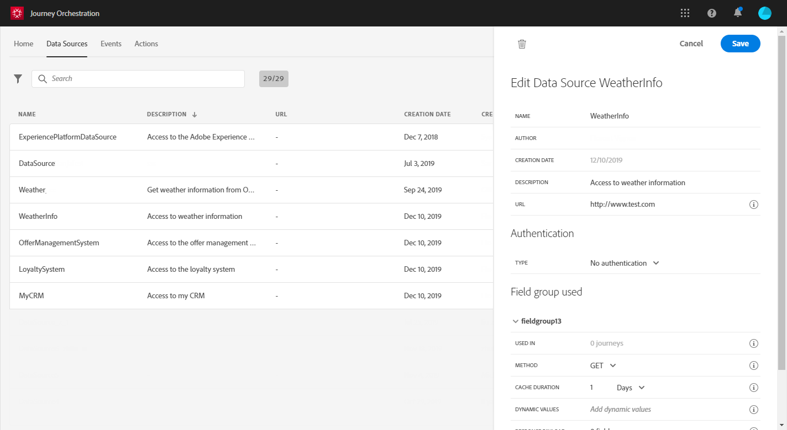
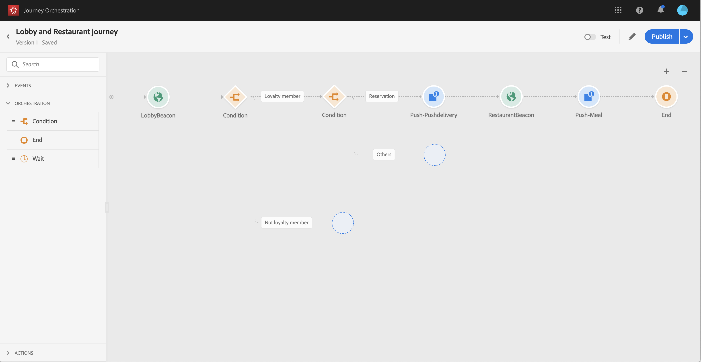
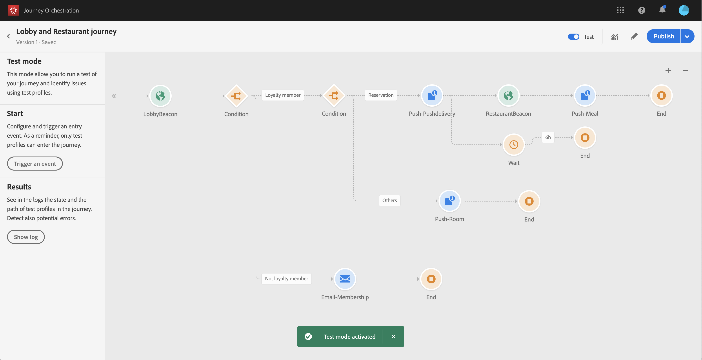

# 基本を学ぶ{#concept_y4b_4qt_52b}

>[!CAUTION]
>
>**Adobe Journey Optimizer をお探しですか**？ Journey Optimizer のドキュメントについて詳しくは、[こちら](https://experienceleague.adobe.com/ja/docs/journey-optimizer/using/ajo-home){target="_blank"}をクリックしてください。
>
>
>_このドキュメントは、Journey Optimizer に置き換えられた従来の Journey Orchestration 資料を参照しています。 Journey Orchestration または Journey Optimizer へのアクセスについてご質問がある場合は、アカウントチームにお問い合わせください。_

[!DNL Journey Orchestration] には、**技術ユーザー**&#x200B;と&#x200B;**ビジネスユーザー**&#x200B;の 2 種類のユーザーがあり、それぞれが特定のタスクを実行します。 ユーザーアクセスは、製品プロファイルと権限で管理します。 ユーザーアクセスを設定する方法については、[このページ](../about/access-management.md)を参照してください。

以下は、[!DNL Journey Orchestration] を設定して使用する主な手順です。

1. **イベントの設定**

   必要な情報とその処理方法を定義する必要があります。 この設定は必須です。 このステップは、**技術ユーザー**&#x200B;が実行します。

   詳しくは、[このページ](../event/about-events.md)を参照してください。

   

1. **データソースの設定**

   例えば、状況に応じて、ジャーニーで使用される追加情報（例：条件）を取得するには、システムへの接続を定義する必要があります。 プロビジョニング時に、ビルトインの Adobe Experience Platform データソースも設定されます。 イベントのデータのみをジャーニーで活用する場合、このステップは必要ありません。 このステップは、**技術ユーザー**&#x200B;が実行します。

   詳しくは、[このページ](../datasource/about-data-sources.md)を参照してください。

   

1. **アクションの設定**

   サードパーティシステムを利用してメッセージを送信する場合は、[!DNL Journey Orchestration] との接続を設定する必要があります。 [このページ](../action/about-custom-action-configuration.md)を参照してください。

   Adobe Campaign Standard を使用してメッセージを送信する場合は、ビルトインのアクションを設定する必要があります。 [このページ](../action/working-with-adobe-campaign.md)を参照してください。

   これらの手順は、**技術ユーザー**&#x200B;が実行します。

   

1. **ジャーニーのデザイン**

   様々なイベント、オーケストレーション、アクションなどのアクティビティを組み合わせて、複数のステップから成るクロスチャネルのシナリオを構築します。 この手順は、**ビジネスユーザー**&#x200B;が実行します。

   詳しくは、[このページ](../building-journeys/journey.md)を参照してください。

   

1. **ジャーニーのテストと公開**

   ジャーニーを検証し、アクティブにする必要があります。 この手順は、**ビジネスユーザー**&#x200B;が実行します。

   詳しくは、[ジャーニーのテスト](../building-journeys/testing-the-journey.md)と[ジャーニーの公開](../building-journeys/publishing-the-journey.md)を参照してください。

   

1. **ジャーニーの監視**

   専用のレポートツールを使用して、ジャーニーの効果を測定します。 この手順は、**ビジネスユーザー**&#x200B;が実行します。

   詳しくは、[このページ](../reporting/about-journey-reports.md)を参照してください。

   
