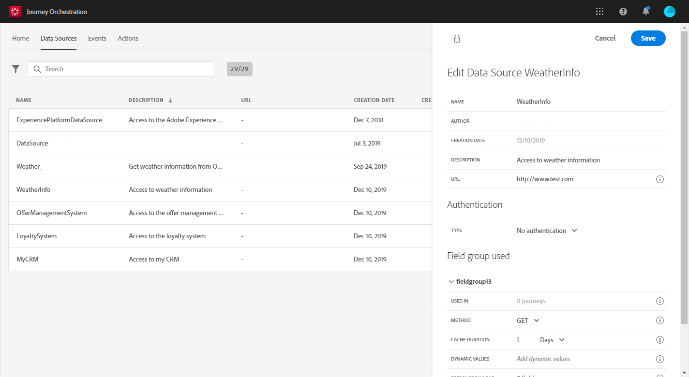

# はじめに{#concept_y4b_4qt_52b}

In [!DNL Journey Orchestration], there are two types of users, each of them performing specific tasks: the **technical user** and the **business user**. ユーザーアクセスは、製品プロファイルと権限によって管理されます。ユーザーアクセスを設定する方法については、を参照してください。

Here are the main steps to configure and use [!DNL Journey Orchestration]:

1. **イベントの設定**

   必要な情報とその処理方法を定義する必要があります。この設定は必須です。この手順は、**技術ユーザー**&#x200B;が実行します。

   詳しくは、を参照してください。

   

1. **データソースの設定**

   例えば、状況に応じて、ジャーニーで使用される追加情報（例：条件）を取得するには、システムへの接続を定義する必要があります。組み込みのAdobe Experience Platformデータソースは、プロビジョニング時にも設定されます。 この手順は、ジャーニーでイベントのデータのみを活用する場合には必要ありません。この手順は、**技術ユーザー**&#x200B;が実行します。

   詳しくは、を参照してください。

   

1. **アクションの設定**

   If you&#39;re using a third-party system to send your messages, you need to configure its connection with [!DNL Journey Orchestration]. を参照してください。

   Adobe Campaign Standard を使用してメッセージを送信する場合は、組み込みのアクションを設定する必要があります。を参照してください。

   これらの手順は、**技術ユーザー**&#x200B;が実行します。

   

1. **ジャーニーのデザイン**

   様々なイベント、オーケストレーション、アクションアクティビティを組み合わせて、複数手順のクロスチャネルシナリオを構築します。この手順は、**ビジネスユーザー**&#x200B;が実行します。

   詳しくは、を参照してください。

   

1. **ジャーニーのテストと公開**

   ジャーニーを検証し、アクティブにする必要があります。この手順は、**ビジネスユーザー**&#x200B;が実行します。

   詳しくは、およびを参照してください。

   

1. **ジャーニーの監視**

   専用のレポートツールを使用して、ジャーニーの効果を測定します。この手順は、**ビジネスユーザー**&#x200B;が実行します。

   詳しくは、を参照してください。

   

