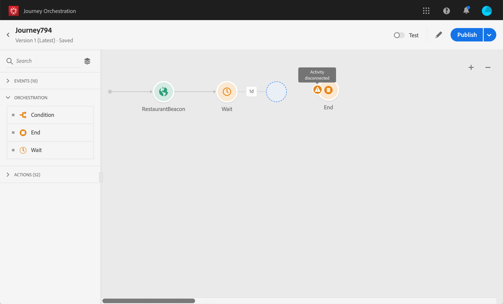

# トラブルシューティング{#concept_nlv_bcv_2fb}

このセクションでは、テストまたは公開の前にジャーニーのトラブルシューティングを行う方法を説明します。 以下に示すすべてのチェックは、ジャーニーがテストモードの場合、またはジャーニーがライブの場合に実行できます。 テストモードで以下のすべてのチェックを行い、発行に進むことをお勧めします。 [](../building-journeys/testing-the-journey.md)を参照してください。

## テスト前のエラーの確認{#section_h3q_kqk_fhb}

遍歴をテストおよび公開する前に、すべてのアクティビティが正しく設定されていることを確認します。 システムでエラーが検出される場合は、テストやパブリケーションを実行できません。

エラーは、キャンバス上のアクティビティ自体に警告記号と共に表示されます。 感嘆符の上にカーソルを置くと、エラーメッセージが表示されます。 アクティビティをクリックすると、エラーの行と警告が表示されます。 例えば、必須フィールドが空の場合、エラーが表示されます。


例えば、キャンバスで2つのアクティビティが切断されると、警告が表示されます。



切り替えボタン **[!UICONTROL Test]** とボタンの **[!UICONTROL Publish]** 横に、警告記号を表示できます。 この警告記号は、システムで検出されたエラーを表示し、テストモードのアクティベーションや旅行の発行を防ぎます。 ほとんどの場合、システムで検出されたエラーは、アクティビティに表示されるエラーにリンクされますが、他の問題にリンクされることもあります。 この場合、エラーを表示し、エラーの説明を使用して問題を特定します。 問題を特定できない場合は、詳細をコピーして管理者に送信するか、サポートに送信できます。 テストをブロックするエラーと、パブリケーションをブロックするエラーは似ています。

システムは、次の2種類の問題を検出します。エラーと警告。 エラーは、パブリケーションとテストアクティベーションをブロックします。 警告は、テストのアクティベーションや発行を妨げない潜在的な問題を示します。 問題の説明と、タイプERR_XXX_XXXの問題ログIDが表示されます。 これは、テクニカルサポートが問題を特定するのに役立ちます。

トグルとボタンの隣の記号に2色を表示 **[!UICONTROL Test]****[!UICONTROL Publish]** できます。 エラーの場合、記号は赤で表示されます。 警告の場合、オレンジ色で表示されます。


この旅行に関するグローバルなエラーと警告は、最初にリストに表示されます。 特定のアクティビティに関連するエラーと警告は、その後、アクティビティの順序または表示順で左から右に表示されます。 このボタ **[!UICONTROL Copy details]** ンは、サポートチームがトラブルシューティングに使用できる道程に関する技術情報をコピーします。

## イベントが適切に送信されたかどうかの確認{#section_rqz_11t_dgb}

旅の出発点は常にイベント Postmanなどのツールを使用してテストを実行できます。

これらのツールを通じて送信するAPI呼び出しが正しく送信されているかどうかを確認できます。 エラーが返された場合は、通話に問題があることを意味します。 ペイロード、ヘッダー（特に組織ID）およびリンク先URLを再度確認します。 ヒットする適切なURLは管理者に問い合わせることができます。

イベントは、ソースからJureny Orchestrationに直接プッシュされません。 実際、Javerny Orchestrationは、Experience Platformのストリーミング取り込みAPIに依存しています。 その結果、イベント関連の問題が発生した場合は、このページを参照して、Streaming [Ingestion](https://docs.adobe.com/content/help/en/experience-platform/ingestion/streaming/troubleshooting.html) APIのトラブルシューティングを行うことができます。

## 人々が旅に出るかどうかの確認{#section_x4v_zzs_dgb}

旅のオーケストレーションレポートは、人々の旅行への参加をリアルタイムで測定します。

イベントの送信に成功しても道のりに入り口が見えない場合はイベントの送信とイベントの受信との間に何か問題が起きています

以下にいくつかの点を示し、管理者が確認する必要があります。

* 受信モードがテストモードかライブかをイベントするジャーニーを確認しますか？
* ペイロードイベントからペイロードをコピーする前にプレビューを保存したか？
* イベントペイロードにイベントIDが含まれるか。
* 正しいURLをヒットしましたか。
* Streaming Ingestion APIのペイロード構造に従っていましたか。ペイロード構造プレビューを使用していますか。 [](../event/previewing-the-payload.md)を参照してください。
* イベントのヘッダーで正しいキーと値のペアを使用したか。

   ```
   X-gw-ims-org-id - your ORGID
   Content-type - application/json
   ```

## 人々がどのように旅をしているかチェックする{#section_l5y_yzs_dgb}

旅のオーケストレーションレポートは、旅の中での個人の進行状況を測定します。 人がどこでなぜ止められたのかを簡単に特定できます

以下に、確認する必要がある点を示します。

* その人を除く条件のせいか？ 例えば、条件は「性別=男性」、その人は女性です。 このチェックは、条件が複雑すぎない場合に、ビジネスユーザーが実行できます。
* データソースの呼び出しが応答しないことが原因ですか。 この情報は、テスト中にテストモードログで確認できます。 この遍歴が実行されると、管理者はデータソースに対する直接呼び出しをテストし、受け取った回答を確認できます。 また、管理者は、この遍歴を重複してテストすることもできます。

## メッセージが正常に送信されたことを確認しています{#section_qb1_yzs_dgb}

個人が正しい方向に進むが、受け取るべきメッセージを受け取らない場合は、次のことを確認できます。

* トランザクションメッセージングでは、メッセージの送信要求が正しく考慮されています。 ビジネス・ユーザは、送信される予定のトランザクションメッセージにアクセスし、最新の実行時刻が旅行の実行時刻に対応しているかどうかを確認できます。 また、トランザクションメッセージングで受信した最新のAPI呼び出し/イベントを確認することもできます。
* トランザクションメッセージングがメッセージを正常に送信しました。 各実行のステータスは、トランザクションメッセージの送信ログで確認できます。 緑か赤か何かが分かります ビジネスユーザはこの画面にアクセスし、ログを管理者に送信して、さらに調査を行うことができます。

カスタムアクションを介して送信されたメッセージの場合、遍歴テスト中にチェックできるのは、カスタムアクションのシステムを呼び出すとエラーが発生するかどうかだけです。 カスタムアクションに関連付けられた外部システムへの呼び出しがエラーを引き起こさず、メッセージの送信につながらない場合、外部システム側で調査を行う必要があります。

