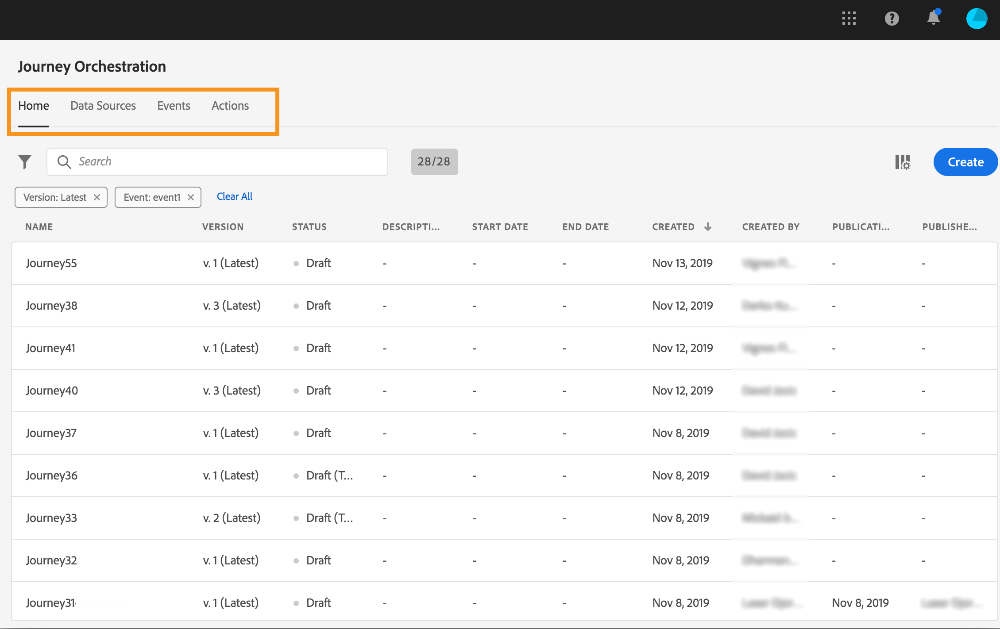
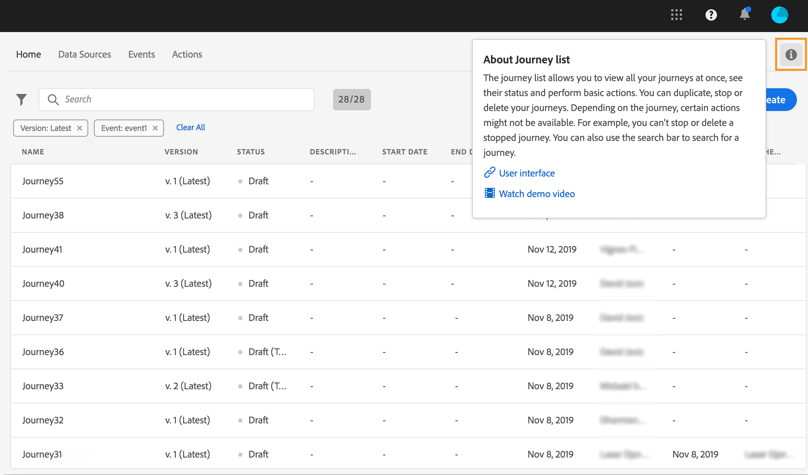

# User interface{#concept_rcq_lqt_52b}

>[!CONTEXTUALHELP]
>id=&quot;jo_home&quot;
>title=&quot;About Jureny list&quot;
>abstract=&quot;The journey list all you cant view all your journeys at once, see their status and perform basic actions. ジャーニーは複製、停止または削除できます。 旅程によっては、特定のアクションが使用できない場合があります。 例えば、完了した旅行を停止したり削除したりすることはできません。 また、検索バーを使用して旅行を検索することもできます。」
>additional-url=&quot;https://images-tv.adobe.com/mpcv3/38af62cb-9390-4bc0-a576-d336849adb97_1574809570.1920x1080at3000_h264.mp4&quot; text=&quot;デモビデオを見る&quot;

>[!NOTE]
>
>Jargeny Orchestrationを最大限に活用するには、Chromeをインターネットブラウザーとして使用することをお勧めします。
>
>このドキュメントは、製品の最新の変更を反映して頻繁に更新されています。 ただし、一部のスクリーンショットは、製品のインターフェイスと少し異なる場合があります。

## インターフェイスの検出{#section_jsq_zr1_ffb}

Jargeny Orchestrationのインターフェイスにアクセスするには、右上のアイコ **[!UICONTROL App Selector]** ンをクリックします。 次に、右 **[!UICONTROL Journey Orchestration]**&#x200B;側の「エクスペリエンスプラットフォーム」の下のをクリックします。

また、Experience cloudホームページのセクションからJureny Orchestrationにアクセスすることもで **[!UICONTROL Quick access]** きます。

上部のメニューを使用すると、Jureny Orchestrationの様々な機能を操作できます。 **[!UICONTROL Home]**（旅行）、**[!UICONTROL Data Sources]**、 **[!UICONTROL Events]**、 **[!UICONTROL Actions]**。

画面の右  上隅にあるアイコンをクリックして、コンテキストヘルプを表示します。 これは、様々なJareny Orchestrationリスト画面（ジャーニー、イベント、アクション、データソース）で使用できます。 これにより、現在の機能に関する簡単な説明を表示し、関連する記事やビデオにアクセスできます。

## 検索とフィルター{#section_lgm_hpz_pgb}

、 **[!UICONTROL Home]**、およびリス&#x200B;**[!UICONTROL Data Sources]**&#x200B;トで **[!UICONTROL Events]****[!UICONTROL Actions]** は、検索バーを使用して項目を検索できます。

リスト **[!UICONTROL Filters]** の左上にあるフィルターアイコンをクリックして、にアクセスできます。 フィルターメニューを使用すると、様々な条件に従って表示される要素をフィルターできます。 特定のタイプやステータスの要素、作成した要素、過去30日間に変更された要素のみを表示するよう選択できます。

、およびのリ **[!UICONTROL Data Sources]**&#x200B;ストで、作 **[!UICONTROL Events]** 成フ **[!UICONTROL Actions]** ィルタを使用し **て** 、作成日とユーザに基づいてフィルタリングします。 例えば、過去30日間に作成したイベントのみを表示するように選択できます。

ジャーニーリスト(下 **[!UICONTROL Home]**)では、の他に、ステータスとバ **[!UICONTROL Creation filters]**&#x200B;ージョン（下）に従って表示されたジャーニーをフィルタリングすることもでき&#x200B;**[!UICONTROL Status and version filters]**&#x200B;ます。 また、特定のイベント、フィールドグループ、またはアクション(および&#x200B;**[!UICONTROL Activity filters]** )を使用するジャーニーのみを表示するように選択することもできます。このオプションを使用すると、発 **[!UICONTROL Data filters]****[!UICONTROL Publication filters]** 行日またはユーザーを選択できます。 例えば、昨日公開された最新バージョンのライブジャーニーのみを表示するように選択できます。 を参照してください。

>[!NOTE]
>
>表示される列は、リストの右上にある設定ボタンを使用してパーソナライズできます。 パーソナライゼーションは、各ユーザーに対して保存されます。

列と列 **[!UICONTROL Last update]** を使用 **[!UICONTROL Last update by]** すると、最後にジャーニーが更新され、どのユーザーが操作したかを表示できます。

イベント、データソース、およびアクションの設定パネルでは、このフィー **[!UICONTROL Used in]** ルドに、特定のイベント、フィールドグループまたはアクションを使用するジャーニーの数が表示されます。 ボタンをクリックする **[!UICONTROL View journeys]** と、対応するジャーニーのリストが表示されます。

様々なリストで、各要素に対して基本的なアクションを実行できます。 例えば、アイテムを複製または削除できます。

## XDMフィールド名の表示{#friendly-names-display}

XDMフィールド名は、式エディターでイベントペイロード、フィールドグループペイロードを定義し [てフィールド名と表示名の下に](../event/defining-the-payload-fields.md)、スキーマ内で定義さ [れています](../datasource/field-groups.md)。
フィールドを選択すると、そのフィールドの技術名と、よりわかりやすいフィールド名が表示されます。

「xdm:alternateDisplayInfo」などの記述子を指定しながら、表示名を置き換えるフレンドリ名を定義するスキーマを設定できます。 また、スキーマフィールドの「title」と「description」の値を変更することもできます。

わかりやすい名前が使用可能な場合、フィールドはとして表示されま `<friendly-name>(<name>)`す。 わかりやすい名前がない場合は、表示名などが表示されます `<display-name>(<name>)`。 いずれも定義されていない場合は、フィールドの技術的な名前のみが表示されま `<name>`す。

API呼び出しを使用して、わかりやすい名前記述子を設定できます。 詳しくは、『 [Schema Registry Developer guide』を参照してください](https://www.adobe.io/apis/experienceplatform/home/xdm/xdmservices.html#!api-specification/markdown/narrative/technical_overview/schema_registry/schema_registry_developer_guide.md)。

>[!NOTE]
>
>スキーマの結合からフィールドを選択した場合、フレンドリ名は取得されません。

## 様々なショートカットの使用{#section_ksq_zr1_ffb}

以下に、Jureny Orchestrationのインターフェイスで使用できる様々なショートカットを示します。

_ジャーニー、アクション、データソースまたはイベントのリスト：_

* cを押 **して** 、新しいジャーニー、アクション、データソース、またはイベントを作成します。

_遍歴でアクティビティを設定する場合：_

キャンバスは自動的に保存されます。 キャンバスの左上に保存状態が表示されます。

* Escキーを **押して** 、設定ウィンドウを閉じ、変更を破棄します。 これはボタンと同じ **[!UICONTROL Cancel]** です。
* 設定ペ **[!UICONTROL Enter]** インを閉じるには、ペインの外側を押すか、クリックします。 変更が保存されます。 これはボタンと同じ **[!UICONTROL Ok]** です。
* BackSpaceキーを押すと **[!UICONTROL Delete]** 、を押して ******[!UICONTROL Enter]** 削除を確定できます。

_ポップアップ内：_

* Escキー **を押して** 、閉じます(「キャンセル」ボタン **と同じ** )。
* 保存ま **[!UICONTROL Enter]** たは確認を押します(またはボタンと同 **[!UICONTROL Ok]** 等 **[!UICONTROL Save]** です)。

_イベントのデータソースまたはアクションの設定ペインで、次の操作を行います。_

* 保存せず **に** 、Escキーを押して設定ウィンドウを閉じます。
* を押し **[!UICONTROL Enter]** て変更を保存し、設定ペインを閉じます。
* 設定する **** 異なるフィールド間を移動するには、Tabキーを押します。

_簡易式エディター_

* 左側のフィールドをダブルクリックして、クエリを追加します（ドラッグ&amp;ドロップと同じ）。

_XDMフィールドを閲覧する場合：_

* 「node」をチェックすると、ノードのすべてのフィールドが選択されます。

_すべてのテキスト領域で、次の操作を行います。_

* テキストを **選択するには、Ctrl/Command+A** キーの組み合わせを使用します。 ペイロードプレビューで、ペイロードを選択します。

_検索バーのある画面で、次の操作を行います。_

* 検索バーを **選択するには、Ctrl/Command+F** キーの組み合わせを使用します。

_旅のキャンバスに_

* すべてのアクテ **ィビティを選択するには、Ctrl/Command + A** キーの組み合わせを使用します。
* 1つまたは複数のアクティビティを選択したら、BackSpaceキ **[!UICONTROL Delete]** ーを **押す** か、削除します。 その後、確認ポッ **[!UICONTROL Enter]** プアップでを押して確認できます。
* 左のパレットでアクティビティをダブルクリックし、最初に使用可能な位置（上から下）に追加します。
