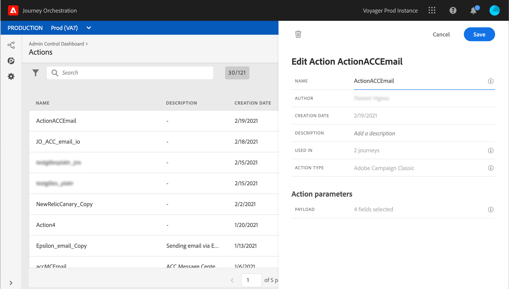

# Adobe Campaign v7／v8 の使用 {#integrating-with-adobe-campaign-classic}


>[!CAUTION]
>
>**Adobe Journey Optimizer をお探しですか**？ Journey Optimizer のドキュメントについて詳しくは、[こちら](https://experienceleague.adobe.com/ja/docs/journey-optimizer/using/ajo-home){target="_blank"}をクリックしてください。
>
>
>_このドキュメントは、Journey Optimizer に置き換えられた従来の Journey Orchestration 資料を参照しています。 Journey Orchestration または Journey Optimizer へのアクセスについてご質問がある場合は、アカウントチームにお問い合わせください。_


この統合は、Adobe Campaign Classic v7 リリース 21.1 以降および Adobe Campaign v8 で利用できます。 Adobe Campaign のトランザクションメッセージ機能を使用して、メール、プッシュ通知、SMS などを送信できるようになります。

Journey Orchestration インスタンスと Campaign インスタンスの接続は、プロビジョニング時にアドビが設定します。

エンドツーエンドの使用例については、[この節](../usecase/campaign-classic-use-case.md)を参照してください。

設定したアクションごとに、1 つのアクションアクティビティをジャーニー designer パレットで使用できます。 詳しくは、この[節](../building-journeys/using-adobe-campaign-classic.md)を参照してください。

## 重要な注意事項

* メッセージのスロットルはありません。 Campaign の現行の SLA に基づいて、送信できるメッセージの数を 1 時間あたり 50,000 件にキャップしています。 この理由により、Journey Orchestration は単一の使用例（セグメントではなく個々のイベント）でのみ使用してください。

* 使用するテンプレートごとに、1 つのアクションをキャンバス上に設定する必要があります。 Adobe Campaignから使用するテンプレートごとに、Journey Orchestrationで1つのアクションを設定する必要があります。

* この統合にホストしている専用の Message Center インスタンスを使用して、実行中の 他の Campaign 操作に影響を与えないようにすることをお勧めします。 マーケティングサーバーはホスト型でもオンプレミス型でも構いません。 必要なビルドは、リリース候補 21.1 以降です。

* ペイロード、または Campaign メッセージが正しいかどうかは検証されません。

* セグメントの選定イベントでは、Campaign アクションを使用できません。

## 前提条件

Campaign では、トランザクションメッセージとそれに関連するイベントを作成して公開する必要があります。 [Adobe Campaign ドキュメント](https://experienceleague.adobe.com/docs/campaign-classic/using/transactional-messaging/introduction/about-transactional-messaging.html?lang=ja#transactional-messaging)を参照してください。

以下のパターンに従って、各メッセージに対応する JSON ペイロードを作成できます。 Journey Orchestration でアクションを設定する際に、このペイロードを貼り付けてください（以下を参照）。

次に例を示します。

```
{
    "channel": "email",
    "eventType": "welcome",
    "email": "example@adobe.com",
    "ctx": {
        "firstName": "John"
    }
}
```

* **channel**：Campaign トランザクションテンプレート用に定義したチャネル
* **eventType**：Campaign イベントの内部名
* **ctx**：メッセージに含めるパーソナライズ機能に基づく変数。

## アクションの設定

Journey Orchestration では、トランザクションメッセージごとに 1 つのアクションを設定する必要があります。 次の手順に従います。

1. 新しいアクションの作成 詳しくは、この[節](../action/action.md)を参照してください。
1. 名前と説明を入力
1. 「**アクションタイプ**」フィールドで、**Adobe Campaign Classic** を選択します。
1. 「**ペイロード**」フィールドをクリックし、 Campaign メッセージに対応する JSON ペイロードの例を貼り付けます。 アドビに問い合わせて、このペイロードを取得してください。
1. ジャーニー キャンバスでマッピングするかどうかに応じて、さまざまなフィールドを静的または可変に調整します。 メールアドレスのチャネルパラメーターやパーソナライゼーションフィールド（ctx）など、特定のフィールドは、ジャーニーのコンテキストでマッピングの変数として定義する必要があります。
1. 「**保存**」をクリックします。




