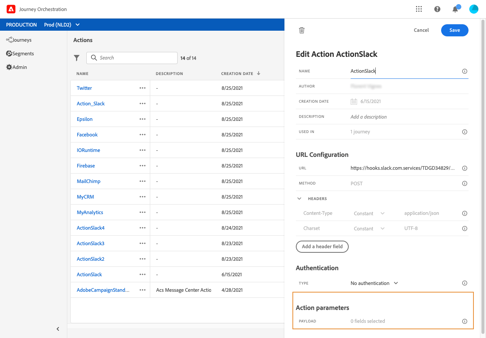

# メッセージパラメーターの定義 {#concept_wy4_bf1_2gb}

このセクシ **[!UICONTROL Message parameters]**ョンに、外部サービスに送信するJSONペイロードの例を貼り付けます。

パラメータのタイプが正しいかどうかを定義できます(例：文字列、整数など)。

また、パラメーターが定数か変数かを指定することもできます。

* 「定数」は、パラメーターの値が、アクション設定ウィンドウで技術的な人物によって定義されることを意味します。 この値は、旅の間で常に同じになります。 この変数は変化せず、マーケティング担当者は、旅の中でカスタムアクションを使用する場合にこの値を見ることはできません。 例えば、サードパーティシステムが予期するIDを指定できます。 この場合、トグル定数/変数の右側のフィールドに渡された値が表示されます。
* 変数は、パラメーターの値が変化することを意味します。 このカスタムアクションを遍歴で使用するマーケターは、必要な値を渡したり、このパラメーターの値を取得する場所を自由に指定できます（例：イベントから、データプラットフォームから）。 この場合、トグル定数/変数の右側のフィールドは、このパラメーターに名前を付けるための遍歴でマーケターに表示されるラベルです。
