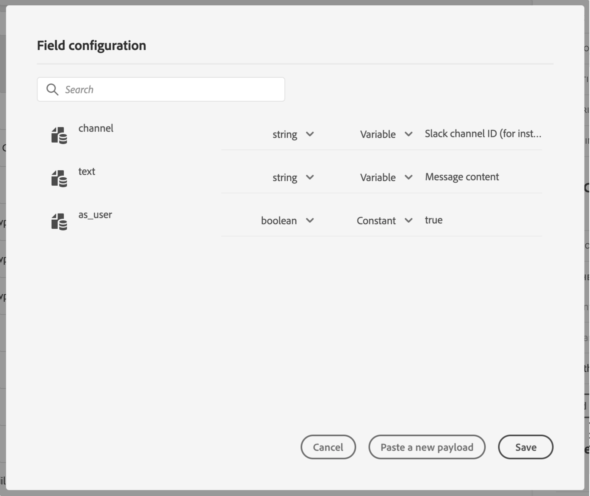

# メッセージパラメーターの定義 {#concept_wy4_bf1_2gb}

「**[!UICONTROL メッセージパラメーター]**」セクションに、外部サービスに送信するJSONペイロードの例を貼り付けます。

>[!NOTE]
>
>ペイロード内のフィールド名に「。」を含めることはできません。 文字。

パラメーターのタイプを定義できます(例：文字列、整数など)。

また、パラメーターが定数か変数かを指定することもできます。

* 定数は、パラメーターの値が技術的なペルソナによってアクション設定ペインで定義されることを意味します。 この値は、ジャーニー間で常に同じになります。 ジャーニーでカスタムアクションを使用する場合、変化はなく、マーケターには表示されません。 例えば、サードパーティシステムが想定するIDなどです。 その場合、切り替え定数/変数の右側にあるフィールドに渡された値が表示されます。
* 変数は、パラメーターの値が変わることを意味します。 このカスタムアクションをジャーニーで使用するマーケターは、目的の値を自由に渡したり、このパラメーターの値を取得する場所を指定したりできます(イベントから、Adobe Experience Platformからなど)。 この場合、切り替え定数/変数の右側のフィールドは、ジャーニーでマーケターがこのパラメーターに名前を付ける際に表示するラベルです。

