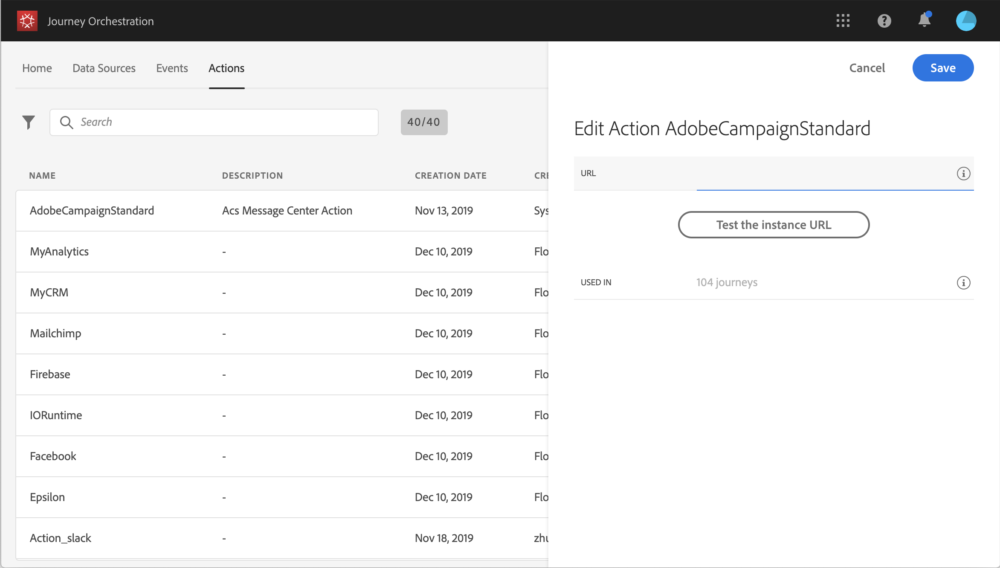

# Adobe Campaign Standard の使用 {#using_adobe_campaign_standard}

>[!CAUTION]
>
>**Adobe Journey Optimizer をお探しですか**？ Journey Optimizer のドキュメントについて詳しくは、[こちら](https://experienceleague.adobe.com/ja/docs/journey-optimizer/using/ajo-home){target="_blank"}をクリックしてください。
>
>
>_このドキュメントは、Journey Optimizer に置き換えられた従来の Journey Orchestration 資料を参照しています。 Journey Orchestration または Journey Optimizer へのアクセスについてご質問がある場合は、アカウントチームにお問い合わせください。_

Adobe Campaign Standard のトランザクションメッセージ機能を使用して、メール、プッシュ通知、SMS を送信できます。

[!DNL Journey Orchestration]には、Adobe Campaign Standardへの接続を許可する、すぐに使用できるアクションが付属しています。

Journey Orchestrationで使用するには、Campaign Standard トランザクションメッセージとその関連イベントを公開する必要があります。 イベントが公開されていてもメッセージが公開されていない場合、Journey Orchestration インターフェイスには表示されません。 メッセージが公開されているが、関連するイベントが公開されていない場合、Journey Orchestration インターフェイスに表示されますが、使用できません。

>[!NOTE]
>
>5分あたり4,000回の呼び出しのキャッピングルールは、Adobe Campaign Standard統合が設定されるとすぐに、Adobe Campaign Standard アクションに対して自動的に定義されます。 これは、Adobe Campaign Standard Transactional Messagingの正式な規模に相当します。
>
>トランザクションメッセージ SLA の詳細については、[Adobe Campaign Standard 製品説明](https://helpx.adobe.com/jp/legal/product-descriptions/campaign-standard.html)を参照してください。

次に、設定手順を示します。

1. **[!UICONTROL アクション]** リストから、組み込みの&#x200B;**[!UICONTROL AdobeCampaignStandard]** アクションをクリックします。 画面右側にアクション設定ペインが開きます。

   

1. Adobe Campaign Standard インスタンスの URL をコピーし、「**[!UICONTROL URL]**」フィールドにペーストします。

1. 「**[!UICONTROL インスタンス URL をテスト]**」をクリックし、インスタンスの有効性をテストします。

   >[!NOTE]
   >
   >このテストでは、次のことを検証します。
   >
   >ホストは「.campaign.adobe.com」、「.campaign-sandbox.adobe.com」、「.campaign-demo.adobe.com」、「.ats.adobe.com」または「.adls.adobe.com」です。
   >
   >https で始まる URL
   >
   >このAdobe Campaign Standard インスタンスに関連付けられている組織は、Journey Orchestrationの組織と同じです。

ジャーニーをデザインする際に、**[!UICONTROL アクション]** カテゴリで3つのアクションを使用できます：**[!UICONTROL 電子メール]**、**[!UICONTROL プッシュ]**、**[!UICONTROL SMS]** （[Adobe Campaign アクションの使用](../building-journeys/using-adobe-campaign-actions.md)を参照）。 **反応イベント**&#x200B;では、メッセージのクリックや開封などの際に反応することもできます（[反応イベント ](../building-journeys/reaction-events.md)を参照）。

サードパーティのシステムを使用してメッセージを送信する場合は、カスタムアクションを追加および設定する必要があります。 [カスタムアクション設定について](../action/about-custom-action-configuration.md)を参照してください。
