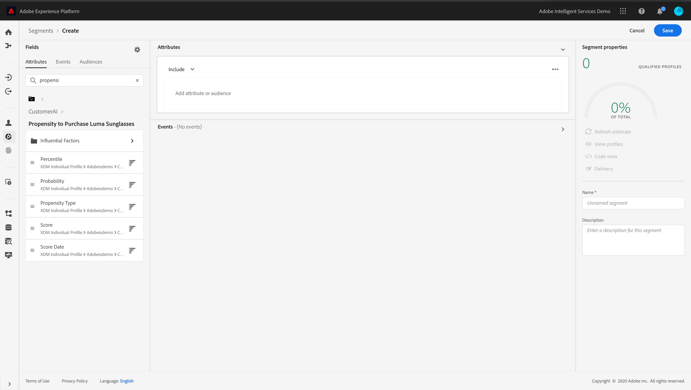

# 顧客 AI の活用 {#customer-ai}

お客様向けAIはインテリジェントサービスの一部です。 これは、顧客が何をする可能性があるかを予測するのに役立ちます。 [ドキュメント](https://docs.adobe.com/content/help/en/experience-platform/intelligent-services/customer-ai/overview.html)を参照してください。

顧客AIを使用すると、ブランドは、Adobe Experience Platformプロファイル(リアルタイム顧客プロファイル)でプロファイル属性として利用できる、チャーンやコンバージョン機械学習に基づくスコアを作成できます。

その結果、これらはJourney Orchestrationの条件で（最適な判断を行うために）他のプロファイル属性、アクション、セグメント作成として使用できます。

お客様向けAIは、Adobe Experience Platformの有料機能です。

