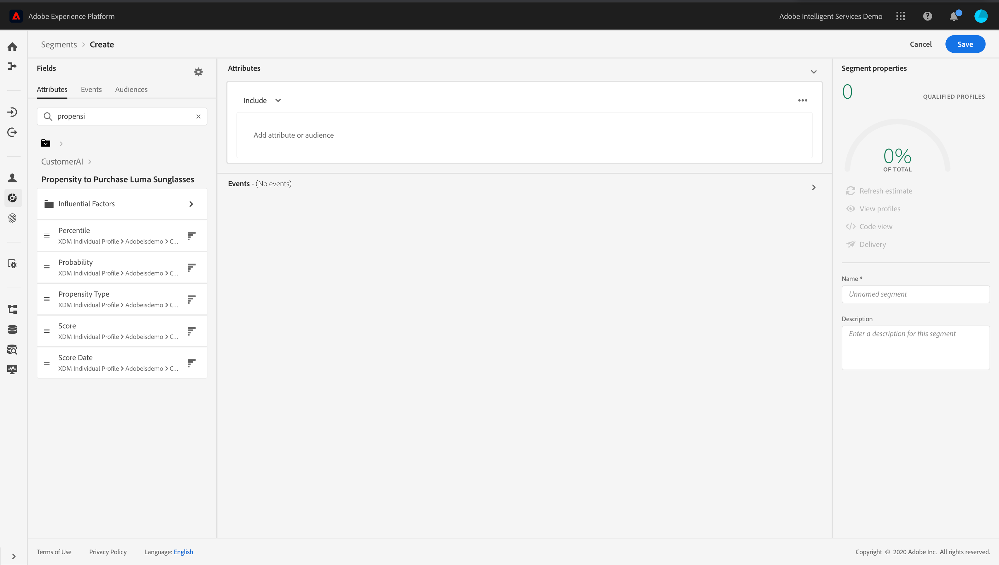

# 顧客 AI の活用 {#customer-ai}

>[!CAUTION]
>
>**Adobe Journey Optimizer をお探しですか**？ Journey Optimizer のドキュメントについて詳しくは、[こちら](https://experienceleague.adobe.com/ja/docs/journey-optimizer/using/ajo-home){target="_blank"}をクリックしてください。
>
>
>_このドキュメントは、Journey Optimizer に置き換えられた従来の Journey Orchestration 資料を参照しています。 Journey Orchestration または Journey Optimizer へのアクセスについてご質問がある場合は、アカウントチームにお問い合わせください。_

顧客 AI はインテリジェントサービスの一部です。 これは、顧客がとる可能性の高い行動を予測するのに役立ちます。 [ドキュメント](https://experienceleague.adobe.com/docs/experience-platform/intelligent-services/customer-ai/overview.html?lang=ja)を参照してください。

顧客 AI を使用すると、ブランドは、Adobe Experience Platform プロファイル（リアルタイム顧客プロファイル）のプロファイル属性として使用できる、チャーンまたはコンバージョンの機械学習に基づくスコアを作成できます。

その結果、Journey Orchestrationの条件（最適な意思決定を行う）、アクション、またはセグメント構築で、他のプロファイル属性として使用できます。

顧客 AI は Adobe Experience Platform の有料機能です。
