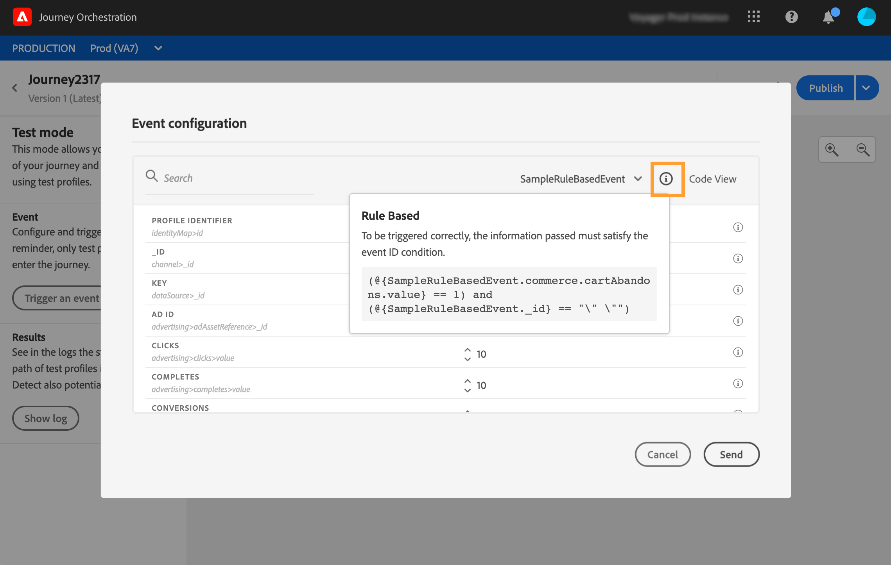

# ルールベースのイベント{#simplified-events}

エクスペリエンスイベントの設定方法が簡略化されました。eventID を使用する必要のない新しいメソッドが導入されます。Journey Orchestration でイベントを設定する際に、ルールベースのイベントを定義できるようになりました。

この新しいタイプのイベントでは、eventIDが生成されません。 シンプルな式エディターを使用して、システムがジャーニーをトリガーする関連イベントを特定するために使用するルールを定義するだけです。 このルールは、イベントペイロードで使用可能な任意のフィールドに基づくことができます。例えば、プロファイルの場所や、プロファイルの買い物かごに追加された項目数などです。

この新しいメソッドは、ほとんどの場合、ユーザーに対して透明です。 唯一の変更は、イベント定義画面の新しいフィールドです。

>[!CAUTION]
>
>キャップルールは、ルールベースのイベントに対して定義されます。 1回の遍歴で処理できる正規イベントの数を1分あたり400,000個に制限します。 詳しくは、アルファプログラムの連絡先にお問い合わせください。

## Adobe Analyticsデータの活用{#analytics-data}

>[!NOTE]
>
>この節は、Adobe Analyticsデータを使用する必要があるお客様にのみ適用されます。

既に収集およびプラットフォームへのストリーミングを行っているAdobe Analytics行動イベントのすべてのデータを活用して、お客様の体験を自動化できます。

この機能を動作させるには、活用するレポートスイートをAdobe Experience Platformでアクティブ化する必要があります。

1. Adobe Experience Platformで、「 **[!UICONTROL ソース]** 」を選択し **[!UICONTROL 、「Adobe Analytics」セクションで「]** データ」を選択します。 使用可能なAdobe Analyticsレポートスイートのリストが表示されます。

1. 有効にするレポートスイートを選択し、「 **[!UICONTROL 次へ]** 」をクリックして「 **[!UICONTROL 完了」をクリックします]**。

1. ソースデータIDをアルファプログラムの連絡先と共有します。

これにより、そのレポートスイートのAnalyticsソースコネクタが有効になります。 データが入ってくるたびに、そのデータはエクスペリエンスイベントに変換され、Adobe Experience Platformに送信されます。

Adobe Analyticsソースコネクタの詳細については、 [ドキュメント](https://docs.adobe.com/help/en/experience-platform/sources/connectors/adobe-applications/analytics.html) と [チュートリアルを参照してください](https://docs.adobe.com/content/help/en/experience-platform/sources/ui-tutorials/create/adobe-applications/analytics.html)。

## ルールベースのイベントの設定{#configuring-rule-based}

1. 左側のメニューで、「 **[!UICONTROL 管理者]** 」アイコンをクリックし、「 **[!UICONTROL イベント]**」をクリックします。 イベントのリストが表示されます。

   

1. 新しいイベントを作成するには、「**[!UICONTROL 追加]**」をクリックします。画面の右側にイベント設定ペインが開きます。

   

1. イベントの名前を入力します。 説明を追加することもできます。

   

1. 新しい **[!UICONTROL イベントID type]** ( **[!UICONTROL IDタイプ]**)フィールドで、「ルールに基づく」を選択します。

   

   >[!NOTE]
   >
   >「 **[!UICONTROL System Generated]** 」タイプは、eventIDを必要とする既存のメソッドです。 [こちらの節](../event/about-events.md)を参照してください。

1. **[!UICONTROL スキーマ]** とペイロードの **[!UICONTROL フィールドを定義します]**。 [こちらの節](../event/defining-the-payload-fields.md)を参照してください。

   

   >[!NOTE]
   >
   >「 **[!UICONTROL システム生成タイプ]**」を選択した場合は、eventIDタイプがmixinのスキーマのみを使用できます。 「 **[!UICONTROL ルールベース]** 」タイプを選択した場合は、エクスペリエンスイベントスキーマをすべて使用できます。

1. 「 **[!UICONTROL イベントID条件]** 」フィールド内をクリックします。 シンプルな式エディターを使用して、遍歴のトリガーとなるイベントを特定するためにシステムで使用される条件を定義します。

   

   この例では、プロファイルの都市に基づいて条件を作成しました。 つまり、この条件に一致するイベント(**[!UICONTROL City]** フィールドと **[!UICONTROL Paris]** 値)を受け取るたびに、その情報がJourney Orchestrationに渡されます。

1. **[!UICONTROL 名前空間]** と ****&#x200B;キーを定義します。 「名前空間の [選択](../event/selecting-the-namespace.md) 」および「イベントキーの [定義」を参照してください](../event/defining-the-event-key.md)。

   

イベントの設定と遍歴の作成に関するその他の手順は変更されません。

これでイベントが設定され、他のイベントと同様に遍歴に含まれる準備が整いました。 ルールに一致するイベントがシステムに送信されるたびに、そのイベントがJourney Orchestrationに渡され、ジャーニーがトリガーされます。

## ルールベースのイベントのテストモード{#test-rule-based}

テストモードは、ルールベースのイベントを使用するジャーニーでも使用できます。

イベントをトリガする場合、 **イベント設定** 画面では、テストに合格するイベントパラメータを定義できます。 右上隅のツールチップアイコンをクリックして、イベントID条件を表示できます。 ルール評価の一部である各フィールドの横にもツールチップが表示されます。

For more information on how to use the test mode, refer to .

