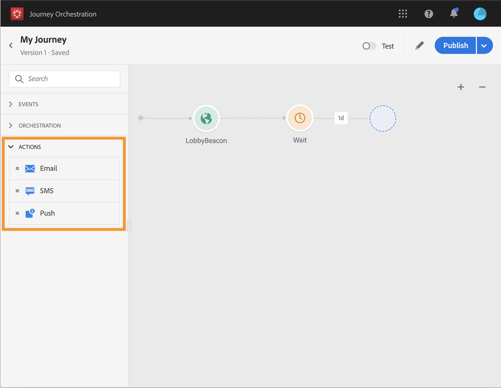
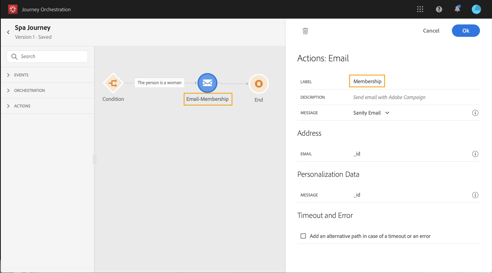

# アクションアクティビティについて {#concept_hbj_hrt_52b}

>[!CAUTION]
>
>**Adobe Journey Optimizer をお探しですか**？ Journey Optimizer のドキュメントについて詳しくは、[こちら](https://experienceleague.adobe.com/ja/docs/journey-optimizer/using/ajo-home){target="_blank"}をクリックしてください。
>
>
>_このドキュメントは、Journey Optimizer に置き換えられた従来の Journey Orchestration 資料を参照しています。 Journey Orchestration または Journey Optimizer へのアクセスについてご質問がある場合は、アカウントチームにお問い合わせください。_

パレットの画面の左側の&#x200B;**[!UICONTROL イベント]**&#x200B;および&#x200B;**[!UICONTROL オーケストレーション]**&#x200B;の下に、**[!UICONTROL アクション]** カテゴリがあります。

これらのアクティビティは、様々な通信チャネルを表します。 これらを組み合わせて、クロスチャネルシナリオを作成できます。

Adobe Campaign Standardを使用している場合は、次のすぐに使用できるアクションアクティビティを使用できます：**[!UICONTROL 電子メール]**、**[!UICONTROL プッシュ]**、**[!UICONTROL SMS]**。 [このページ](../building-journeys/using-adobe-campaign-actions.md)を参照してください。

カスタムアクションを設定している場合は、ここに表示されます（[このページ &#x200B;](../building-journeys/using-custom-actions.md)を参照）。

キャンバスにアクションアクティビティをドロップすると、**[!UICONTROL ラベル]**&#x200B;を定義できます。 これにより、キャンバスのアクティビティの下に表示されるアクション名にサフィックスを追加できます。 これは、ジャーニーで同じアクションを何度も使用し、より簡単に識別したい場合に役立ちます。 レポートも読みやすくなります。 また、オプションで&#x200B;**[!UICONTROL 説明]**&#x200B;を追加することもできます。

アクションまたは条件でエラーが発生すると、個人のジャーニーが停止します。 続行するには、「**[!UICONTROL タイムアウトまたはエラーの場合に代替パスを追加]**」チェックボックスをオンにするだけです。 詳しくは、[この節](../building-journeys/using-the-journey-designer.md#paths)を参照してください。
