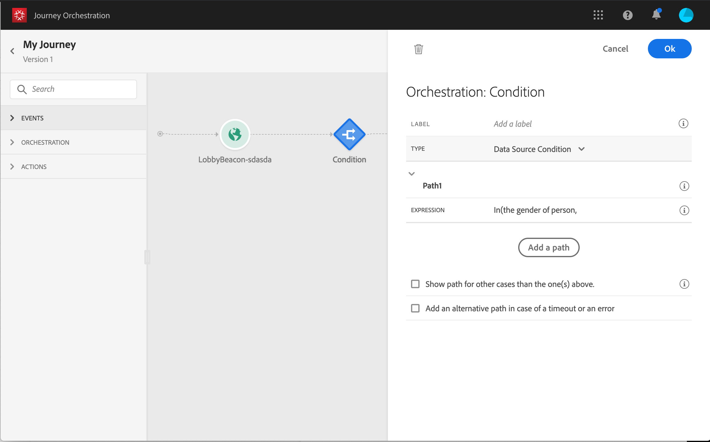

# 条件アクティビティ{#section_e2n_pft_dgb}

次の4種類の条件を使用できます。

* [データソースの条件](#data_source_condition)
* [時間条件](#time_condition)
* [分割された割合](#percentage_split)
* [日付条件](#date_condition)

## 条件アクティビティについて {#about_condition}

複数の条件 **** を定義する場合は、追加パスをクリックします。 条件ごとに、キャンバスのアクティビティの後に新しいパスが追加されます。

ジャーニーの設計は機能的な影響を及ぼすことに注意してください。 条件の後に複数のパスが定義された場合、最初の有効なパスのみが実行されます。 つまり、パスを重ね合わせるか、重ね合わせることで、パスの優先順位付けを変更できます。 例えば、最初のパスの条件が「The person is a VIP」で、2番目のパスの条件が「The person is a male」の場合、 この手順は、両方の条件を満たす人(VIPの男性)が通過した場合に、最初のパスが2番目のパスにも適格である場合でも選択されます。1番目のパスは「上」なのです。 この優先度を変更するには、アクティビティを別の垂直方向の順序に移動します。

上記以外の場合に対して「パスを **[!UICONTROL 表示]**」をオンにすると、定義した条件に該当しないオーディエンスに対して別のパスを作成できます。 このオプションは、分割条件では使用できません。 「 [割合の分割](#percentage_split)」を参照してください。

シンプルモードでは、フィールドの組み合わせに基づいて単純なクエリを実行できます。 使用可能なすべてのフィールドが画面の左側に表示されます。 フィールドをメインゾーンにドラッグ&amp;ドロップします。 異なる要素を組み合わせるには、それらを互いに連動させて異なるグループやグループレベルを作成します。 次に、論理演算子を選択して、同じレベルの要素を組み合わせることができます。

* AND: 2つの条件の交点。 すべての条件に一致する要素のみが考慮されます。
* OR: 2つの基準の和集合。 2つの条件の少なくとも1つに一致する要素が考慮されます。

Segmentation Service [Adobe Experience Platformを使用してセグメントを作成する場合](https://docs.adobe.com/content/help/en/experience-platform/segmentation/home.html) 、セグメントを旅の条件で活用できます。 「条件でのセグメントの [使用](../segment/using-a-segment.md)」を参照してください。

>[!NOTE]
>
>単純なエディターでは、時系列(購入のリスト、メッセージの過去のクリックなど)に対してクエリを実行できません。 このためには、高度なエディタを使用する必要があります。 を参照してください。

アクションまたは条件でエラーが発生すると、個々のエラーの移動が停止します。 この処理を続行する唯一の方法は、タイムアウトやエラーが発生した場合 **[!UICONTROL に別の追加パスをチェックボックスにチェックを付けることで]**&#x200B;す。 を参照してください。

## Data Source condition {#data_source_condition}

これにより、データソースのフィールドや、以前に遍歴内に配置したイベントに基づいて条件を定義できます。 式エディタの使用方法については、を参照してくだ さい。 アドバンス式エディターを使用すると、コレクションを操作する、またはパラメーターを渡す必要があるデータソースを使用する、より高度な条件を設定できます。 を参照してください。

## Time condition{#time_condition}

これにより、時間帯や曜日に応じて異なるアクションを実行できます。 例えば、日中にSMSメッセージを送信し、平日の夜に電子メールを送信するように指定できます。

>[!NOTE]
>
>タイムゾーンは、条件に固有のものではなくなり、ジャーニープロパティのジャーニーレベルで定義されるようになりました。 を参照してください。

## 分割された割合 {#percentage_split}

このオプションを使用すると、オーディエンスをランダムに分割して、グループごとに異なるアクションを定義できます。 各パスの分割数と再分割数を定義します。 分割計算は統計的なもので、このアクティビティの旅行に何人の人が流れるかを予測できません。 その結果、分割のエラーマージンは非常に低くなります。 この関数は、Javaのランダムメカニズムに基づいています(この [ページを参照](https://docs.oracle.com/javase/7/docs/api/java/util/Random.html))。

>[!NOTE]
>
>パーセンテージ分割条件では、パスを追加するボタンはありません。 パスの数は、分割数によって異なります。 分割条件では、他のケースではパスは発生しないので、パスを追加できません。 ユーザーは常に、分割されたパスの1つに入ります。

## Date condition {#date_condition}

これにより、日付に基づいて異なるフローを定義できます。 例えば、「sales」期間中にステップに入ったユーザーには、特定のメッセージが送信されます。 残りの年は、別のメッセージを送ります。

>[!NOTE]
>
>タイムゾーンは、条件に固有のものではなくなり、ジャーニープロパティのジャーニーレベルで定義されるようになりました。 を参照してください。

