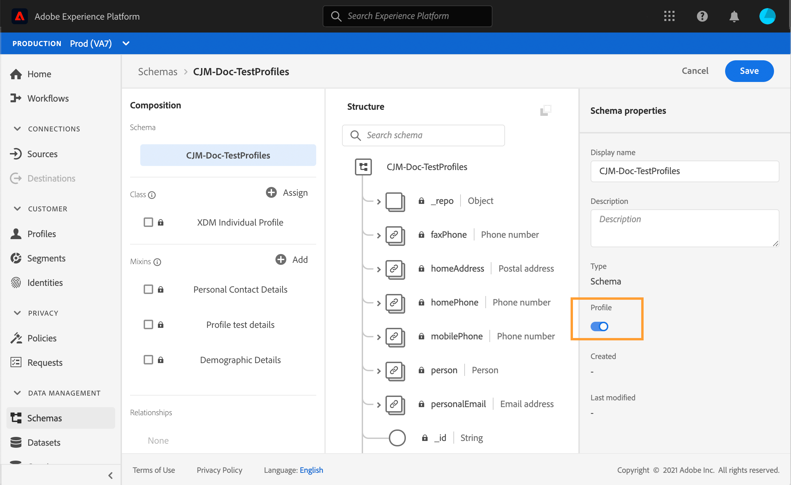

# テストプロファイルを作成{#create-test-profiles}

テストプロファイルは、ジャーニーでテストモードを使用する場合に必要です。 テストモードの使い方については、[この](../building-journeys/testing-the-journey.md)を参照してください。

Adobe Experience Platformでテストプロファイルを作成するには、様々な方法があります。 このドキュメントでは、次の2つの方法に焦点を当てます。[csvファイル](../building-journeys/creating-test-profiles.md#create-test-profiles-csv)をアップロードし、[APIを使用して](../building-journeys/creating-test-profiles.md#create-test-profiles-api)を呼び出します。 また、データセットにjsonファイルをアップロードすることもできます。[データ収集ドキュメント](https://experienceleague.adobe.com/docs/experience-platform/ingestion/tutorials/ingest-batch-data.html#add-data-to-dataset)を参照してください。

これらの読み込み方法を使用して、プロファイル属性を更新することもできます。 これにより、既存のプロファイルをテストプロファイルに変換できます。 同様のファイルまたはAPI呼び出しを使用し、「testProfile」フィールドの値を「true」にするだけで済みます。

テストプロファイルの作成は、Adobe Experience Platformで正規プロファイルを作成するのと似ています。 詳しくは、[リアルタイム顧客プロファイルドキュメント](https://experienceleague.adobe.com/docs/experience-platform/profile/home.html)を参照してください。

## 前提条件{#test-profile-prerequisites}

プロファイルを作成するには、まずAdobe Experience Platformでスキーマとデータセットを作成する必要があります。

まず、**スキーマ**&#x200B;を作成する必要があります。 次の手順に従います。

1. Adobe Experience Platformで、左のメニューの&#x200B;**スキーマ**をクリックします。
   
1. 右上の「**スキーマを作成**」をクリックし、スキーマの種類を選択します(例：**XDM個別プロファイル**)。
   
1. スキーマの名前を選択します。
1. 「**ミックスイン**」セクションで、「**追加**」をクリックします。
   
1. 適切なミックスインを選択します。 **プロファイルテストの詳細**&#x200B;ミックスインを追加してください。 **ミックスイン追加**をクリックします。
   
ミックスインのリストは、スキーマの概要画面に表示されます。

   
1. フィールドのリストで、主IDとして定義するフィールドをクリックします。
   
1. **フィールドのプロパティ**&#x200B;右パネルで、**ID**&#x200B;および&#x200B;**プライマリID**&#x200B;オプションを確認し、名前空間を選択します。 プライマリIDを電子メールアドレスにする場合は、**電子メール**&#x200B;名前空間を選択します。 「**適用**」をクリックします。
   
1. スキーマを選択し、**スキーマのプロパティ**&#x200B;で&#x200B;**プロファイル**オプションを有効にします。
   
1. 「**保存**」をクリックします。

>[!NOTE]
>
>スキーマの作成について詳しくは、[XDMドキュメント](https://experienceleague.adobe.com/docs/experience-platform/xdm/ui/resources/schemas.html#prerequisites)を参照してください。

次に、プロファイルを読み込むデータセット&#x200B;**を**&#x200B;作成する必要があります。 次の手順に従います。

1. Adobe Experience Platformで、左のメニューで「**データセット**」をクリックし、「**データセットを作成**」をクリックします。
   
1. 「**スキーマからデータセットを作成**」を選択します。
   
1. 以前に作成したスキーマを選択し、「**次へ**」をクリックします。
   
1. 名前を選択し、**完了**をクリックします。
   
1. **プロファイル**オプションを有効にします。
   

>[!NOTE]
>
> データセットの作成について詳しくは、[カタログサービスのドキュメント](https://experienceleague.adobe.com/docs/experience-platform/catalog/datasets/user-guide.html#getting-started)を参照してください。

## CSVファイルを使用したテストプロファイルの作成{#create-test-profiles-csv}

Adobe Experience Platformでは、様々なプロファイルフィールドを含むCSVファイルをプロファイルセットにアップロードして、を作成できます。 これが最も簡単な方法です。

1. スプレッドシートソフトウェアを使用して、単純なCSVファイルを作成します。
1. 必要な各フィ追加ールドに対して1列。 主IDフィールド（上記の例では「personID」）と「testProfile」フィールドを「true」に設定して追加します。
   
1. プロファイルご追加とに1行を入力し、各フィールドの値を入力します。
   
1. スプレッドシートをCSVファイルとして保存します。 カンマが区切り文字として使用されていることを確認します。
1. Adobe Experience Platformで、左のメニューの&#x200B;**ワークフロー**をクリックします。
   
1. 「**CSVをXDMスキーマにマップ**」を選択し、「****を起動」をクリックします。
   
1. プロファイルの読み込み先のデータセットを選択します。 「**次へ**」をクリックします。
   
1. 「**ファイルを選択**」をクリックし、csvファイルを選択します。 ファイルをアップロードしたら、「**次へ**」をクリックします。
   
1. ソースcsvフィールドをスキーマフィールドにマップし、「**完了**」をクリックします。
   
1. データのインポートが開始されます。 ステータスが&#x200B;**処理**&#x200B;から&#x200B;**成功**&#x200B;に変わります。 右上の&#x200B;**プレビューデータセット**をクリックします。
   
1. テストプロファイルが正しく追加されていることを確認します。
   

テストプロファイルが追加され、ジャーニーをテストする際に使用できるようになりました。 [こちらの節](../building-journeys/testing-the-journey.md)を参照してください。
>[!NOTE]
>
> CSVのインポートについて詳しくは、[データ収集ドキュメント](https://experienceleague.adobe.com/docs/experience-platform/ingestion/tutorials/map-a-csv-file.html#tutorials)を参照してください。

## API呼び出しを使用したテストプロファイルの作成{#create-test-profiles-api}

また、API呼び出しを使用してテストプロファイルを作成することもできます。 この[ページ](https://docs.adobe.com/content/help/ja-JP/experience-platform/profile/home.html)を参照してください。

「プロファイルテストの詳細」ミックスインが含まれるプロファイルスキーマを使用する必要があります。 testProfileフラグは、このmixinの一部です。

プロファイルを作成する場合は、次の値を渡す必要があります。testProfile = true。

既存のプロファイルを更新して、testProfileフラグを「true」に変更することもできます。

テストプロファイルを作成するためのAPI呼び出しの例を以下に示します。

```
curl -X POST \
'https://dcs.adobedc.net/collection/xxxxxxxxxxxxxx' \
-H 'Cache-Control: no-cache' \
-H 'Content-Type: application/json' \
-H 'Postman-Token: xxxxx' \
-H 'cache-control: no-cache' \
-H 'x-api-key: xxxxx' \
-H 'x-gw-ims-org-id: xxxxx' \
-d '{
"header": {
"msgType": "xdmEntityCreate",
"msgId": "xxxxx",
"msgVersion": "xxxxx",
"xactionid":"xxxxx",
"datasetId": "xxxxx",
"imsOrgId": "xxxxx",
"source": {
"name": "Postman"
},
"schemaRef": {
"id": "https://example.adobe.com/mobile/schemas/xxxxx",
"contentType": "application/vnd.adobe.xed-full+json;version=1"
}
},
"body": {
"xdmMeta": {
"schemaRef": {
"contentType": "application/vnd.adobe.xed-full+json;version=1"
}
},
"xdmEntity": {
"_id": "xxxxx",
"_mobile":{
"ECID": "xxxxx"
},
"testProfile":true
}
}
}'
```

