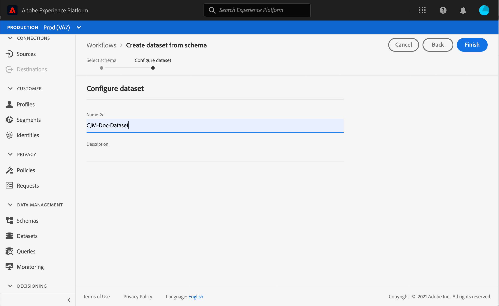
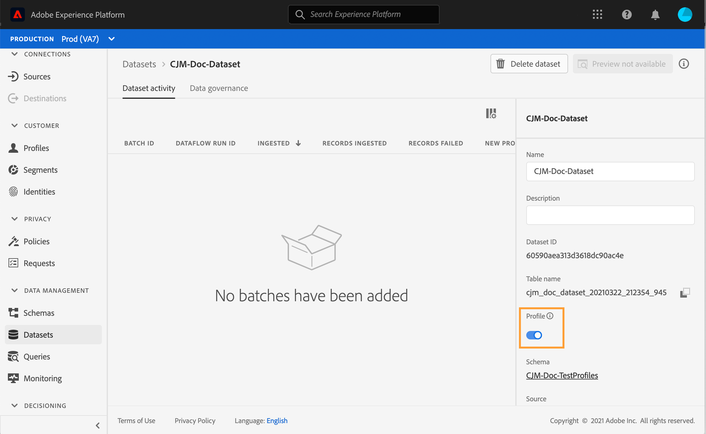

# テストプロファイルの作成 {#create-test-profiles}

ジャーニーでテストモードを使用する場合は、テストプロファイルが必要です。テストモードの使用方法については、[この節](../building-journeys/testing-the-journey.md)を参照してください。

Adobe Experience Platform でテストプロファイルを作成するには、様々な方法があります。このドキュメントでは、[CSV ファイル](../building-journeys/creating-test-profiles.md#create-test-profiles-csv)のアップロードと [API 呼び出し](../building-journeys/creating-test-profiles.md#create-test-profiles-api)の使用の 2 とおりの方法を重点的に説明します。また、データセットに JSON ファイルをアップロードすることもできます。[データ取り込みのドキュメント](https://experienceleague.adobe.com/docs/experience-platform/ingestion/tutorials/ingest-batch-data.html?lang=ja#add-data-to-dataset)を参照してください。

これらの読み込み方法では、プロファイル属性を更新することもできます。 この方法で、既存のプロファイルをテストプロファイルに変換できます。 同様のファイルまたは API 呼び出しを使用し、「testProfile」フィールドの値を「true」にするだけです。

テストプロファイルの作成は、Adobe Experience Platform で通常のプロファイルを作成する場合と似ています。詳しくは、[リアルタイム顧客プロファイルのドキュメント](https://experienceleague.adobe.com/docs/experience-platform/profile/home.html?lang=ja)を参照してください。

## 前提条件{#test-profile-prerequisites}

プロファイルを作成するには、まず Adobe Experience Platform でスキーマとデータセットを作成する必要があります。

まず、**スキーマを作成**&#x200B;する必要があります。次の手順に従います。

1. Adobe Experience Platform で、左メニューの「**[!UICONTROL スキーマ]**」をクリックします。
   
1. 右上の「**[!UICONTROL スキーマを作成]**」をクリックして、スキーマの種類を選択します（例：**[!UICONTROL XDM 個人プロファイル]**）。
   
1. スキーマの名前を選択します。
1. 「**[!UICONTROL Mixin]**」セクションで、「**[!UICONTROL 追加]**」をクリックします。
   
1. 適切な Mixin を選択します。「**[!UICONTROL プロファイルテストの詳細]**」Mixin を必ず追加してください。「**[!UICONTROL Mixin を追加]**」をクリックします。
   
Mixin のリストは、スキーマの概要画面に表示されます。

   
1. フィールドのリストで、プライマリ ID として定義するフィールドをクリックします。
   
1. 右の&#x200B;**[!UICONTROL フィールドのプロパティ]**&#x200B;ペインで、「**[!UICONTROL ID]**」オプションと「**[!UICONTROL プライマリ ID]**」オプションをオンにし、名前空間を選択します。メールアドレスをプライマリ ID にする場合は、「**[!UICONTROL メール]**」名前空間を選択します。「**[!UICONTROL 適用]**」をクリックします。
   
1. スキーマを選択し、**[!UICONTROL スキーマのプロパティ]**&#x200B;で「**[!UICONTROL プロファイル]**」オプションを有効にします。
   
1. 「**[!UICONTROL 保存]**」をクリックします。

>[!NOTE]
>
>スキーマ作成の詳細については、[XDM のドキュメント](https://experienceleague.adobe.com/docs/experience-platform/xdm/ui/resources/schemas.html?lang=ja#prerequisites)を参照してください。

次に、プロファイルのインポート先となる&#x200B;**データセットを作成**&#x200B;する必要があります。次の手順に従います。

1. Adobe Experience Platform で、左メニューの「**[!UICONTROL データセット]**」をクリックし、次に「**[!UICONTROL データセットを作成]**」をクリックします。
   
1. 「**[!UICONTROL スキーマからデータセットを作成]**」を選択します。
   
1. 作成済みのスキーマを選択し、「**[!UICONTROL 次へ]**」をクリックします。
   
1. 名前を選択し、「**[!UICONTROL 終了]**」をクリックします。
   
1. 「**[!UICONTROL プロファイル]**」オプションを有効にします。
   

>[!NOTE]
>
> データセットの作成について詳しくは、[カタログサービスのドキュメント](https://experienceleague.adobe.com/docs/experience-platform/catalog/datasets/user-guide.html?lang=ja#getting-started)を参照してください。

## CSV ファイルを使用したテストプロファイルの作成 {#create-test-profiles-csv}

Adobe Experience Platform では、様々なプロファイルフィールドを含む CSV ファイルをデータセットにアップロードして、プロファイルを作成できます。これが最も簡単なメソッドです。

1. スプレッドシートソフトウェアを使用して、単純な CSV ファイルを作成します。
1. 必要な各フィールドごとに 1 列ずつ追加しますプライマリ ID フィールド（上記の例では「personID」）を追加し、「testProfile」フィールドを「true」に設定するようにしてください。
   
1. プロファイルごとに 1 行追加し、各フィールドの値を入力します。
   
1. スプレッドシートを CSV ファイルとして保存します。カンマが区切り文字として使用されていることを確認します。
1. Adobe Experience Platform で、左のメニューの「**[!UICONTROL ワークフロー]**」をクリックします。
   
1. 「**[!UICONTROL CSV を XDM スキーマにマッピング]**」を選択し、「**[!UICONTROL 開始]**」をクリックします。
   
1. プロファイルの読み込み先となるデータセットを選択します。「**[!UICONTROL 次へ]**」をクリックします。
   
1. 「**[!UICONTROL ファイルを選択]**」をクリックし、csv ファイルを選択します。ファイルをアップロードしたら、「**[!UICONTROL 次へ]**」をクリックします。
   
1. ソース csv フィールドをスキーマフィールドにマッピングし、「**[!UICONTROL 終了]**」をクリックします。
   
1. データの読み込みが開始します。ステータスが「**[!UICONTROL 処理中]**」から「**[!UICONTROL 成功]**」に変わります。右上の「**[!UICONTROL データセットのプレビュー]**」をクリックします。
   
1. テストプロファイルが正しく追加されていることを確認します。
   

テストプロファイルが追加され、ジャーニーのテストで使用できるようになりました。[この節](../building-journeys/testing-the-journey.md)を参照してください。
>[!NOTE]
>
> CSV の読み込みについて詳しくは、[データ取り込みドキュメント](https://experienceleague.adobe.com/docs/experience-platform/ingestion/tutorials/map-a-csv-file.html?lang=ja#tutorials)を参照してください。

## API 呼び出しを使用したテストプロファイルの作成 {#create-test-profiles-api}

また、API 呼び出しを使用してテストプロファイルを作成することもできます。この[ページ](https://experienceleague.adobe.com/docs/experience-platform/profile/home.html?lang=ja)を参照してください。

「プロファイルテストの詳細」Mixin を含むプロファイルスキーマを使用する必要があります。testProfile フラグは、この Mixin の一部です。

プロファイルを作成する場合は、次の値を渡す必要があります：testProfile = true

既存のプロファイルを更新して、testProfile フラグを「true」に変更することもできます。

テストプロファイルを作成するための API 呼び出しの例を以下に示します。

```
curl -X POST \
'https://dcs.adobedc.net/collection/xxxxxxxxxxxxxx' \
-H 'Cache-Control: no-cache' \
-H 'Content-Type: application/json' \
-H 'Postman-Token: xxxxx' \
-H 'cache-control: no-cache' \
-H 'x-api-key: xxxxx' \
-H 'x-gw-ims-org-id: xxxxx' \
-d '{
"header": {
"msgType": "xdmEntityCreate",
"msgId": "xxxxx",
"msgVersion": "xxxxx",
"xactionid":"xxxxx",
"datasetId": "xxxxx",
"imsOrgId": "xxxxx",
"source": {
"name": "Postman"
},
"schemaRef": {
"id": "https://example.adobe.com/mobile/schemas/xxxxx",
"contentType": "application/vnd.adobe.xed-full+json;version=1"
}
},
"body": {
"xdmMeta": {
"schemaRef": {
"contentType": "application/vnd.adobe.xed-full+json;version=1"
}
},
"xdmEntity": {
"_id": "xxxxx",
"_mobile":{
"ECID": "xxxxx"
},
"testProfile":true
}
}
}'
```
