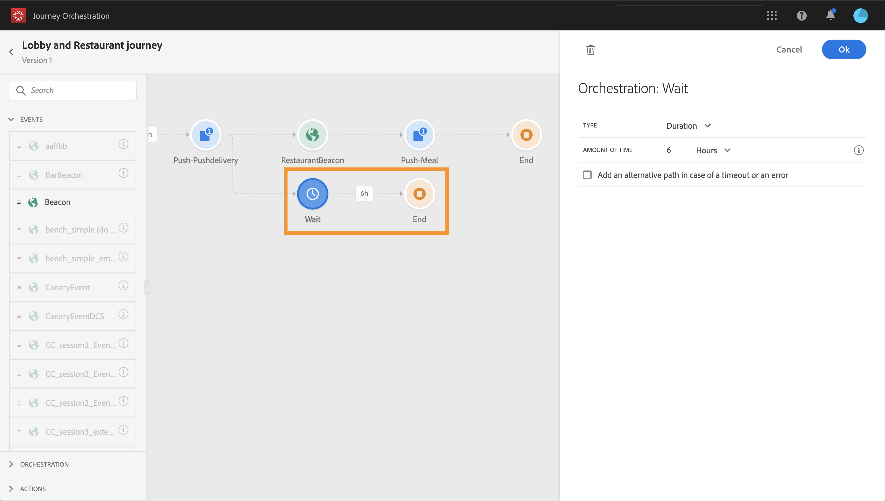

# イベントアクティビティ {#concept_rws_1rt_52b}

技術ユーザーが設定するイベント（「 」を参照）  は、すべてパレットの最初のカテゴリの画面の左側に表示されます。

イベントアクティビティをドラッグ&amp;ドロップして、必ず旅を開始してください。 また、ダブルクリックすることもできます。

キャンバスでイベントアクティビティをクリックすると、アクティビティ設定ペインが表示されます。 デフォルトでは、同じイベントを複数回使用すると、キャンバスのイベント名に増分番号が追加されます。 さらに、このフィールドを使用して、 **[!UICONTROL Label]**キャンバスのアクティビティの下に表示されるイベント名にサフィックスを追加することもできます。 これは、特に同じイベントを複数回使用する場合に、キャンバス内のイベントを識別するのに役立ちます。 また、エラーが発生した場合のデバッグが容易になり、レポートが読みやすくなります。

## 一般イベント {#section_ofg_jss_dgb}

このタイプのイベントでは、ラベルと説明のみを追加できます。 残りの設定は編集できません。 これは技術ユーザーが実行しました。 を参照してください。

## 反応イベント {#section_dhx_gss_dgb}

パレットで使用できる様々なイベントアクティビティの中には、組み込みの **Reactions** イベントがあります。 このアクティビティにより、電子メール、SMS、または同じ遍歴内のプッシュアクティビティと共に送信されるメッセージに関連するデータの追跡に対応できます。 この情報は、Adobe Campaign Standardのトランザクションメッセージングに基づいています。 この情報は、データプラットフォームと共有された時点でリアルタイムに取得されます。 プッシュ通知の場合、クリック、送信または失敗したメッセージに反応できます。 SMSメッセージの場合は、送信されたメッセージや失敗したメッセージに対して対応できます。 電子メールの場合は、クリック、送信、開いた、または失敗したメッセージに反応できます。

このメカニズムを使用して、メッセージに反応がない場合にアクションを実行することもできます。 これを行うには、反応アクティビティに平行な2番目のパスを作成し、待機アクティビティを追加します。 待機アクティビティで定義された期間中に反応がない場合は、2番目のパスが選択されます。 例えば、フォローアップメッセージを送信するように選択できます。

キャンバスに電子メール、プッシュ、またはSMSアクティビティがある場合は、その前にリアクションアクティビティを使用する必要があります。

を参照してください。

反応イベントを設定する様々な手順を次に示します。

1. 反応にを **[!UICONTROL Label]**追加します。 この手順はオプションです。
1. ドロップダウンリストから、反応させるアクションアクティビティを選択します。 パスの前の手順に配置された任意のアクションアクティビティを選択できます。
1. 選択した操作（電子メール、SMS、またはプッシュ通知）に応じて、反応を選択します。
1. 条件はオプションの手順として定義できます。 例えば、電子メールアクションの後に、2つのパスを作成できます。1つはリアクションイベントで、1つはVIP顧客のクリックのみを追跡し、もう1つは女性が実行したクリックを追跡するリアクションイベントです。

>[!NOTE]
>
>リアクションイベントは、異なる遍歴で発生した電子メール、SMS、またはプッシュアクションを追跡できません。
>
>リアクションイベントは、「tracked」タイプのリンクのクリックを追跡します(このページ [を参照](https://docs.adobe.com/content/help/en/campaign-standard/using/designing-content/links.html#about-tracked-urls))。 購読解除とミラーページのリンクは考慮されません。

>[!CAUTION]
>
>Gmailなどの電子メールクライアントは画像のブロックを許可します。 電子メールの開封は、電子メールに含まれる0ピクセルの画像を使用して追跡されます。 画像がブロックされている場合、電子メールの開封は考慮されません。

## 高度な使用方法：並行して待機するイベント{#section_vxv_h25_pgb}

**イベントを一定の時間のみリッスンするにはどうしたらよいですか。**

この遍歴に配置されるイベントアクティビティは、イベントを無限にリッスンします。 特定の時間内にのみイベントをリッスンするには、イベントパスに並行して待機アクティビティを追加する必要があります。 次に、この遍歴は、待機アクティビティで指定された時間内にイベントをリッスンします。 その期間にイベントを受け取った場合、その人はイベントパスをフローします。 そうでない場合は、顧客は待機パスにフローします。

例えば、最初のお客様にウェルカムプッシュを送信し、その後6時間以内にお客様がレストランに入った場合にのみ食事割引プッシュを送信するとします。 これを行うには、6時間の待機アクティビティを持つ2つ目のパス（レストランのイベント1と平行）を作成します。 レストランイベントがウェルカムプッシュから6時間未満で受け取られた場合は、食事割引プッシュアクティビティが送信されます。 次の6時間以内にレストランのイベントが受け取られない場合、その人は待機パスを流れます。

