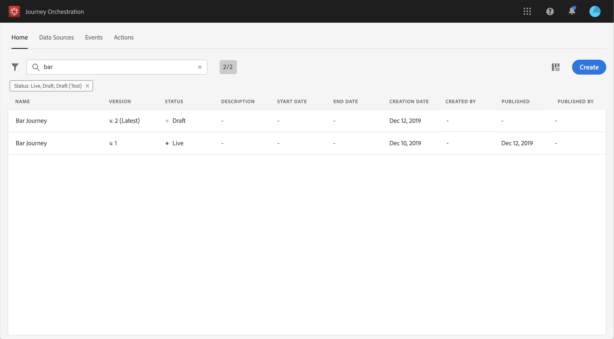

# ジャーニーのバージョン{#concept_ldc_k55_zgb}

ジャーニーリストでは、すべてのジャーニーバージョンがバージョン番号と共に表示されます。 [このページ](../building-journeys/using-the-journey-designer.md)を参照してください。旅行を検索する場合、アプリを初めて開くと、最新バージョンがリストの先頭に表示されます。 次に、必要な並べ替えを定義します。これにより、アプリケーションはその並べ替えをユーザーの好みに合わせて行います。 このジャーニーのバージョンは、ジャーニーエディションのインターフェイスの上部のキャンバスの上にも表示されます。

ライブジャーニーに変更を加える必要がある場合は、新しいバージョンの旅を作成する必要があります。

>[!NOTE]
>
>ジャーニーバージョンの制限について詳しくは、 [このページを参照してください](../about/limitations.md#journey-versions-limitations)

1. ライブジャーニーの最新バージョンを開き、「新しいバージョンを **[!UICONTROL 作成]** 」をクリックして確認します。

   

   >[!NOTE]
   >
   >新しいバージョンは、ジャーニーの最新バージョンからのみ作成できます。

1. 変更を行うには、「 **[!UICONTROL 発行]** 」をクリックして確認します。

   

この旅行が出版されると、個人は開始を持って最新版の旅に出る。 以前のバージョンに既に入力したユーザーは、そのバージョンを終えるまでそのまま残ります。 後で同じ遍歴を再び記録した場合は、最新版に移行します。

ジャーニーバージョンは個別に停止できます。 ジャーニーのバージョンはすべて同じ名前です。

>[!NOTE]
>
>When you publish a new version of a journey, the previous version automatically ends and switches to the **Closed** status. 旅に出るのは無理だ。 最新バージョンを停止しても、以前のバージョンは閉じたままとなります。
