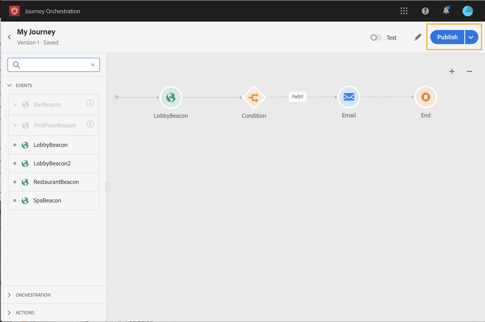

# ジャーニーの作成 {#concept_gq5_sqt_52b}

この手順は、**ビジネスユーザー**&#x200B;が実行します。 ここでジャーニーを作成します。 様々なイベント、オーケストレーション、アクションアクティビティを組み合わせて、複数手順のクロスチャネルシナリオを構築します。

ジャーニーインターフェイスを使用すると、アクティビティをパレットからキャンバスに簡単にドラッグ&amp;ドロップできます。 また、アクティビティを重複クリックして、次のステップでキャンバスに追加することもできます。 各アクティビティは、プロセス内の特定の役割と場所を持ちます。 アクティビティが順番に並べられます。 アクティビティが完了すると、フローは続行され、次のアクティビティなどを処理します。

1つのジャーニーで許可される名前空間は1つだけです。 最初のイベントをドロップすると、異なる名前空間を持つイベントは灰色表示になります。 最初のイベントに名前空間がない場合は、名前空間を含むすべてのイベントが灰色表示になります。 [このページ](../event/selecting-the-namespace.md)を参照してください。また、ジャーニーに名前空間のないイベントが含まれる場合、Adobe Experience Platformのフィールドグループは灰色表示になります。 最後に、同じジャーニーで複数のイベントを使用する場合は、同じ名前空間を使用する必要があります。

新しいジャーニーを開始すると、最初の手順としてキャンバスにドロップできない要素は非表示になります。 これは、すべてのアクション、条件のアクティビティ、待機、反応が対象です。

## クイックスタート {#creating_journey}

ジャーニーを作成して公開する主な手順は次のとおりです。

1. 上部のメニューで、「**[!UICONTROL ホーム]**」タブをクリックします。

   ジャーニーのリストが表示されます。 インターフェイスの詳細は、[このページ](../building-journeys/using-the-journey-designer.md)を参照してください。

   

1. 「**[!UICONTROL 作成]**」をクリックして、新しいジャーニーを作成します。

   

1. 右側に表示される設定ペインで、ジャーニーのプロパティを編集します。[このページ](../building-journeys/changing-properties.md)を参照してください。

   

1. イベントアクティビティをパレットからカンバスにドラッグ&amp;ドロップして開始します。 アクティビティを重複クリックしてキャンバスに追加することもできます。

   

1. その他のアクティビティをドラッグ&amp;ドロップして設定します。 [イベントアクティビティ](../building-journeys/event-activities.md)、[オーケストレーションアクティビティ](../building-journeys/about-orchestration-activities.md)、[アクションアクティビティ](../building-journeys/about-action-activities.md)の各ページを参照してください。

   

1. ジャーニーが自動的に保存されます。 ジャーニーをテストして公開します。 [ジャーニーのテスト](../building-journeys/testing-the-journey.md)と[ジャーニーの公開](../building-journeys/publishing-the-journey.md)を参照してください。

   

## ジャーニーの終了{#ending_a_journey}

個人のジャーニーは、次の2つの理由で終了する可能性があります。

* その人は道の最後のアクティビティに着く。 最後のアクティビティは、エンドアクティビティまたは別のアクティビティにすることができます。 エンドアクティビティでパスを終了する義務はありません。 [このページ](../building-journeys/end-activity.md)を参照してください。
* 訪問者は、条件アクティビティ(または条件を含む待機アクティビティ)に到達し、どの条件とも一致しません。

再入場が許可された場合は、ジャーニーに再入場できます。 [このページ](../building-journeys/changing-properties.md)を参照してください。

次の理由で、ジャーニーを閉じることができます。

* ジャーニーは、「**[!UICONTROL 新しい参加者に閉じる]**」ボタンを使用して手動で閉じます。
* ジャーニーの終了日に達しました。

ジャーニーが閉じられた場合（上記の理由のいずれかにより）、ステータスは&#x200B;**[!UICONTROL 閉じられた（入り口なし）]**&#x200B;になります。 新規エントリは停止されますが、既にジャーニーの中にいる人は、通常通りにジャーニーを完了することができます。デフォルトのグローバルタイムアウト30日後、ジャーニーは&#x200B;**完了**&#x200B;ステータスに切り替わります。 [こちら](../building-journeys/changing-properties.md#entrance)を参照してください。

ジャーニー内のすべての個人の進行を停止する必要がある場合は、それを停止できます。 ジャーニーを停止すると、ジャーニー内のすべての個人がタイムアウトになります。

ジャーニーを手動で閉じたり停止したりする方法については、を参照してください。
