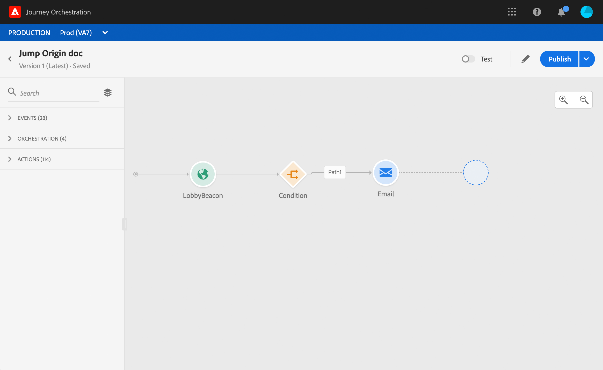

# ある旅から別の旅へジャンプする{#jump}

**[!UICONTROL ジャンプ]**&#x200B;アクションアクティビティを使用すると、個々の人を別のジャーニーに移動できます。 この機能を使用すると、次のことができます。

* 非常に複雑な旅行を複数の旅行に分けて設計を簡素化する
* 一般的で再利用可能な遍歴パターンに基づいてジャーニーを構築する

接触チャネルの遍歴では、**[!UICONTROL ジャンプ]**&#x200B;アクティビティを追加し、ターゲットの遍歴を選択します。 個人が&#x200B;**[!UICONTROL ジャンプ]**&#x200B;ステップに入ると、内部イベントがターゲットの遍歴の最初のイベントに送られます。 **[!UICONTROL ジャンプ]**&#x200B;アクションが成功した場合、個々のアクションは進行を続けます。 動作は他のアクションと同様です。

ターゲットの遍歴では、**[!UICONTROL Jump]**&#x200B;アクティビティが内部的にトリガーした最初のイベントが個々の流れをその旅に作り出します。

## ライフサイクル

例えば、Aの旅の中に&#x200B;**[!UICONTROL ジャンプ]**&#x200B;アクティビティをBの旅に追加したとします。ジャーニーAは&#x200B;**接触チャネルの旅**&#x200B;で、旅Bは&#x200B;**ターゲットの旅**です。
実行プロセスの様々な手順を次に示します。

**外部イベントからトリガーされたジャーニー** アイズ：

1. ジャーニーAは、個人に関連する外部イベントを受信する。
1. 個人が&#x200B;**[!UICONTROL ジャンプ]**&#x200B;ステップに到達します。
1. 個人はジャーニーBに押され、**[!UICONTROL ジャンプ]**&#x200B;のステップの後、ジャーニーAの次のステップに進みます。

ジャーニーBでは、最初のイベントが内部的にトリガーされ、ジャーニーAの&#x200B;**[!UICONTROL Jump]**&#x200B;アクティビティを介します。

1. ジャーニーBは、ジャーニーAから内部イベントを受け取りました。
1. 旅Bに流れる個々の開始。

>[!NOTE]
>
>ジャーニーBは、外部イベントを介してトリガーすることもできます。

## ベストプラクティスと制限事項

### オーサリング

* **[!UICONTROL Jump]**&#x200B;アクティビティは、名前空間を使用するジャーニーでのみ利用できます。
* 接触チャネルの遍歴と同じ名前空間を使った旅にジャンプすることしかできません。
* **セグメントクオリフィケーション**&#x200B;イベントを持つ開始が行う遍歴にジャンプすることはできません。
* 同じ遍歴に&#x200B;**[!UICONTROL ジャンプ]**&#x200B;アクティビティと&#x200B;**セグメントクオリフィケーション**&#x200B;イベントを持つことはできません。
* ジャーニーに必要な数の&#x200B;**[!UICONTROL ジャンプ]**&#x200B;アクティビティを含めることができます。 **[!UICONTROL ジャンプ]**&#x200B;の後に、必要なアクティビティを追加できます。
* 必要な数だけジャンプレベルを設定できます。 例えば、ジャーニーAはBの旅にジャンプし、Cの旅にジャンプします。
* ターゲットの遍歴には、必要に応じて&#x200B;**[!UICONTROL ジャンプ]**&#x200B;アクティビティも含めることができます。
* ループパターンはサポートされていません。 2つ以上のジャーニーをリンクして無限ループを作る方法はありません。 **[!UICONTROL ジャンプ]**&#x200B;アクティビティ設定画面では、この操作はできません。

### 「EXECUTION」タブ

* **[!UICONTROL Jump]**&#x200B;アクティビティが実行されると、ターゲットの遍歴の最新バージョンがトリガされます。
* いつものように、ユニークな個人は1回だけ同じ旅に出ることができます。 その結果、接触チャネルの遍歴から押し出された人が既にターゲットの旅に出ている場合、その人はターゲットの旅に出ません。 **[!UICONTROL Jump]**&#x200B;アクティビティは通常の動作なので、エラーは報告されません。

## ジャンプアクティビティの設定

1. **接触チャネルの遍歴**&#x200B;を設計します。

   

1. この旅の任意のステップで、**[!UICONTROL ACTIONS]**&#x200B;カテゴリから&#x200B;**[!UICONTROL Jump]**&#x200B;アクティビティを追加します。 追加ラベルと説明。

   

1. **ターゲットの遍歴**フィールド内をクリックします。
リストには、ドラフトモード、ライブモード、またはテストモードのすべてのジャーニーバージョンが表示されます。 別の名前空間または**セグメントクオリフィケーション**&#x200B;イベントを持つ開始を使用するジャーニーは使用できません。 ループパターンを作り出すターゲットジャーニーも除外されます。

   

   >[!NOTE]
   >
   >右側の&#x200B;**ターゲットの遍歴を開く**&#x200B;アイコンをクリックすると、新しいタブでターゲットの遍歴を開くことができます。

1. ジャンプ先のターゲットのジャーニーを選択します。
**「最初のイベント**」フィールドには、ターゲットの遍歴の最初のイベントの名前が事前に入力されています。 ターゲットの遍歴に複数のイベントが含まれる場合、**[!UICONTROL Jump]**&#x200B;は最初のイベントでのみ許可されます。

   

1. **アクションパラメーター**&#x200B;セクションには、ターゲットイベントのすべてのフィールドが表示されます。 他のタイプのアクションと同様に、各フィールドを接触チャネルイベントまたはデータソースのフィールドにマップします。 この情報は、実行時にターゲットの遍歴に渡されます。
1. 次のアクティビティ追加は、接触チャネルの遍歴を終えることです。

   

   >[!NOTE]
   >
   >個人のIDは自動的にマッピングされます。 この情報は、インターフェイスには表示されません。

**[!UICONTROL Jump]**&#x200B;アクティビティが構成されています。 ジャーニーがライブモードまたはテストモードになると、**[!UICONTROL ジャンプ]**&#x200B;ステップに到達した個人がターゲットの遍歴に追い出されます。

ジャーニーで&#x200B;**[!UICONTROL Jump]**&#x200B;アクティビティを設定すると、ターゲットの遍歴の最初に&#x200B;**[!UICONTROL Jump]**&#x200B;エントリアイコンが自動的に追加されます。 これは、**[!UICONTROL Jump]**&#x200B;アクティビティから内部的にもトリガーされる可能性があることを識別するのに役立ちます。

## トラブルシューティング

ジャーニーが公開されたとき、またはテストモードのとき、次の場合にエラーが発生します。
* ターゲットの旅はもはや存在しない
* ターゲットの旅行は、下書きであるか、閉じられているか、または停止している
* もしターゲットの旅の最初のイベントが変わり、マッピングが壊れたら

