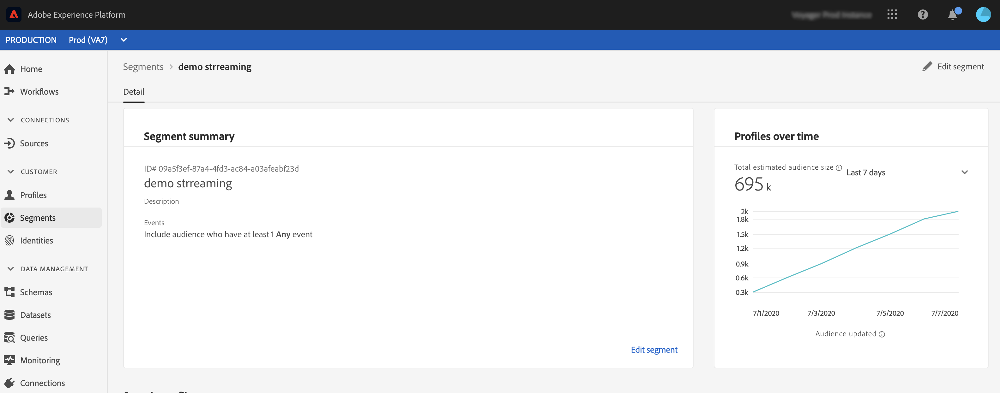

# セグメントの選定イベント {#segment-qualification}

>[!CAUTION]
>
>**Adobe Journey Optimizerをお探しですか** Journey Optimizerのドキュメントについては、[ こちら ](https://experienceleague.adobe.com/ja/docs/journey-optimizer/using/ajo-home){target="_blank"} をクリックしてください。
>
>
>_このドキュメントでは、Journey Optimizerに置き換えられた従来のJourney Orchestration マテリアルについて説明します。 Journey OrchestrationやJourney Optimizerへのアクセスに関するご質問は、アカウントチームにお問い合わせください。_

## セグメントの選定イベントについて{#about-segment-qualification}

セグメントの選定イベントを使用すると、ジャーニーは Adobe Experience Platform セグメントでプロファイルのエントリや離脱をリッスンして、ユーザーをジャーニーにエントリさせたり、ジャーニーを先に進ませたりできます。この機能について詳しくは、この[節](../segment/about-segments.md)を参照してください。

「シルバー顧客」セグメントがあるとします。このアクティビティを使用すると、新しいシルバーの顧客全員をジャーニーにエントリさせ、パーソナライズされた一連のメッセージを送ることができます。

このタイプのイベントは、ジャーニーの最初または後半に配置できます。

>[!IMPORTANT]
>
>Adobe Experience Platform セグメントは、1 日に 1 回（**バッチ**&#x200B;セグメント）、またはリアルタイム（**ストリーム**&#x200B;セグメント）で計算されます（Adobe Experience Platform の「高頻度のオーディエンス」オプションを使用）。
>
>選択したセグメントがストリーミングされると、このセグメントに属する個人がリアルタイムでジャーニーにエントリする可能性があります。セグメントがバッチの場合、新たにこのセグメントに選定された訪問者は、セグメントの計算がAdobe Experience Platformで実行されるとジャーニーにエントリする可能性があります。

1. **[!UICONTROL イベント]**&#x200B;カテゴリを展開し、**[!UICONTROL セグメントの選定]**&#x200B;アクティビティをキャンバスにドロップします。

   

1. アクティビティに&#x200B;**[!UICONTROL ラベル]**&#x200B;を追加します。この手順はオプションです。

1. 「**[!UICONTROL セグメント]**」フィールドをクリックし、活用するセグメントを選択します。

   >[!NOTE]
   >
   >リストに表示される列はカスタマイズして並べ替えることができます。

   

   セグメントが追加されると、「**[!UICONTROL コピー]**」ボタンを使用して、セグメントの名前と ID をコピーできます。

   `{"name":"Loyalty membership","id":"8597c5dc-70e3-4b05-8fb9-7e938f5c07a3"}`

   

1. 「**[!UICONTROL 動作]**」フィールドで、セグメントへのエントリ、離脱またはその両方をリッスンするかどうかを選択します。

   >[!NOTE]
   >
   >なお、**[!UICONTROL エントリ]**&#x200B;と&#x200B;**[!UICONTROL 離脱]**&#x200B;は、Adobe Experience Platform の&#x200B;**実現**&#x200B;と&#x200B;**離脱**&#x200B;のセグメント参加ステータスに対応します。セグメントの評価方法について詳しくは、[Segmentation Service ドキュメント](https://experienceleague.adobe.com/docs/experience-platform/segmentation/tutorials/evaluate-a-segment.html?lang=ja#interpret-segment-results)を参照してください。

1. 名前空間を選択します。これは、イベントがジャーニーの最初のステップとして位置付けられている場合にのみ必要です。

   

ペイロードには、条件とアクションで使用できる次のコンテキスト情報が含まれています。

* 行動（エントリ、離脱）
* 選定のタイムスタンプ
* セグメント ID。

**[!UICONTROL セグメントの選定]**&#x200B;アクティビティに続く条件またはアクションで式エディターを使用する場合、**[!UICONTROL SegmentQualification]** ノードにアクセスできます。**[!UICONTROL 前回の選定時間]**&#x200B;と&#x200B;**[!UICONTROL ステータス]**&#x200B;のどちらかを選択できます（エントリまたは離脱）。

[条件アクティビティ](../building-journeys/condition-activity.md#about_condition)を参照してください。

セグメントの選定イベントを含む新しいジャーニーは、公開してから 10 分後に運用を開始します。この時間間隔は、専用サービスのキャッシュ更新間隔に対応します。したがって、このジャーニーを使用する前に 10 分待つ必要があります。

## ベストプラクティス {#best-practices-segments}

**[!UICONTROL セグメントの選定]**&#x200B;アクティビティを使用すると、Adobe Experience Platform セグメントから選定された個人や選定されなかった個人を、直ちにジャーニーにエントリさせることができます。

この情報は瞬時に処理されます。測定した値は、1 秒あたり 10,000 件の速度でイベントを受信したことを示しています。その結果、エントリのピークがどのように発生するか、その回避方法やジャーニーの準備方法を理解する必要があります。

### バッチセグメント {#batch-speed-segment-qualification}

バッチセグメントでセグメントの選定を使用する場合、エントリのピークは毎日の計算時に発生することに注意してください。
ピークのサイズは、1 日にセグメントにエントリ（または離脱）する個人の数によって異なります。

また、バッチセグメントを新たに作成して即座にジャーニーで使用すると、最初のバッチの計算によって、非常に多くの人がジャーニーにエントリする可能性があります。

### ストリーミングセグメント {#streamed-speed-segment-qualification}

ストリーミングセグメントに対してセグメントの選定を使用すると、セグメントの継続的な評価により、エントリと離脱のピークが大きくなるリスクを軽減できます。ただし、セグメント定義によって大量の顧客を同時に選定すると、ピークも生じる可能性があります。

ストリーミングのセグメント化について詳しくは、この[ページ](https://experienceleague.adobe.com/docs/experience-platform/segmentation/api/streaming-segmentation.html?lang=ja#api)を参照してください。

### オーバーロードの回避方法 {#overloads-speed-segment-qualification}

ジャーニーで使用するシステム（データソース、カスタムアクション、Adobe Campaign Standardのアクション）の過負荷を回避するのに役立つ、いくつかのベストプラクティスを示します。

**[!UICONTROL セグメントの選定]**&#x200B;アクティビティでは、作成直後のバッチセグメントを使用しないでください。最初の計算のピークは回避されます。まだ計算されていないセグメントを使用しようとすると、ジャーニーキャンバスに黄色の警告が表示されます。

データソースとジャーニーで使用されるアクションのキャッピングルールを設定し、データソースの過負荷を回避します（を参照）。キャッピングルールには再試行がないことに注意してください。再試行が必要な場合は、条件やアクションで「**[!UICONTROL タイムアウトまたはエラーの場合に代替パスを追加]**」ボックスをオンにし、ジャーニーで代替パスを使用する必要があります。

実稼動ジャーニーでセグメントを使用する前には、必ず、このセグメントに選定された個人の数を評価してください。それには、Adobe Experience Platformの **[!UICONTROL セグメント]** セクションをチェックして、右側のグラフを確認します。

