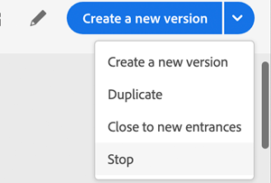

# ジャーニーの終了

「 **[!UICONTROL 停止]** 」および「新しい参加者に **[!UICONTROL 近い」オプションを使用すると、]** ライブジャーニーを終了できます **** 。 旅を終える **には、新規客の到着が阻止され** 、既に旅に出た客は最後まで経験できる。 これは、オファーが顧客にとって最高のエクスペリエンスとなる旅を終了させるのに最もお勧めの方法です。 旅を中止するには、既に旅に出た人はみな進行の途中で立ち止まります。 この旅は基本的にオフになっています

>[!NOTE]
>
>終了したジャーニーや停止したジャーニーは再開できません。

## 旅の終わり

遍歴を手動で閉じて、既に旅行に参加した顧客がパスを終了できるが、新しいユーザーが旅に出られないようにすることができます。

終了したジャーニーバージョンは、再開または削除できません。 新しいバージョンを作成するか、重複することができます。

旅のリストにある旅の上をカーソルで移動しながら、 **[!UICONTROL 新しい入り口に近い]** [閉じる]をクリックすると、旅を終えることができます。

また、次のこともできます。

1. ホ **[!UICONTROL ーム]**&#x200B;で、閉じるジャーニーをクリックします。
1. 右上の下向き矢印をクリックします。

   

1. Click **[!UICONTROL Close to new entrances]**. ダイアログボックスが表示されます。
1. 「新規参加者に **[!UICONTROL 閉じる]** 」をクリックして確認します。

## 旅行の中止

緊急事態が発生した場合、すべての処理をジャーニーで直ちに終了する必要がある場合は、ジャーニーを停止できます。

停止したジャーニーバージョンは再開できません。

ジャーニーのリストの旅の上にマウスポインターを置いて「 **[!UICONTROL 停止]** 」をクリックすると、ジャーニーのターゲットが間違ったオーディエンスや、メッセージを配信するカスタムアクションが正しく機能していないことを知った場合などに、ジャーニーを停止できます。

また、次のこともできます。

1. ホ **[!UICONTROL ーム]**&#x200B;で、停止するジャーニーをクリックします。
1. 右上の下向き矢印をクリックします。

1. 「 **[!UICONTROL 停止]**」をクリックします。 ダイアログボックスが表示されます。
1. Click **[!UICONTROL Stop]** to confirm.
