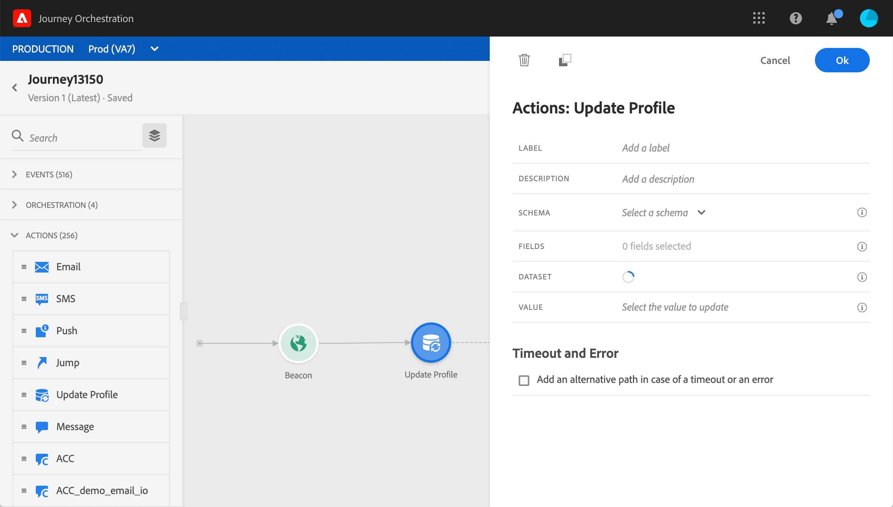

# プロファイルの更新 {#update-profile}

「**[!UICONTROL プロファイルを更新]**」アクションアクティビティを使用すると、イベントやデータソースから得られた情報または特定の値を使用して、既存の Adobe Experience Platform のプロファイルを更新できます。

## 重要な注意事項

* 「**プロファイルを更新**」アクションは、名前空間を持つイベントで開始されるジャーニーでのみ使用できます。
* この操作では、既存のフィールドのみが更新され、新しいプロファイルフィールドは作成されません。
* 「**プロファイルを更新**」アクションを使用して、購入などのエクスペリエンスイベントを生成することはできません。
* 他のアクションのように、エラーやタイムアウトの場合の代替パスを定義でき、2 つのアクションを並行して配置することはできません。
* Platform に送信される更新リクエストは高速ですが、1 秒以内や即時というわけではありません。通常は数秒かかりますが、もっと時間がかかる場合もあり、保証はありません。そのため、例えば、アクションで使用している「フィールド 1」が、そのアクションの直前に配置された「プロファイルを更新」アクションで更新される場合でも、更新された「フィールド 1」が必ず使用されるとは限りません。
* テストモードでは、プロファイルの更新はシミュレーションされません。更新はテストプロファイルに対して実行されます。
* この&#x200B;**プロファイルを更新**&#x200B;アクティビティは、定義済みリストとして定義された XDM フィールドをサポートしていません。

## プロファイル更新の使用

1. ジャーニーのデザインをイベントから始めます。この[節](../building-journeys/journey.md)を参照してください。

1. パレットの「**アクション**」セクションで、「**プロファイルを更新**」アクティビティをキャンバスにドロップします。

   

1. リストからスキーマを選択します。

1. 「**フィールド**」をクリックして、更新するフィールドを選択します。選択できるフィールドは 1 つだけです。

   

1. リストからデータセットを選択します。

   >[!NOTE]
   >
   >**プロファイルの更新**&#x200B;アクションは、プロファイルデータをリアルタイムで更新しますが、データセットは更新しません。データセットの選択は、プロファイルがデータセットに関連するレコードであるため、必要です。

1. 「**値**」フィールドをクリックして、使用する値を定義します。

   * 簡単な式エディターを使用して、データソースまたは受信イベントからフィールドを選択できます。

      

   * 特定の値を定義する場合や高度な機能を利用する場合は、「**詳細設定モード**」をクリックします。

      

これで、「**プロファイルを更新**」を設定できました。

