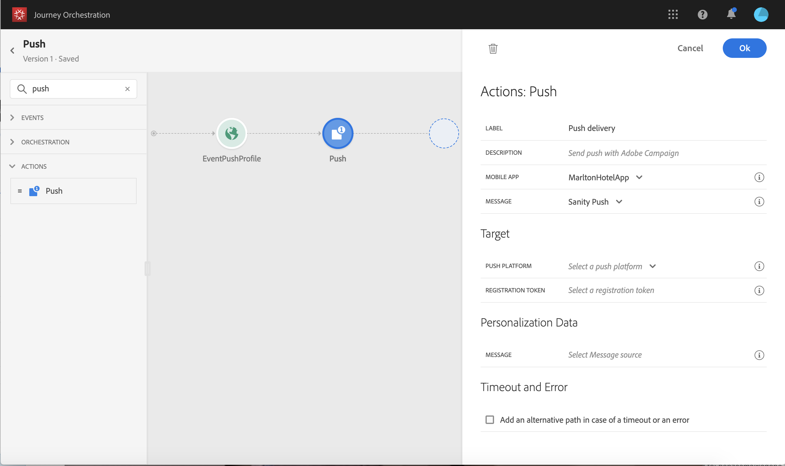

# Adobe Campaign のアクションの使用 {#using_campaign_action}

## Adobe Campaign Standardの使用 {#using_campaign_standard_action}

Adobe Campaign Standardがある場合は、次の標準のアクションアクティビティを使用できます。**[!UICONTROL Eメール]**、**[!UICONTROL プッシュ]**&#x200B;および&#x200B;**[!UICONTROL SMS]**。

>[!NOTE]
>
>この場合は、組み込みのアクションを設定する必要があります。 [このページ](../action/working-with-adobe-campaign.md)を参照してください。

これらのチャネルごとに、Adobe Campaign Standardトランザクションメッセージ&#x200B;**テンプレート**&#x200B;を選択します。 実際、[!DNL Journey Orchestration]はメッセージ送信ソリューションではありません。 組み込み型のEメール、SMS、プッシュチャネルの場合、メッセージ送信の実行にはトランザクションメッセージを使用します。 つまり、ジャーニーで特定のメッセージテンプレートを使用する場合は、Adobe Campaign Standardで公開する必要があります。 この機能の使い方については、[このページ](https://docs.adobe.com/content/help/ja-JP/campaign-standard/using/communication-channels/transactional-messaging/about-transactional-messaging.html)を参照してください。

>[!NOTE]
>
>Campaign Standardで使用するには、Journey Orchestrationトランザクションメッセージとそれに関連するイベントを公開する必要があります。 イベントが公開されてもメッセージが表示されない場合、Journey Orchestrationインターフェイスには表示されません。 メッセージが公開されても、関連するイベントが発行されない場合、Journey Orchestrationインターフェイスに表示されますが、使用できません。


イベント（リアルタイムとも呼ばれます）またはプロファイルトランザクションメッセージテンプレートを使用できます。

>[!NOTE]
>
>リアルタイムトランザクションメッセージ(rtEvent)を送信する場合、またはカスタムアクションを使用してサードパーティシステムとメッセージをルーティングする場合、疲労、ブロックリスト、購読解除の管理には特定の設定が必要です。 例えば、「購読解除」属性がAdobe Experience Platformまたはサードパーティシステムに保存されている場合、メッセージが送信されてこの条件を確認する前に条件を追加する必要があります。

テンプレートを選択すると、メッセージペイロードで必要なすべてのフィールドが、アクティビティ設定ペインの「**[!UICONTROL アドレス]**」と「**[!UICONTROL パーソナライゼーションデータ]**」の下に表示されます。 これらの各フィールドを、イベントまたはデータソースのいずれかから使用するフィールドにマッピングする必要があります。高度な式エディターを使用して、値を手動で渡したり、取得した情報に対してデータ操作（例えば、文字列を大文字に変換）を実行したり、「if, then, else」などの関数を使用したりすることもできます。 [このページ](../expression/expressionadvanced.md)を参照してください。


### EメールとSMS {#section_asc_51g_nhb}

**[!UICONTROL Eメール]**&#x200B;と&#x200B;**[!UICONTROL SMS]**&#x200B;の場合、パラメーターは同じです。

>[!NOTE]
>
>Eメールの場合、プロファイルトランザクションテンプレートを使用している場合、購読解除メカニズムはCampaign Standardによって標準で処理されます。 テンプレートに&#x200B;**[!UICONTROL 購読解除リンク]**&#x200B;コンテンツブロックを追加するだけです（[詳細情報](https://docs.adobe.com/content/help/en/campaign-standard/using/communication-channels/transactional-messaging/about-transactional-messaging.html)）。 イベントベースのテンプレート(rtEvent)を使用している場合、URLパラメーターに個人のEメールを渡し、購読解除ランディングページを指すリンクをメッセージに追加する必要があります。 このランディングページを作成し、ユーザーの購読解除の決定がAdobeに送信されるようにする必要があります。

最初に、トランザクションメッセージテンプレートを選択する必要があります。 [このページ](../building-journeys/about-action-activities.md)を参照してください。

次の2つのカテゴリを使用できます。**[!UICONTROL アドレス]**&#x200B;と&#x200B;**[!UICONTROL パーソナライゼーションデータ]**。

インターフェイスを使用して、**[!UICONTROL アドレス]**&#x200B;や&#x200B;**[!UICONTROL パーソナライゼーションデータ]**&#x200B;を取得する場所を簡単に定義できます。 イベントや使用可能なデータソースのフィールドを参照できます。 高度な式エディターは、パラメーターの受け渡しや操作の実行を必要とするデータソースの使用など、より高度な使用例にも使用できます。 [このページ](../expression/expressionadvanced.md)を参照してください。

**[!UICONTROL 住所]**

>[!NOTE]
>
>このカテゴリは、「イベント」トランザクションメッセージを選択した場合にのみ表示されます。 「プロファイル」メッセージの場合、「**[!UICONTROL アドレス]**」フィールドは、システムによってAdobe Campaign Standardから自動的に取得されます。

これらは、メッセージの送信先をシステムが知るために必要なフィールドです。 Eメールテンプレートの場合は、Eメールアドレスです。 SMSの場合は、携帯電話番号です。


**[!UICONTROL パーソナライゼーションデータ]**

>[!NOTE]
>
>コレクションをパーソナライゼーションデータに渡すことはできません。 トランザクションEメールまたはSMSでコレクションが必要な場合は、機能しません。 また、パーソナライゼーションデータの形式は想定どおりです(例：文字列、10進数など)に基づいて、 これらの想定される形式には注意が必要です。

これらは、Adobe Campaign Standardメッセージで想定されるフィールドです。 これらのフィールドを使用して、メッセージのパーソナライズ、条件付き書式の適用、特定のメッセージバリアントの選択を行うことができます。


### プッシュ {#section_im3_hvf_nhb}

プッシュアクティビティを使用する前に、プッシュ通知を送信するCampaign Standardと共にモバイルアプリを設定する必要があります。 この[記事](https://helpx.adobe.com/jp/campaign/kb/integrate-mobile-sdk.html)を使用して、モバイルに必要な実装手順を実行します。

まず、ドロップダウンリストからモバイルアプリを選択し、トランザクションメッセージを選択します。 [このページ](../building-journeys/about-action-activities.md)を参照してください。



次の2つのカテゴリを使用できます。**[!UICONTROL Target]**&#x200B;と&#x200B;**[!UICONTROL パーソナライゼーションデータ]**。

**[!UICONTROL ターゲット]**

>[!NOTE]
>
>このカテゴリは、イベントメッセージを選択した場合にのみ表示されます。 プロファイルメッセージの場合、「**[!UICONTROL Target]**」フィールドは、Adobe Campaign Standardが実行した紐付けを使用して、システムによって自動的に取得されます。

この節では、**[!UICONTROL プッシュプラットフォーム]**&#x200B;を定義する必要があります。 ドロップダウンリストで、「**[!UICONTROL Apple Push Notification Server]**(iOS)」または「**[!UICONTROL Firebase Cloud Messaging]**(Android)」を選択できます。 または、イベントやデータソースから特定のフィールドを選択したり、高度な式を定義したりできます。

また、**[!UICONTROL 登録トークン]**&#x200B;を定義する必要があります。 式は、イベントペイロードまたは他の[!DNL Journey Orchestration]情報でのトークンの定義方法によって異なります。 例えば、コレクションでトークンが定義されている場合は、単純なフィールドにすることも、より複雑な式にすることもできます。

```
@{Event_push._experience.campaign.message.profileSnapshot.pushNotificationTokens.first().token}
```

**[!UICONTROL パーソナライゼーションデータ]**

>[!NOTE]
>
>コレクションをパーソナライゼーションデータに渡すことはできません。 トランザクションプッシュでコレクションが必要な場合は機能しません。 また、パーソナライゼーションデータの形式は想定どおりです(例：文字列、10進数など)に基づいて、 これらの想定される形式には注意が必要です。

これらは、Adobe Campaign Standardメッセージで使用されるトランザクションテンプレートで想定されるフィールドです。 これらのフィールドを使用して、メッセージをパーソナライズしたり、条件付き書式を適用したり、特定のメッセージバリアントを選択したりできます。

## Adobe Campaign v7/v8の使用 {#using_campaign_v7_v8_action}

この統合は、21.1リリース以降のAdobe Campaign Classic v7およびAdobe Campaign v8で使用できます。 Adobe Campaignのトランザクションメッセージ機能を使用して、Eメール、プッシュ通知、SMSを送信できます。

Journey Orchestration インスタンスと Campaign インスタンスとの接続は、プロビジョニング時にアドビによって設定されます。連絡先Adobe。

これを機能させるには、専用のアクションを設定する必要があります。 [こちら](../action/working-with-adobe-campaign.md#using_adobe_campaign_v7_v8)を参照してください。

エンドツーエンドの使用例については、この[節](../usecase/campaign-v7-v8-use-case.md)で説明します。

1. イベントから始めて、ジャーニーを設計します。 [こちら](../building-journeys/journey.md)を参照してください。
1. パレットの「**アクション**」セクションで、Campaign アクションを選択してジャーニーに追加します。
1. **アクションパラメーター**&#x200B;には、メッセージペイロードで想定されるすべてのフィールドが表示されます。 これらの各フィールドを、イベントまたはデータソースのいずれかから使用するフィールドにマッピングする必要があります。これはカスタムアクションと似ています。 [こちら](../building-journeys/using-custom-actions.md)を参照してください。


