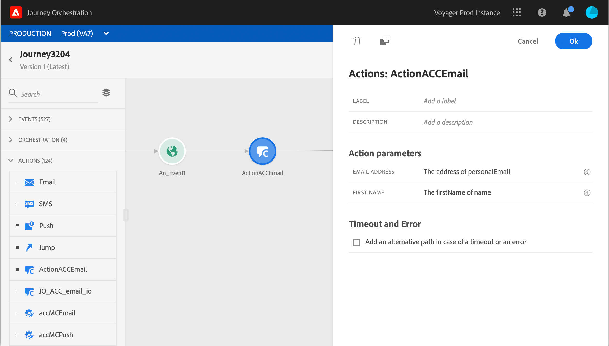

# Adobe Campaign v7／v8 の使用 {#using_campaign_classic}

>[!CAUTION]
>
>**Adobe Journey Optimizer をお探しですか**？ Journey Optimizer のドキュメントについて詳しくは、[こちら](https://experienceleague.adobe.com/ja/docs/journey-optimizer/using/ajo-home){target="_blank"}をクリックしてください。
>
>
>_このドキュメントは、Journey Optimizer に置き換えられた従来の Journey Orchestration 資料を参照しています。 Journey Orchestration または Journey Optimizer へのアクセスについてご質問がある場合は、アカウントチームにお問い合わせください。_

統合は、Adobe Campaign v7 または v8 のユーザーが使用できます。 これにより、Adobe Campaign のトランザクションメッセージ機能を使用して、メール、プッシュ通知、SMS などを送信できるようになります。

Journey Orchestration インスタンスと Campaign インスタンスの接続は、プロビジョニング時にアドビが設定します。 アドビにご連絡ください。

これを機能させるには、専用のアクションを設定する必要があります。 詳しくは、この[節](../action/acc-action.md)を参照してください。

エンドツーエンドのユースケースについては、この[節](../usecase/campaign-classic-use-case.md)を参照してください。

1. イベントから始めて、ジャーニーを設計します。 詳しくは、この[節](../building-journeys/journey.md)を参照してください。
1. パレットの「**アクション**」セクションで、Campaign アクションを選択してジャーニーに追加します。
1. **アクションパラメーター**&#x200B;には、メッセージペイロードで想定されるすべてのフィールドが表示されます。 これらの各フィールドを、イベントまたはデータソースのいずれかから使用するフィールドにマッピングする必要があります。 これはカスタムアクションと似ています。 詳しくは、この[節](../building-journeys/using-custom-actions.md)を参照してください。

