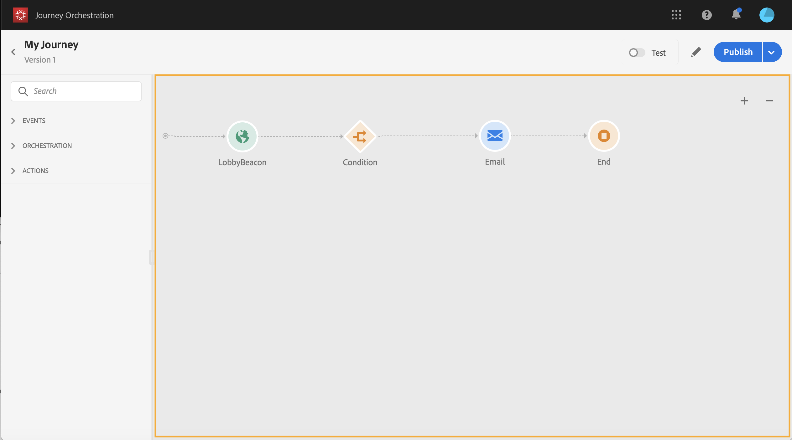
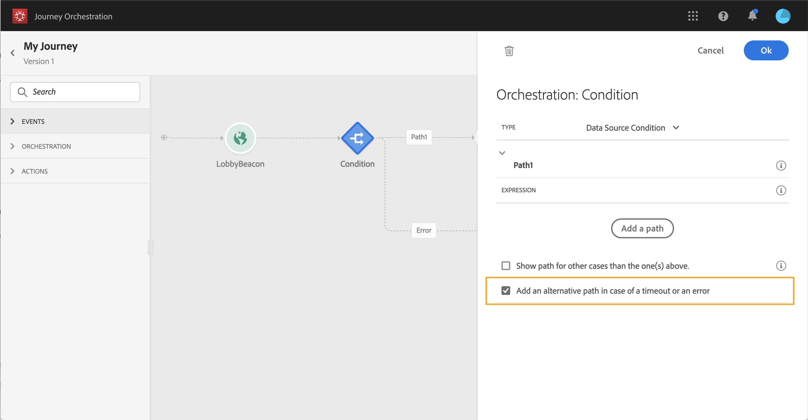

# ジャーニーデザイナーの使用 {#concept_m1g_5qt_52b}

ジャーニーホームメニューを使用すると、ジャーニーの **リストを表示でき**&#x200B;ます。 新しいジャーニーを作成するか、既存のジャーニーをクリックして、 **ジャーニーデザイナーのインターフェイスを開きます**。 デザイナーは、次のゾーンで構成されています。 パレット、キャンバス、アクティビティ設定ペイン。

## ザジャーニーリスト {#journey_list}

The **journey list** allows you to view all your journeys at once, see their status and perform basic actions. ジャーニーは、複製、停止、削除できます。ジャーニーによっては、特定のアクションを使用できない場合があります。例えば、終了したジャーニーを削除したり再開したりすることはできません。 新しいバージョンを作成したり、重複したり、停止したりできます。 検索バーを使用して、ジャーニーを検索することも可能です。

**[!UICONTROL フィルター]**&#x200B;にアクセスするには、リストの左上にあるフィルターアイコンをクリックします。フィルターメニューを使用すると、様々な条件（ステータス、作成したジャーニー、過去30日間に変更されたジャーニー、最新バージョンなど）に従って、表示されたジャーニーをフィルタリングできます。 また、特定のイベント、フィールドグループまたはアクションを使用するジャーニーのみを表示するように選択することもできます。 リストに表示される列は設定できます。 すべてのフィルターと列は、ユーザーごとに保存されます。

ジャーニーのすべてのバージョンが、リストにバージョン番号と共に表示されます。 を参照してください。

>[!NOTE]
>
>ジャーニーのキャンバスを別のブラウザタブで開くには、 **Control** ( **** Command)キーを押しながらジャーニーをクリックします。

## パレット {#palette}

**パレット** は、画面の左側に表示されます。 使用可能なすべてのアクティビティは、次の複数のカテゴリに分類されます。 **[!UICONTROL イベント]**、オーケストレーション **[!UICONTROL 、]** アクション ****。 異なるカテゴリの名前をクリックして、それぞれを展開または折りたたむことができます。 アクティビティを使用するには、パレットからカンバスにドラッグ&amp;ドロップします。 また、パレット内のアクティビティを重複クリックして、次のステップでキャンバスに追加することもできます。 ジャーニーを公開する前に、パレットから追加した各アクティビティを設定する必要があります。 キャンバスにアクティビティをドロップして、設定を完了しなかった場合、そのアクティビティはキャンバスに残りますが、赤い警告が表示され、このの設定が完了していないことを示します。

>[!NOTE]
>
>ジャーニーを設定する場合は、ルールがあります。 許可されていない構成は破棄されます。 例えば、アクションを並行して配置したり、アクティビティを前のステップにリンクしてループを作成したり、イベント以外のものを使用して遍歴を開始したりすることはできません。

左上隅の「 **[!UICONTROL 無効な項目を]** 表示」アイコンを使用すると、パレット内の使用できない要素(例えば、旅で使用する要素とは異なる名前空間を使用するイベント)を表示または非表示にできます。 デフォルトでは、使用できない項目は非表示になります。表示を選択すると、灰色表示になります。

「 **[!UICONTROL 検索]** 」フィールドを使用する場合、キャンバスアクティビティカテゴリごとに結果数が表示されます。

## キャンバス {#canvas}

キャン **バス** は、旅行デザイナーの中心ゾーンです。 アクティビティをドロップして設定できるのは、このゾーンです。 キャンバスのアクティビティをクリックして設定します。 右側にアクティビティ設定ペインが開きます。 右上の「+」ボタンと「 — 」ボタンを使用して、ズームインおよびズームアウトできます。 キャンバスでは、 **[!UICONTROL エンドアクティビティを除くすべてのアクティビティで、その後に次の手順を追加できます(「]** エンド 」を除く)。

## アクティビティ設定ペイン {#configuration_pane}

パレット内のアクティビティをクリックすると **、** アクティビティ設定ペインが表示されます。 必須フィールドに入力します。 アクティビティを削除するには、 **[!UICONTROL 削除]** アイコンをクリックします。 変更をキャンセルするには **[!UICONTROL 「Cancel]** 」をクリックし、 **[!UICONTROL 確認するには「Ok]** 」をクリックします。 アクティビティを削除するには、1つのアクティビティ（または複数）を選択してBackSpaceキーを押します。 Escキーを押すと、アクティビティ設定ペインが閉じます。

キャンバスでは、アクションとイベントのアクティビティは、イベントまたはアクションの名前が下に表示されたアイコンで表されます。 アクティビティ設定ペインで、「 **[!UICONTROL ラベル]** 」フィールドを使用してアクティビティ名にサフィックスを追加できます。 これらのラベルは、特に、同じイベントやアクションを何度か旅行中に使用する場合に、イベントやアクションの使用状況を説明するのに役立ちます。 追加したラベルを [!DNL Journey Orchestration] レポートに表示することもできます。

## 上部バーのアクション {#top_actions}

ジャーニーのステータスに応じて、右上隅のボタンを使用して、様々な操作をジャーニーに対して実行できます。 **[!UICONTROL Publish]**, **[!UICONTROL 重複]**, **[!UICONTROL Delete]**, **[!UICONTROL Jurneyプロパティ，]** Test **** Test Net Properties これらのボタンは、アクティビティが選択されていないときに表示されます。 一部のボタンは文脈上表示されます。 テストモードがアクティブになると、テストモードのログボタンが表示されます(を参照 )。 このレポートボタンは、ジャーニーがライブ、停止または閉じられたときに表示されます。

## キャンバスでのパスの使用 {#paths}

一部のアクティビティ(**[!UICONTROL 条件]**、 **[!UICONTROL アクション]** アクティビティ)では、エラーやタイムアウトの場合のフォールバックアクションを定義できます。 アクティビティ設定ウィンドウで、次のボックスをオンにします。 **[!UICONTROL タイム追加アウトやエラーが発生した場合の代替パス]**。 アクティビティの後に別のパスが追加されます。 タイムアウト時間は、ジャーニーのプロパティで定義します(管理者ユーザー  が参照してください)。 例えば、電子メールの送信に時間がかかりすぎたり、エラーが発生した場合は、SMSを送信することを決定できます。

様々なアクティビティ(イベント、アクション、待機)を使用して、それらの後に複数のパスを追加できます。 これを行うには、カーソルをアクティビティ上に置き、「+」記号をクリックします。 並行して設定できるのは、イベントアクティビティと待機イベントのみです。 複数のイベントを並行して設定した場合は、最初に発生するイベントの1つが選択されたパスになります。

イベントをリッスンする場合は、イベントを無期限に待つことをお勧めします。 これは必須ではありません。ただのベストプラクティスです。 1つまたは複数のイベントを一定の時間だけリッスンする場合は、1つまたは複数のイベントと待機アクティビティを並行して配置します。 を参照してください。

パスを削除するには、その上にカーソルを置いて、 **[!UICONTROL 削除矢印]** アイコンをクリックします。

キャンバスで、2つのアクティビティが切断されると、警告が表示されます。 カーソルを警告アイコンに合わせて、エラーメッセージを表示します。 この問題を修正するには、切断されたアクティビティを移動し、前のアクティビティに接続するだけです。

## アクティビティのコピーと貼り付け {#copy-paste}

1つまたは複数のアクティビティをコピーして、同じ遍歴または別の遍歴に貼り付けることができます。 これにより、以前の遍歴で既に設定済みの多数のアクティビティを再利用する場合に、時間を節約できます。

**重要な注意事項**

* 様々なタブやブラウザー間でコピー&amp;ペーストできます。 アクティビティは、同じインスタンス内でのみコピー/貼り付けできます。
* コピー先のジャーニーに別の名前空間を使用するイベントがある場合、イベントをコピー&amp;ペーストすることはできません。
* 貼り付けたアクティビティは、コピー先の遍歴に存在しないデータを参照する場合があります。例えば、異なるサンドボックス間でコピー&amp;ペーストする場合です。 必ずエラーをチェックし、必要な調整を行ってください。
* 操作を元に戻すことはできないことに注意してください。 貼り付けたアクティビティを削除するには、それらを選択して削除する必要があります。 したがって、必要なアクティビティのみを選択してからコピーしてください。
* 読み取り専用のアクティビティも含め、任意の遍歴から画像をコピーできます。
* リンクされていないアクティビティも含め、任意の画像を選択できます。 リンクされたアクティビティは、貼り付け後もリンクされた状態が維持されます。

アクティビティをコピー/貼り付ける手順は次のとおりです。

1. 旅を開く。
1. マウスをクリックしながら移動して、コピーするアクティビティを選択します。 また、 **CtrlキーまたはCommandキーを押しながら各アクティビティをクリックすることもできます** 。 すべてのアクティビティを選択する場合は、 **Ctrl/Command + A** 。
   
1. Ctrl/ **Command + C**.を押します。
1つのアクティビティのみをコピーする場合は、そのアクティビティをクリックし、設定ペインの左上にある **コピー** アイコンを使用します。
   
1. どのような遍歴でも、 **Ctrl/Command + V** (Ctrl)キーまたはCommandキーを押しながらアクティビティを貼り付け、既存のノードにリンクしないでください。 貼り付けたアクティビティは同じ順序で配置されます。 貼り付け後も、アクティビティは選択されたままなので、簡単に移動できます。 空のプレースホルダーにカーソルを置いて、 **Ctrl/Command + V**.を押すこともできます。 貼り付けたアクティビティはノードにリンクされます。
   

