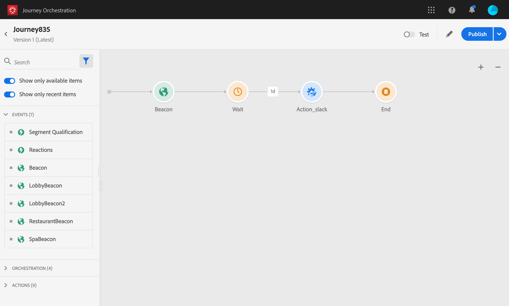

# ジャーニーデザイナーの使用 {#concept_m1g_5qt_52b}

>[!CAUTION]
>
>**Adobe Journey Optimizerをお探しですか** Journey Optimizerのドキュメントについては、[&#x200B; こちら &#x200B;](https://experienceleague.adobe.com/ja/docs/journey-optimizer/using/ajo-home){target="_blank"} をクリックしてください。
>
>
>_このドキュメントでは、Journey Optimizerに置き換えられた従来のJourney Orchestration マテリアルについて説明します。 Journey OrchestrationやJourney Optimizerへのアクセスに関するご質問は、アカウントチームにお問い合わせください。_

ジャーニーホームメニューを使用すると、**ジャーニーのリスト** を表示できます。 新しいジャーニーを作成するか、既存のジャーニーをクリックして **ジャーニーデザイナーのインターフェイス** を開きます。 デザイナーは、パレット、キャンバス、アクティビティ設定ペインの 3 つのゾーンで構成されています。

## ジャーニーリスト {#journey_list}

**ジャーニーリスト** を使用すると、すべてのジャーニーを一度に表示し、ステータスを確認して、基本的なアクションを実行できます。 ジャーニーは、複製、停止、削除できます。ジャーニーによっては、特定のアクションを使用できない場合があります。例えば、クローズ済みジャーニーを削除したり再開したりすることはできません。そこから新しいバージョンを作成したり、複製したり、停止したりできます。 検索バーを使用して、ジャーニーを検索することも可能です。

「**[!UICONTROL フィルター]**」にアクセスするには、リストの左上にあるフィルターアイコンをクリックします。フィルターメニューを使用すると、様々な条件（ステータス、作成した条件、過去 30 日間に変更された条件、最新のバージョンなど）に従って表示されたジャーニーをフィルタリングできます。 また、特定のイベント、フィールドグループ、アクションなどを使用するジャーニーのみを表示するように選択することもできます。 リストに表示される列は設定できます。 すべてのフィルターと列が、ユーザーごとに保存されます。

ジャーニーのすべてのバージョンが、バージョン番号と共にリストに表示されます。 詳しくは、[このページ](../building-journeys/journey-versions.md)を参照してください。

>[!NOTE]
>
>別のブラウザータブでジャーニーキャンバスを開くには、**Control** または **Command** キーを押したまま、ジャーニーをクリックします。

## パレット {#palette}

**パレット**&#x200B;は画面の左側にあります。すべての使用可能なアクティビティは、複数のカテゴリ（**[!UICONTROL イベント]**、**[!UICONTROL オーケストレーション]**、**[!UICONTROL アクション]**）に分類されます。カテゴリの名前をクリックすると、カテゴリを展開したり、折りたたむことができます。ジャーニーでアクティビティを使用するには、パレットからキャンバスにドラッグ&amp;ドロップします。 パレット内のアクティビティをダブルクリックして、以下の手順でキャンバスに追加することもできます。 ジャーニーを公開する前に、パレットから追加した各アクティビティを設定する必要があります。 キャンバスにアクティビティをドロップしても、設定が完了していない場合、キャンバスには残りますが、赤い警告は、このアクティビティで設定が完了していないことを示します。

>[!NOTE]
>
>ジャーニーを設定する際にはルールがあることに注意してください。 許可されていない設定は破棄されます。 例えば、アクションを並行して配置したり、アクティビティを前のステップにリンクしてループを作成したり、イベント以外の要素でジャーニーを開始したりすることはできません。

左上隅の&#x200B;**[!UICONTROL アイテムをフィルター]**&#x200B;アイコンを使用すると、次のフィルターを表示できます。

* **使用可能な項目のみを表示**：パレットの使用できない要素を表示または非表示にします（ジャーニーと異なる名前空間を使用しているイベントなど）。デフォルトでは、使用できない項目は非表示になっています。表示するよう選択すると、灰色表示になります。

* **最近使用したアイテムのみを表示**：このフィルターでは、既製のイベントやアクションに加え、最近使用した 5 つのイベントやアクションのみを表示できます。この機能は、各ユーザーに固有です。デフォルトでは、すべての項目が表示されます。

また、「**[!UICONTROL 検索]**」フィールドを使用することもできます。イベントとアクションのみフィルタリングされます。

## キャンバス {#canvas}

**キャンバス**&#x200B;は、ジャーニーデザイナーの中心にあるゾーンです。アクティビティをこのゾーンにドロップすると設定できます。キャンバスのアクティビティをクリックして設定します。アクティビティ設定ペインが右側に開きます。 右上の「+」ボタンと「–」ボタンを使用して、ズームイン/ズームアウトできます。 キャンバスでは、**[!UICONTROL 終了]** アクティビティを除くすべてのアクティビティで、その後に次の手順を追加できます（[&#x200B; このページ &#x200B;](../building-journeys/end-activity.md) を参照）。

## アクティビティ設定ペイン {#configuration_pane}

パレット内のアクティビティをクリックすると、**アクティビティ設定ペイン**&#x200B;が表示されます。
必須のフィールドに入力します。アクティビティを削除するには、**[!UICONTROL 削除]**&#x200B;アイコンをクリックします。「**[!UICONTROL キャンセル]**」をクリックして変更をキャンセルするか、 「**[!UICONTROL OK]**」をクリックして変更を確定します。アクティビティを削除するには、アクティビティ（1 つまたは複数）を選択して BackSpace キーを押します。アクティビティ設定ペインを閉じるには、Esc キーを押します。

キャンバスでは、アクションとイベントアクティビティは、イベント名またはアクション名が下に表示されたアイコンで表されます。 アクティビティ設定ペインで、「**[!UICONTROL ラベル]**」フィールドを使用して、アクティビティ名にサフィックスを追加できます。 これらのラベルは、特に、ジャーニーで同じイベントまたはアクションを複数回使用する場合に、イベントとアクションの使用をコンテキスト化するのに役立ちます。 また、[!DNL Journey Orchestration] レポートに追加したラベルも表示できます。 条件アクティビティのラベルを定義することもできます。

デフォルトでは、読み取り専用フィールドは非表示です。読み取り専用フィールド表示するには、アクティビティ設定ペインの左上にある「**読み取り専用フィールドを表示**」アイコンをクリックします。この設定は、すべてのジャーニーのすべてのアクティビティに適用されます。

## 上部バーのアクション {#top_actions}

ジャーニーのステータスに応じ、右上隅のボタン（**[!UICONTROL 公開]**、**[!UICONTROL 複製]**、**[!UICONTROL 削除]**、**[!UICONTROL ジャーニーのプロパティ]**、**[!UICONTROL テスト]**&#x200B;など）を使用して様々なアクションを実行できます。これらのボタンは、アクティビティが選択されていないときに表示されます。ボタンの中には文脈に応じて表示されるものもあります。テストモードがアクティブになると、テストモードのログボタンが表示されます（[&#x200B; このページ &#x200B;](../building-journeys/testing-the-journey.md) を参照）。 レポートボタンは、ジャーニーがライブ、停止またはクローズされたときに表示されます。

## キャンバスでのパスの使用 {#paths}

一部のアクティビティ（**[!UICONTROL 条件]**、**[!UICONTROL アクション]**&#x200B;アクティビティ）では、エラーやタイムアウトが発生した場合に備えて代替アクションを定義できます。アクティビティ設定ペインで、「**[!UICONTROL タイムアウトまたはエラーの場合に代替パスを追加]**」ボックスを選択します。
アクティビティの後に別のパスが追加されます。タイムアウト時間は、ジャーニーのプロパティで定義します（管理者ユーザーは[このページ](../building-journeys/changing-properties.md)を参照）。例えば、メールの送信に時間がかかりすぎたり、エラーが発生した場合に、SMS を送信することを決定できます。

様々なアクティビティ（イベント、アクション、待機）を使用して、それらの後に複数のパスを追加できます。これをおこなうには、カーソルをアクティビティ上に置き、「+」記号をクリックします。並行して設定できるのは、イベントと待機アクティビティのみです。複数のイベントを並行して設定した場合は、選択したパスが最初に発生するイベントのパスになります。

イベントをリッスンする場合は、イベントの待機時間を無限にしないことをお勧めします。これは必須ではありません。ただのベストプラクティスです。1 つまたは複数のイベントを一定の時間だけリッスンする場合は、1 つまたは複数のイベントと待機アクティビティを並行して配置します。[この節](../building-journeys/event-activities.md#section_vxv_h25_pgb)を参照してください。

パスを削除するには、その上にカーソルを置き、「**[!UICONTROL 矢印を削除]**」アイコンをクリックします。

キャンバスで 2 つのアクティビティが切断されると、警告が表示されます。警告アイコンにマウスポインターを合わせると、エラーメッセージが表示されます。この問題を修正するには、切断されたアクティビティを移動し、前のアクティビティに接続します。

## アクティビティのコピーと貼り付け {#copy-paste}

ジャーニーの 1 つまたは複数のアクティビティをコピーして、同じジャーニーまたは別のジャーニーに貼り付けることができます。以前のジャーニーで設定済みの多数のアクティビティを再利用する場合は、こうすることで時間を節約できます。

**重要な注意事項**

* 異なるタブやブラウザーをまたいでコピー／貼り付けができます。アクティビティは、同じインスタンス内でのみコピー／貼り付けできます。
* 宛先のジャーニーに別の名前空間を使用するイベントがある場合、イベントのコピー／貼り付けを実行することはできません。
* 貼り付けたアクティビティが、宛先のジャーニーに存在しないデータを参照する場合があります（異なるサンドボックスをまたいでコピー／貼り付けする場合など）。常にエラーをチェックし、必要な調整をおこなってください。
* アクションは取り消すことができません。貼り付けたアクティビティを削除するには、それらを選択して削除する必要があります。そのため、コピーする前に、必要なアクティビティだけを選択するようにしてください。
* どのジャーニーからでもアクティビティをコピーできます（読み取り専用のアクティビティを含む）。
* どのアクティビティでも選択できます（リンクされていないアクティビティを含む）。リンクされているアクティビティは、貼り付けた後もリンクが保持されます。

アクティビティのコピーや貼り付けの手順は次のとおりです。

1. ジャーニーを開きます。
1. マウスをクリックしながら動かし、コピーするアクティビティを選択します。**Ctrl / Command** キーを押しながら各アクティビティをクリックすることもできます。すべてのアクティビティを選択する場合は、**Ctrl / Command + A** を使用します。
   
1. **Ctrl / Command + C** を押します。
1 つのアクティビティのみをコピーする場合は、そのアクティビティをクリックし、設定ペインの左上にある&#x200B;**コピー**&#x200B;アイコンを使用します。

   
1. 任意のジャーニーで、アクティビティを既存のノードにリンクせずに貼り付ける場合は、**Ctrl / Command + V** を押します。貼り付けたアクティビティは同じ順序で配置されます。貼り付け後も、アクティビティは選択されたままなので、簡単に移動できます。空のプレースホルダーにカーソルを置いて、**Ctrl / Command + V** を押すこともできます。貼り付けたアクティビティはそのノードにリンクされます。
   
