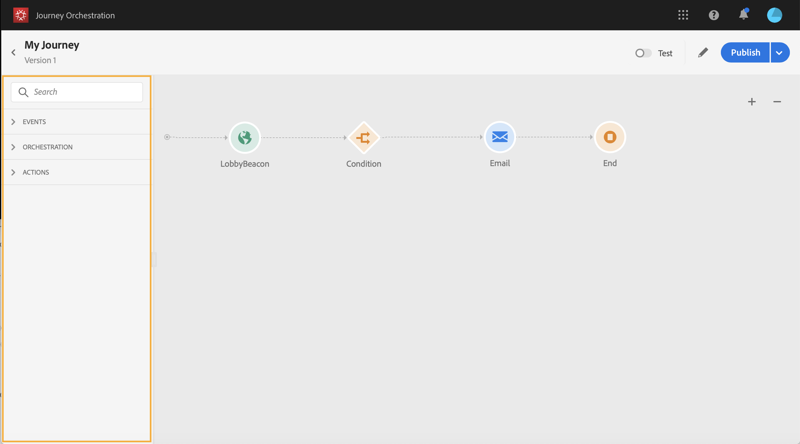

# ジャーニーデザイナーの使用 {#concept_m1g_5qt_52b}

ジャーニーホームメニューを使用すると、ジャーニー&#x200B;**の**&#x200B;リストを表示できます。 新しいジャーニーを作成するか、既存のジャーニーをクリックして&#x200B;**デザイナーのインターフェイス**&#x200B;を開きます。 デザイナーは、次のゾーンで構成されています。パレット、キャンバス、アクティビティ設定ペイン。

## ジャーニーリスト{#journey_list}

**ジャーニーリスト**&#x200B;を使用すると、すべてのジャーニーを一度に表示し、そのステータスを確認し、基本的な操作を実行できます。 ジャーニーは、複製、停止、削除できます。ジャーニーによっては、特定のアクションを使用できない場合があります。例えば、クローズ済みジャーニーを削除したり再開したりすることはできません。新しいバージョンを作成したり、重複したり、停止したりできます。 検索バーを使用して、ジャーニーを検索することも可能です。

**[!UICONTROL フィルター]**&#x200B;にアクセスするには、リストの左上にあるフィルターアイコンをクリックします。フィルターメニューでは、様々な条件(ステータス、作成したジャーニー、過去30日間に変更されたもの、最新バージョンなど)に従って、表示されたバージョンをフィルタリングできます。 また、特定のイベント、フィールドグループまたはアクションを使用するジャーニーのみを表示するように選択することもできます。 リストに表示される列は設定できます。 すべてのフィルターと列は、ユーザーごとに保存されます。

ジャーニーのすべてのバージョンが、リストにバージョン番号と共に表示されます。 [このページ](../building-journeys/journey-versions.md)を参照してください。

>[!NOTE]
>
>ジャーニーのキャンバスを別のブラウザタブで開くには、**Control**&#x200B;または&#x200B;**Command**&#x200B;キーを押しながらジャーニーをクリックします。

## パレット{#palette}

**パレット**&#x200B;は画面の左側にあります。 使用可能なすべてのアクティビティは、次の複数のカテゴリに分類されます。**[!UICONTROL イベント]**、**[!UICONTROL オーケストレーション]**、**[!UICONTROL アクション]**。 異なるカテゴリの名前をクリックして、それぞれを展開または折りたたむことができます。 ジャーニーでアクティビティを使用するには、パレットからカンバスにドラッグ&amp;ドロップします。 また、パレット内のアクティビティを重複クリックして、次のステップでキャンバスに追加することもできます。 ジャーニーを公開する前に、パレットから追加した各アクティビティを設定する必要があります。 キャンバスにアクティビティをドロップして、設定を完了しなかった場合、そのアクティビティはキャンバスに残りますが、赤い警告が表示され、このの設定が完了していないことを示します。

>[!NOTE]
>
>ジャーニーを設定する場合は、ルールが存在することに注意してください。 許可されていない構成は破棄されます。 例えば、アクションを並行して配置したり、アクティビティを前のステップにリンクしてループを作成したり、ジャーニーをイベント以外のものと開始したりすることはできません。

左上隅の&#x200B;**[!UICONTROL アイテムをフィルター]**&#x200B;アイコンを使用すると、次のフィルターを表示できます。

* **使用可能な項目のみを表示**:パレット内の使用できない要素を非表示にしたり、表示したりします。例えば、ジャーニーで使用されている要素とは異なる名前空間を使用するイベントなどです。デフォルトでは、使用できない項目は非表示になります。表示を選択すると、灰色表示になります。

* **最近使用したアイテムのみを表示**:このフィルターでは、すぐに使用できるイベントに加えて、最近5つのアクションとアクションのみを表示できます。これは、各ユーザー固有です。 デフォルトでは、すべての項目が表示されます。 

「**[!UICONTROL 検索]**」フィールドを使用することもできます。

## キャンバス{#canvas}

**canvas**&#x200B;は、ジャーニーデザイナーの中心ゾーンです。 アクティビティをドロップして設定できるのは、このゾーンです。 キャンバスのアクティビティをクリックして設定します。 右側にアクティビティ設定ペインが開きます。 右上の「+」ボタンと「 — 」ボタンを使用して、ズームインおよびズームアウトできます。 キャンバスでは、****&#x200B;終了[アクティビティを除き、すべてのアクティビティで次の手順を追加できます（このページ](../building-journeys/end-activity.md)を参照）。

## アクティビティ構成ペイン{#configuration_pane}

パレット内のアクティビティをクリックすると、**アクティビティ設定ペイン**&#x200B;が表示されます。 必須フィールドに入力します。 **[!UICONTROL 削除]**&#x200B;アイコンをクリックして、アクティビティを削除します。 **[!UICONTROL 「キャンセル]**」をクリックして変更をキャンセルするか、**[!UICONTROL 「OK]**」をクリックして確認します。 アクティビティを削除するには、1つのアクティビティ（または複数）を選択してBackSpaceキーを押します。 Escキーを押すと、アクティビティ設定ペインが閉じます。

キャンバスでは、アクションとイベントのアクティビティは、イベントまたはアクションの名前が下に表示されたアイコンで表されます。 アクティビティ設定ペインで、**[!UICONTROL Label]**&#x200B;フィールドを使用して、アクティビティ名にサフィックスを追加できます。 これらのラベルは、特にジャーニーで同じイベントやアクションを複数回使用する場合に、イベントやアクションの使用を継続するのに役立ちます。 [!DNL Journey Orchestration]レポートに追加したラベルも表示されます。 また、条件アクティビティのラベルを定義することもできます。

デフォルトでは、読み取り専用フィールドは非表示です。 これらを表示するには、アクティビティ設定ペインの左上にある&#x200B;**読み取り専用フィールドを表示**&#x200B;アイコンをクリックします。

## 上部バーのアクション{#top_actions}

ジャーニーのステータスに応じて、右上隅のボタンを使用して、ジャーニーに対して様々な操作を実行できます。**[!UICONTROL 公開]**、**[!UICONTROL 重複]**、**[!UICONTROL 削除]**、**[!UICONTROL ジャーニーのプロパティ]**、**[!UICONTROL テスト]**。 これらのボタンは、アクティビティが選択されていないときに表示されます。 一部のボタンは文脈上表示されます。 テストモードがアクティブになると、テストモードのログボタンが表示されます（[このページ](../building-journeys/testing-the-journey.md)を参照）。 レポートボタンは、ジャーニーがライブ、停止または閉じられたときに表示されます。

## キャンバスでのパスの使用{#paths}

一部のアクティビティ(**[!UICONTROL 条件]**、**[!UICONTROL アクション]**&#x200B;アクティビティ)では、エラーやタイムアウトの場合にフォールバックアクションを定義できます。 アクティビティ設定ウィンドウで、次のボックスをオンにします。**[!UICONTROL タイムアウトやエラー]**&#x200B;の追加場合の代替パス。 アクティビティの後に別のパスが追加されます。 タイムアウト時間は、ジャーニーのプロパティで定義します（管理者ユーザーが[このページ](../building-journeys/changing-properties.md)を参照）。 例えば、電子メールの送信に時間がかかりすぎたり、エラーが発生した場合は、SMSを送信することを決定できます。

様々なアクティビティ(イベント、アクション、待機)を使用して、それらの後に複数のパスを追加できます。 これを行うには、カーソルをアクティビティ上に置き、「+」記号をクリックします。 並行して設定できるのは、イベントアクティビティと待機イベントのみです。 複数のイベントを並行して設定した場合は、最初に発生するイベントの1つが選択されたパスになります。

イベントをリッスンする場合は、イベントを無期限に待つことをお勧めします。 これは必須ではありません。ただのベストプラクティスです。 1つまたは複数のイベントを一定の時間だけリッスンする場合は、1つまたは複数のイベントと待機アクティビティを並行して配置します。 [この節](../building-journeys/event-activities.md#section_vxv_h25_pgb)を参照してください。

パスを削除するには、その上にカーソルを置き、**[!UICONTROL 削除矢印]**&#x200B;アイコンをクリックします。

キャンバスで、2つのアクティビティが切断されると、警告が表示されます。 カーソルを警告アイコンに合わせて、エラーメッセージを表示します。 この問題を修正するには、切断されたアクティビティを移動し、前のアクティビティに接続するだけです。

## アクティビティのコピーと貼り付け{#copy-paste}

ジャーニーの1つまたは複数のアクティビティをコピーして、同じジャーニーまたは別のに貼り付けることができます。 これにより、以前のジャーニーで既に設定済みの多数のアクティビティを再利用する場合に、時間を節約できます。

**重要な注意事項**

* 様々なタブやブラウザー間でコピー&amp;ペーストできます。 アクティビティは、同じインスタンス内でのみコピー/貼り付けできます。
* コピー先のジャーニーに別の名前空間を使用するイベントがある場合、イベントをコピー&amp;ペーストすることはできません。
* 貼り付けたアクティビティは、コピー先のジャーニーに存在しないデータを参照する場合があります。例えば、異なるサンドボックス間でコピー&amp;ペーストする場合などです。 必ずエラーをチェックし、必要な調整を行ってください。
* 操作を元に戻すことはできないことに注意してください。 貼り付けたアクティビティを削除するには、それらを選択して削除する必要があります。 したがって、必要なアクティビティのみを選択してからコピーしてください。
* 読み取り専用のアクティビティも含め、任意のジャーニーからをコピーできます。
* リンクされていないアクティビティも含め、任意の画像を選択できます。 リンクされたアクティビティは、貼り付け後もリンクされた状態が維持されます。

アクティビティをコピー/貼り付ける手順は次のとおりです。

1. ジャーニーを開きます。
1. マウスをクリックしながら移動して、コピーするアクティビティを選択します。 また、**Ctrl/Command**&#x200B;キーを押しながら各アクティビティをクリックすることもできます。 すべてのアクティビティを選択する場合は、**Ctrl/Command + A**を使用します。
   
1. **Ctrl/Command + C**キーを押します。
1つのアクティビティのみをコピーする場合は、そのアクティビティをクリックし、設定ウィンドウの左上にある**コピー**アイコンを使用します。
   
1. 任意のジャーニーで、**Ctrl/Command + V**&#x200B;キーを押して、既存のノードにリンクせずにアクティビティを貼り付けます。 貼り付けたアクティビティは同じ順序で配置されます。 貼り付け後も、アクティビティは選択されたままなので、簡単に移動できます。 空のプレースホルダーにカーソルを置いて、**Ctrl/Command + V**キーを押すこともできます。 貼り付けたアクティビティはノードにリンクされます。
   

