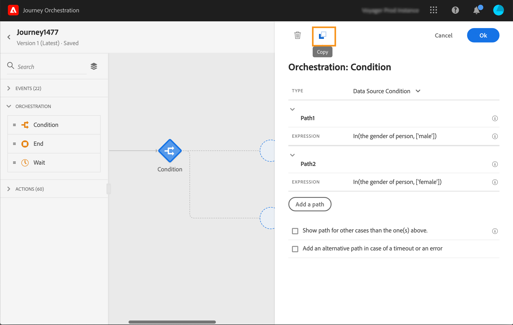

# ジャーニーデザイナーの使用 {#concept_m1g_5qt_52b}

ジャーニーホームメニューを使用すると、ジャーニーの&#x200B;**リスト**&#x200B;を表示できます。 新しいジャーニーを作成するか、既存のジャーニーをクリックして、**ジャーニーデザイナーのインターフェイス**&#x200B;を開きます。 デザイナーは、次のゾーンで構成されています。パレット、キャンバス、アクティビティ設定ペイン。

## ジャーニーリスト {#journey_list}

**ジャーニーリスト**&#x200B;を使用すると、すべてのジャーニーを一度に表示し、ステータスを確認して、基本的なアクションを実行できます。 ジャーニーは、複製、停止、削除できます。ジャーニーによっては、特定のアクションを使用できない場合があります。例えば、クローズ済みジャーニーを削除したり再開したりすることはできません。新しいバージョンを作成したり、複製したり、停止したりできます。 検索バーを使用して、ジャーニーを検索することも可能です。

**[!UICONTROL フィルター]**&#x200B;にアクセスするには、リストの左上にあるフィルターアイコンをクリックします。フィルターメニューを使用すると、様々な条件（ステータス、作成したジャーニー、過去30日間に変更されたジャーニー、最新バージョンなど）に従って、表示されたジャーニーをフィルタリングできます。 また、特定のイベント、フィールドグループ、アクションを使用するジャーニーのみを表示するように選択することもできます。 リストに表示される列を設定できます。 すべてのフィルターと列は、ユーザーごとに保存されます。

ジャーニーのすべてのバージョンが、バージョン番号と共にリストに表示されます。 [このページ](../building-journeys/journey-versions.md)を参照してください。

>[!NOTE]
>
>ジャーニーのキャンバスを別のブラウザータブで開くには、**コントロール**&#x200B;または&#x200B;**コマンド**&#x200B;キーを押したままジャーニーをクリックします。

## パレット {#palette}

**パレット**&#x200B;は画面の左側に表示されます。 使用可能なすべてのアクティビティは、次のように複数のカテゴリに分類されます。**[!UICONTROL イベント]**、**[!UICONTROL オーケストレーション]**、**[!UICONTROL アクション]**。 異なるカテゴリの名前をクリックして、そのカテゴリを展開/折りたたみできます。 ジャーニーでアクティビティを使用するには、パレットからキャンバスにアクティビティをドラッグ&amp;ドロップします。 パレット内のアクティビティをダブルクリックして、次の手順でキャンバスに追加することもできます。 ジャーニーを公開する前に、パレットから追加した各アクティビティを設定する必要があります。 キャンバスにアクティビティをドロップして、設定を完了しない場合、キャンバスはキャンバスに残りますが、赤い警告は、このアクティビティの設定が完了していないことを示します。

>[!NOTE]
>
>ジャーニーを設定する際のルールはあります。 許可されていない設定は破棄されます。 例えば、アクションを並行して配置したり、アクティビティを前の手順にリンクしてループを作成したり、イベント以外のものを使用してジャーニーを開始したりすることはできません。

左上隅の&#x200B;**[!UICONTROL 項目をフィルター]**&#x200B;アイコンを使用すると、次のフィルターを表示できます。

* **使用可能な項目のみを表示**:パレット内の使用できない要素（例えば、ジャーニーで使用される要素とは異なる名前空間を使用するイベント）の表示/非表示を切り替えます。デフォルトでは、使用できない項目は非表示になります。表示を選択すると、灰色表示になります。

* **最近使用した項目のみを表示**:このフィルターを使用すると、標準搭載のイベントに加えて、直近5件のイベントとアクションのみを表示できます。これは、各ユーザー固有です。デフォルトでは、すべての項目が表示されます。

「**[!UICONTROL 検索]**」フィールドを使用することもできます。

## キャンバス {#canvas}

**キャンバス**&#x200B;は、ジャーニーデザイナーの中心ゾーンです。 アクティビティをドロップして設定できるのは、このゾーンです。 キャンバスのアクティビティをクリックして設定します。 右側にアクティビティ設定ペインが開きます。 右上の「+」ボタンと「 — 」ボタンを使用して、ズームインおよびズームアウトできます。 キャンバスでは、**[!UICONTROL 終了]**&#x200B;アクティビティを除き、すべてのアクティビティの後に次のステップを追加できます（[このページ](../building-journeys/end-activity.md)を参照）。

## アクティビティ設定ペイン {#configuration_pane}

パレットでアクティビティをクリックすると、**アクティビティ設定ペイン**&#x200B;が表示されます。 必須フィールドに入力します。 **[!UICONTROL 削除]**&#x200B;アイコンをクリックして、アクティビティを削除します。 「**[!UICONTROL キャンセル]**」をクリックして変更をキャンセルするか、「**[!UICONTROL OK]**」をクリックして確定します。 アクティビティを削除するには、1つ（または複数）のアクティビティを選択してBackSpaceキーを押すこともできます。 Escキーを押すと、アクティビティ設定ペインが閉じます。

キャンバスでは、アクションとイベントアクティビティは、下に表示されるイベントまたはアクションの名前のアイコンで表されます。 アクティビティ設定ペインで、「**[!UICONTROL ラベル]**」フィールドを使用して、アクティビティ名にサフィックスを追加できます。 これらのラベルは、特に、ジャーニーで同じイベントやアクションを複数回使用する場合に、イベントやアクションの使用を文脈化するのに役立ちます。 また、[!DNL Journey Orchestration]レポートに追加したラベルも確認できます。 また、条件アクティビティのラベルを定義することもできます。

デフォルトでは、読み取り専用フィールドは非表示になっています。 読み取り専用フィールドを表示するには、アクティビティ設定ペインの左上にある&#x200B;**読み取り専用フィールド**&#x200B;を表示アイコンをクリックします。 この設定は、すべてのジャーニーのすべてのアクティビティに適用されます。

## 上部のバーの操作 {#top_actions}

ジャーニーのステータスに応じて、右上隅にあるボタンを使用して、ジャーニーに対して様々なアクションを実行できます。**[!UICONTROL パブリッシュ]**、**[!UICONTROL 複製]**、**[!UICONTROL 削除]**、**[!UICONTROL ジャーニーのプロパティ]**、**[!UICONTROL テスト]**。 これらのボタンは、アクティビティが選択されていない場合に表示されます。 一部のボタンはコンテキスト上に表示されます。 テストモードが有効になると、テストモードログボタンが表示されます（[このページ](../building-journeys/testing-the-journey.md)を参照）。 ジャーニーがライブ、停止、または終了すると、レポートボタンが表示されます。

## キャンバスでのパスの使用 {#paths}

いくつかのアクティビティ（**[!UICONTROL 条件]**、**[!UICONTROL アクション]**&#x200B;アクティビティ）では、エラーやタイムアウトが発生した場合のフォールバックアクションを定義できます。 アクティビティ設定ペインで、次のボックスをオンにします。**[!UICONTROL タイムアウトまたはエラーの場合は、代替パスを追加します]**。 アクティビティの後に別のパスが追加されます。 タイムアウト時間は、ジャーニーのプロパティで定義されます（管理者ユーザーが[このページ](../building-journeys/changing-properties.md)を参照）。 例えば、Eメールの送信に時間がかかりすぎる場合や、エラーが発生した場合に、SMSを送信することを決定できます。

様々なアクティビティ（イベント、アクション、待機）を使用して、その後に複数のパスを追加できます。 これをおこなうには、アクティビティにカーソルを置き、「+」記号をクリックします。 イベントアクティビティと待機アクティビティのみを並行して設定できます。 複数のイベントが並行して設定されている場合、最初に発生するイベントの1つが選択されたパスになります。

イベントをリッスンする場合は、イベントを無期限に待たないことをお勧めします。 必須ではなく、ベストプラクティスに過ぎません。 1つまたは複数のイベントを一定の時間にのみリッスンする場合は、1つまたは複数のイベントと1つの待機アクティビティを同時に配置します。 詳しくは、[この節](../building-journeys/event-activities.md#section_vxv_h25_pgb)を参照してください。

パスを削除するには、パスにカーソルを置いて、**[!UICONTROL 削除矢印]**&#x200B;アイコンをクリックします。

キャンバスで、2つのアクティビティが切断されると、警告が表示されます。 警告アイコンにカーソルを置くと、エラーメッセージが表示されます。 この問題を修正するには、切断されたアクティビティを移動し、前のアクティビティに接続するだけです。

## アクティビティのコピーと貼り付け {#copy-paste}

1つのジャーニーの1つまたは複数のアクティビティをコピーして、同じジャーニーまたは別のジャーニーに貼り付けることができます。 これにより、以前のジャーニーで既に設定済みの多数のアクティビティを再利用する際の時間を節約できます。

**重要な注意事項**

* 様々なタブやブラウザー間でコピー/貼り付けできます。 コピー/貼り付けできるのは、同じインスタンス内のアクティビティのみです。
* 宛先のジャーニーに別の名前空間を使用するイベントがある場合、イベントをコピー&amp;ペーストできません。
* 貼り付けたアクティビティは、例えば、異なるサンドボックス間でコピー/貼り付ける場合など、宛先のジャーニーに存在しないデータを参照する可能性があります。 必ずエラーを確認し、必要な調整を行ってください。
* 操作を元に戻すことはできません。 貼り付けたアクティビティを削除するには、アクティビティを選択して削除する必要があります。 したがって、必要なアクティビティのみを選択してから、コピーしてください。
* 読み取り専用のアクティビティも含め、任意のジャーニーからアクティビティをコピーできます。
* リンクされていないアクティビティも含め、任意のアクティビティを選択できます。 リンクされたアクティビティは、貼り付け後もリンクされたままになります。

次に、アクティビティをコピー/貼り付ける手順を示します。

1. ジャーニーを開きます。
1. クリックしながらマウスを移動して、コピーするアクティビティを選択します。 **Ctrl/Command**&#x200B;キーを押しながら各アクティビティをクリックすることもできます。 すべてのアクティビティを選択する場合は、**Ctrl/Command + A**を使用します。
   
1. **Ctrl/Command + C**を押します。
1つのアクティビティのみをコピーする場合は、アクティビティをクリックし、アクティビティ設定ペインの左上にある**コピー**アイコンを使用します。
   
1. どのジャーニーでも、**Ctrl/Command + V**&#x200B;キーを押して、既存のノードにリンクせずにアクティビティを貼り付けます。 貼り付けたアクティビティは同じ順序で配置されます。 貼り付けた後も、アクティビティは選択されたままなので、簡単に移動できます。 空のプレースホルダーにカーソルを置いて、**Ctrl/Command + V**を押すこともできます。 貼り付けたアクティビティは、ノードにリンクされます。
   
