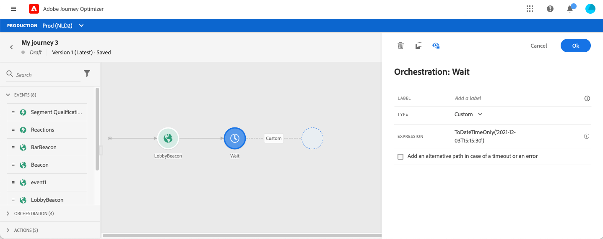

# 待機アクティビティ{#section_rlm_nft_dgb}

パス内の次のアクティビティを実行する前に待機する場合は、 **[!UICONTROL Wait]** アクティビティを使用できます。 次のアクティビティを実行するタイミングを定義できます。 次の4つのオプションが使用できます。

* [期間](#duration)
* [固定日付](#fixed_date)
* [カスタム](#custom)
* [電子メール送信時間の最適化](#email_send_time_optimization)

## 待機アクティビティについて{#about_wait}

複数の待機を並行して使用する場合、待機の優先順位は次のようになります。 設定が同じで、重なり合う条件が異なる場合、上に配置した待機が優先付けされます。 例えば、最初の待機の条件は「女性」で、2回目の待機の条件は「VIP」です。 最初の待機アクティビティが優先付けされます

また、2つの異なる待機が並行している場合は、その垂直位置に関係なく、最初に発生した待機が優先付けされます。 例えば、1時間の待機を超え、30分の待機を超えた場合、30分の待機が処理されます。

特定の母集団の待ち時間を制限する場合は、条件を定義できます。

>[!NOTE]
>
>最大の待機時間は30日です。
>
>テストモードでは、 **[!UICONTROL Wait time in test]** アクティビティーを使用して、各待機パラメーターが持続する時間を定義できます。 デフォルト時間は 10 秒です。これにより、テスト結果を迅速に取得できます。 を参照してください。

## 待機時間{#duration}

次のアクティビティを実行するまでの待機時間を選択します。

## 固定日の待機{#fixed_date}

次のアクティビティの実行日を選択します。

## カスタムの待機{#custom}

このオプションを使用すると、カスタムの日付を定義できます。例えば、2020年7月12日午後5時に、イベントまたはデータソースからのフィールドに基づくアドバンス式を使用して、カスタムの日付を定義できます。 カスタムの期間（例：7日）を定義することはできません。 式エディターの式は、dateTimeOnly形式を提供する必要があります。 を参照してください。dateTimeOnly形式の詳細については、を参照してくだ さい。

>[!NOTE]
>
>dateTimeOnly式を使用するか、関数を使用してdateTimeOnlyに変換できます。 次に例を示します。 toDateTimeOnly(@{イベント.offerOpened.アクティビティ.endTime})(イベント内のフィールドの形式は2016-08-12T09:46:06)。
>
>タ **イムゾーン** は、旅の特性に応じて決まります。 その結果、現在、2016-08-12T09:46:06.982-05のような完全なISO-8601タイムスタンプの混合時間とタイムゾーンのオフセットを、インターフェイスから直接指定することはできません。 を参照してください。

## Email send time optimization{#email_send_time_optimization}

>[!CAUTION]
>
>電子メール送信時間最適化機能は、Adobe Campaign Standardデータサービス機能を使用するお客様のみ利用できます。

このタイプの待機では、Adobe Experience Platformで計算されたスコアが使用されます。 スコアは、過去の行動に基づいて、将来的に電子メールをクリックしたり開いたりする傾向を計算します。 スコアを計算するアルゴリズムは、ある程度のデータ量を必要とします。 その結果、十分なデータがない場合は、デフォルトの待機時間が適用されます。 公開時には、デフォルトの時間が適用されることが通知されます。

>[!NOTE]
>
>旅の最初のイベントには名前空間が必要です。
>
>この機能は、 **[!UICONTROL 電子メール]** アクティビティ後にのみ使用できます。 Adobe Campaign Standardが必要です。

1. 「 **[!UICONTROL Amount of time]** 」フィールドで、電子メール送信の最適化を検討する時間数を定義します。
1. [ **[!UICONTROL 最適化タイプ]** ]フィールドで、最適化によってクリック数が増えるか、開くかを選択します。
1. 「 **[!UICONTROL デフォルト時間]** 」フィールドで、予測送信時間スコアが使用できない場合に待機するデフォルト時間を定義します。

   >[!NOTE]
   >
   >計算を実行するのに十分なデータがないので、送信時間スコアを使用できない場合があります。 この場合、発行時に、デフォルトの時刻が適用されることを通知します。

