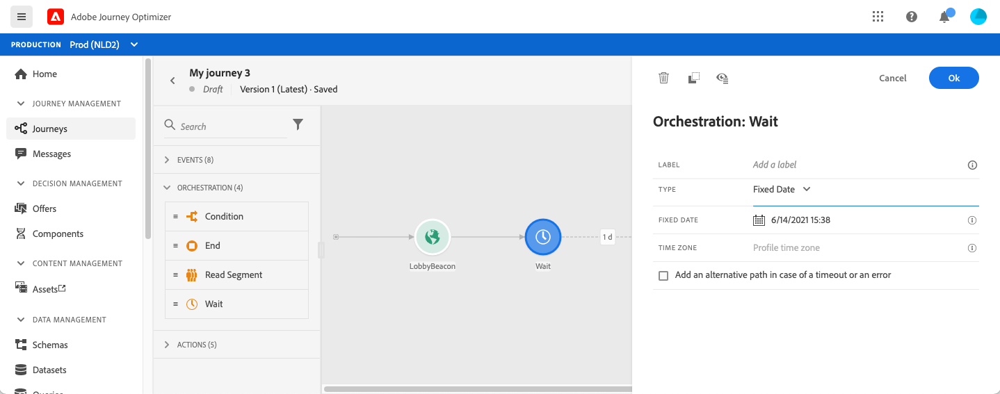
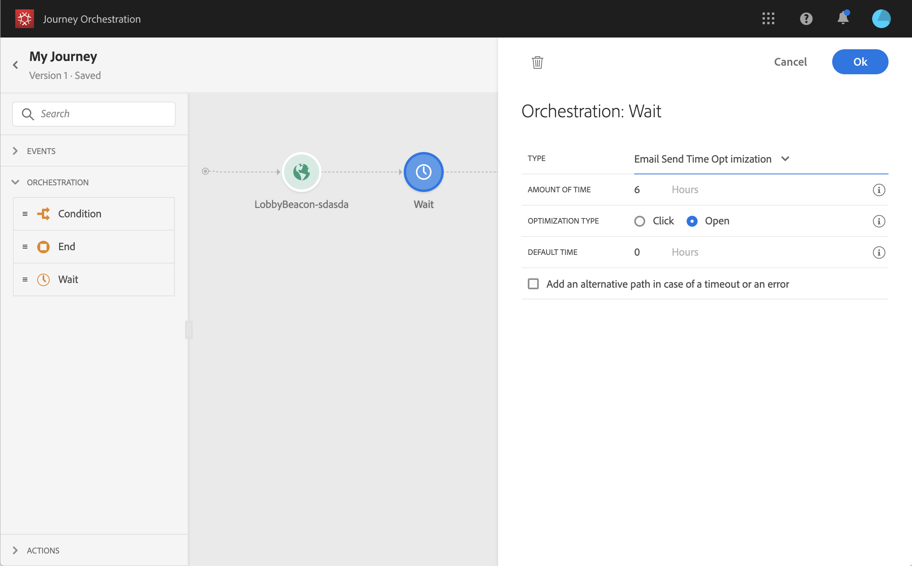

# 待機アクティビティ{#section_rlm_nft_dgb}

パス内の次のアクティビティを実行する前に待つ場合は、**[!UICONTROL Wait]**&#x200B;アクティビティを使用できます。 次のアクティビティを実行するタイミングを定義できます。 次の4つのオプションが使用できます。

* [期間](#duration)
* [固定日付](#fixed_date)
* [カスタム](#custom)

<!--* [Email send time optimization](#email_send_time_optimization)-->

## 待機アクティビティについて{#about_wait}

複数の待機を並行して使用する場合、待機の優先順位は次のようになります。 設定が同じで、重なり合う条件が異なる場合、上に配置した待機が優先付けされます。 例えば、最初の待ち時間が「女性」、2回目の待ち時間が「VIP」となる。 最初の待機アクティビティが優先付けされます

また、2つの異なる待機が並行している場合は、その垂直位置に関係なく、最初に発生した待機が優先付けされます。 例えば、1時間の待機を超え、30分の待機を超えた場合、30分の待機が処理されます。

特定の母集団の待ち時間を制限する場合は、条件を定義できます。

>[!NOTE]
>
>最大の待機時間は30日です。
>
>テストモードでは、**[!UICONTROL Wait time in test]**&#x200B;パラメーターを使用して、各待機アクティビティが持続する時間を定義できます。 デフォルト時間は 10 秒です。これにより、テスト結果を迅速に取得できます。 [このページ](../building-journeys/testing-the-journey.md)を参照

## 待機時間{#duration}

次のアクティビティを実行するまでの待機時間を選択します。


## 固定日の待機{#fixed_date}

次のアクティビティの実行日を選択します。



## カスタムの待機{#custom}

このオプションを使用すると、カスタムの日付を定義できます。例えば、2020年7月12日午後5時に、イベントまたはデータソースからのフィールドに基づくアドバンス式を使用して、カスタムの日付を定義できます。 カスタムの期間（例：7日）を定義することはできません。 式エディターの式は、dateTimeOnly形式を提供する必要があります。 [このページ](../expression/expressionadvanced.md)を参照してください。dateTimeOnly形式について詳しくは、[このページ](../expression/data-types.md)を参照してください。

>[!NOTE]
>
>dateTimeOnly式を使用するか、関数を使用してdateTimeOnlyに変換できます。 次に例を示します。```toDateTimeOnly(@{Event.offerOpened.activity.endTime})```。イベントのフィールドの形式は2016-08-12T09:46:06Zです。
>
>**タイムゾーン**&#x200B;は、旅の特性に必要です。 その結果、現在、2016-08-12T09:46:06.982-05のような完全なISO-8601タイムスタンプの混合時間とタイムゾーンのオフセットを、インターフェイスから直接指定することはできません。 [このページ](../building-journeys/timezone-management.md)を参照してください。


<!--## Email send time optimization{#email_send_time_optimization}

>[!CAUTION]
>
>The email send time optimization capability is only available to customers who use the [Adobe Experience Platform Data Connector](https://docs.adobe.com/content/help/en/campaign-standard/using/developing/mapping-campaign-and-aep-data/aep-about-data-connector.html).

This type of wait uses a score calculated in the Adobe Experience Platform. The score calculates the propensity to click or open an email in the future based on past behavior. Note that the algorithm calculating the score needs a certain amount of data to work. As a result, when it does not have enough data, the default wait time will apply. At publication time, you’ll be notified that the default time applies.

>[!NOTE]
>
>The first event of your journey must have a namespace.
>
>This capability is only available after an **[!UICONTROL Email]** activity. You need to have Adobe Campaign Standard.

1. In the **[!UICONTROL Amount of time]** field, define the number of hours to consider to optimize email sending.
1. In the **[!UICONTROL Optimization type]** field, choose if the optimization should increase clicks or opens.
1. In the **[!UICONTROL Default time]** field, define the default time to wait if the predictive send time score is not available.

    >[!NOTE]
    >
    >Note that the send time score can be unavailable because there is not enough data to perform the calculation. In this case, you will be informed, at publication time, that the default time applies.

-->
