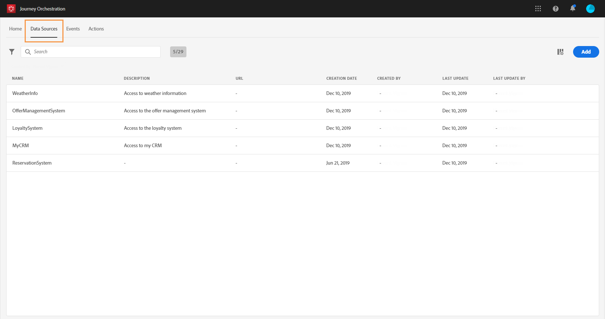

# データソースについて {#concept_s1s_dqt_52b}

>[!CAUTION]
>
>**Adobe Journey Optimizer をお探しですか**？ Journey Optimizer のドキュメントについて詳しくは、[こちら](https://experienceleague.adobe.com/ja/docs/journey-optimizer/using/ajo-home){target="_blank"}をクリックしてください。
>
>
>_このドキュメントは、Journey Optimizer に置き換えられた従来の Journey Orchestration 資料を参照しています。 Journey Orchestration または Journey Optimizer へのアクセスについてご質問がある場合は、アカウントチームにお問い合わせください。_

>[!CONTEXTUALHELP]
>id="jo_datasources"
>title="データソースについて"
>abstract="データソース設定では、ジャーニーで使用する追加情報を取得するためにシステムへの接続を定義できます。"

データソース設定を使用すると、システムへの接続を定義して、ジャーニーにおいて次の目的でジャーニーで使用される追加情報を取得できます。

* [条件の定義](../building-journeys/condition-activity.md)
* [アクション](../action/action.md)のパラメーターとパーソナライゼーションデータ
* [カスタムの待機の定義](../building-journeys/wait-activity.md#custom)
* [タイムゾーンの定義](../building-journeys/timezone-management.md)

ジャーニーがイベントペイロードからのローカルデータのみを活用する場合、この設定は必要ありません。 例えば、ジャーニーがイベントとそれに続くイベントのデータのみを使用する電子メールアクティビティで構成される場合、データソースを設定する必要はありません。

データソースには次の 2 種類があります。

* リアルタイム顧客プロファイルサービスへの接続を定義する、事前設定済みの Adobe Experience Platform データソース。 これはビルトインのデータソースです。 [このページ](../datasource/adobe-experience-platform-data-source.md)を参照してください。
* 外部システムへの接続を定義できる外部データソース。 これは作成可能なデータソースです。 [このページ](../datasource/external-data-sources.md)を参照してください。

各データソースについて、フィールドグループを使用して取得する情報を定義します。 フィールドグループは、データソースから取得できるフィールドのセットです。 [このページ](../datasource/field-groups.md)を参照してください。

主なデータソース設定手順は次のとおりです。

>[!NOTE]
>
>データソースの設定は、常に&#x200B;**技術ユーザー**&#x200B;が実行します。

1. メニューウィンドウで、「**[!UICONTROL 管理者]**」を選択します。 「**[!UICONTROL データソース]**」セクションで、「**[!UICONTROL 管理]**」をクリックします。

   データソースのリストが表示されます。 インターフェイスの詳細については、[このページ](../about/user-interface.md)を参照してください。

   

1. 次に、ビルトインデータソースにフィールドグループを追加するか（[このページ](../datasource/adobe-experience-platform-data-source.md)を参照）、新しい外部データソース（[このページ](../datasource/external-data-sources.md)を参照）および関連付けられたフィールドグループを作成する（[このページ](../datasource/field-groups.md)を参照）ことができます。

   

1. 「**[!UICONTROL 保存]**」をクリックします。

   データソースが設定され、ジャーニーで使用できる状態になります。
