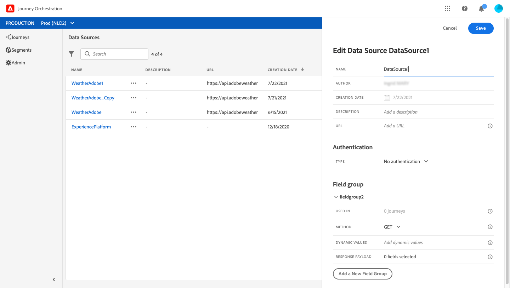
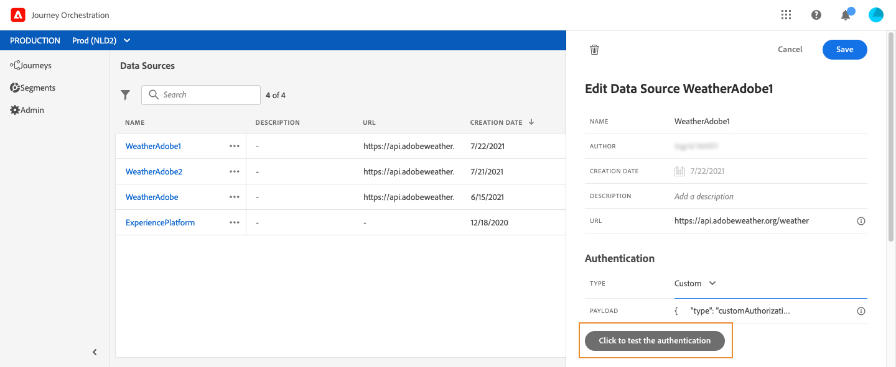

# 外部データソース {#concept_t2s_kqt_52b}

外部データソースを使用すると、サードパーティシステムへの接続を定義できます。例えば、ホテルの予約システムを使用して、部屋が登録されたかどうかを確認する場合などです。組み込みの Adobe Experience Platform データソースとは異なり、外部データソースは必要な数だけ作成できます。

POST または GET を使用して JSON を返す REST API がサポートされています。API キー認証モード、基本認証モード、カスタム認証モードがサポートされています。

次に、リアルタイムの天気データに従ってジャーニーの行動をカスタマイズするのに使用する天気 API サービスの例を見てみましょう。

API 呼び出しの例を 2 つ示します。

* _https://api.adobeweather.org/weather?city=London,uk&amp;appid=1234_
* _https://api.adobeweather.org/weather?lat=35&amp;lon=139&amp;appid=1234_

この呼び出しは、メイン URL（_https://api.adobeweather.org/weather_）、2 つのパラメーターセット（市区町村を表す「city」、緯度と経度を表す「lat/long」）、API キー（appid）で構成されます。

新しい外部データソースを作成および設定する主な手順は次のとおりです。

1. データソースのリストで「**[!UICONTROL 追加]**」をクリックして、新しい外部データソースを作成します。

   

   画面の右側にデータソース設定ペインが開きます。

   

1. データソースの名前を入力します。

   >[!NOTE]
   >
   >スペースや特殊文字は使用しないでください。30 文字以内にしてください。

1. データソースに説明を追加します。この手順はオプションです。
1. 外部サービスの URL を追加します。この例では、_https://api.adobeweather.org/weather_ です。

   >[!CAUTION]
   >
   >セキュリティ上の理由から、HTTPS の使用を強くお勧めします。また、一般公開されていないアドビのアドレスの使用および IP アドレスの使用は許可されていません。

   

1. 外部サービスの設定に応じて認証を&#x200B;**[!UICONTROL 認証なし]**、**[!UICONTROL 基本]**、**[!UICONTROL カスタム]**、**[!UICONTROL API キー]**&#x200B;に設定します。カスタム認証モードについて詳しくは、[このセクション](../datasource/external-data-sources.md#section_wjp_nl5_nhb)を参照してください。 この例では、次を選択します。


   * **[!UICONTROL タイプ]**：API キー
   * **[!UICONTROL 値]**：1234（API キーの値）
   * **[!UICONTROL 名前]**：appid（API キーのパラメーター名）
   * **[!UICONTROL 場所]**：クエリパラメーター（API キーは URL 内にあります）

   

1. 「**[!UICONTROL 新しいフィールドグループを追加]**」をクリックして、API パラメーターセットごとに新しいフィールドグループを作成します。フィールドグループ名にはスペースや特殊文字を使用しないでください。この例では、パラメーターセット（city と longlat）ごとに 1 つずつ、2 つのフィールドグループを作成する必要があります。

「longlat」パラメーターセットに対して、次の情報を持つフィールドグループを作成します。

* **[!UICONTROL 使用されている場所]**：フィールドグループを使用するジャーニーの数を表示します。**[!UICONTROL ジャーニーを表示]**&#x200B;アイコンをクリックすると、このフィールドグループを使用するジャーニーのリストを表示できます。
* **[!UICONTROL メソッド]**：POST または GET メソッドを選択します。ここでは GET メソッドを選択します。
* **[!UICONTROL キャッシュ時間]**：ここでは、天気を 10 分間キャッシュします。
* **[!UICONTROL 応答ペイロード]**：「**[!UICONTROL ペイロード]**」フィールド内をクリックし、呼び出しによって返されたペイロードの例を貼り付けます。この例では、天気 API の web サイトで見つかったペイロードを使用しました。フィールドタイプが正しいことを確認します。API が呼び出されるたびに、ペイロードの例に含まれるすべてのフィールドが取得されます。現在渡されているペイロードを変更する場合は、「**[!UICONTROL 新しいペイロードを貼り付け]**」をクリックできます。
* **[!UICONTROL 動的値]**：この例では、コンマで区切られた異なるパラメーター「long,lat」を入力します。パラメーター値は実行コンテキストに依存するので、ジャーニーで定義されます。[このページ](../expression/expressionadvanced.md)を参照してください。
* **[!UICONTROL 送信済みペイロード]**：このフィールドは、この例では表示されません。このフィールドは POST メソッドを選択した場合にのみ使用できます。サードパーティシステムに送信するペイロードを貼り付けます。

パラメータが必要なGET呼び出しの場合は、**[!UICONTROL 動的値]**&#x200B;フィールドにパラメータを入力すると、呼び出しの最後に自動的に追加されます。 POST 呼び出しの場合は、次の操作が必要です。

* 呼び出し時に渡すパラメーターを&#x200B;**[!UICONTROL 動的値]**&#x200B;フィールドにリストします（次の例を参照）。&quot;識別子&quot;)。
* また、送信済みペイロードの本文で同じ構文を使用して指定します。そのためには、「&quot;param&quot;: &quot;パラメーター名&quot;」（以下の例ではパラメーター名は「identifier」）を追加する必要があります。以下の構文に従います。

   ```
   {"id":{"param":"identifier"}}
   ```


「**[!UICONTROL 保存]**」をクリックします。

これで、データソースが設定され、ジャーニーで使用できる状態になりました。これで、状況に応じて、E メールをパーソナライズできます。例えば、気温が 30 ℃を超える場合に特定の通信を送信したりできます。

## カスタム認証モード{#section_wjp_nl5_nhb}

>[!CONTEXTUALHELP]
>id="jo_authentication_payload"
>title="カスタム認証について"
>abstract="カスタム認証モードは、OAuth2 などの API ラッピングプロトコルを呼び出す複雑な認証に使用されます。アクションの実行は、2 つの手順で構成されるプロセスです。まず、エンドポイントへの呼び出しを実行して、アクセストークンを生成します。次に、アクションの HTTP リクエストにアクセストークンが挿入されます。"

この認証モードは複雑な認証に使用され、OAuth2 などの API ラッピングプロトコルを呼び出して、アクションの実際の HTTP リクエストに挿入されるアクセストークンを取得するために頻繁に使用されます。

カスタム認証を設定する場合、下のボタンをクリックして、カスタム認証ペイロードが正しく設定されているかどうかを確認できます。



テストが成功すると、ボタンが緑色に変わります。


この認証を使用すると、アクションの実行は次の 2 つの手順で構成されるプロセスになります。

1. エンドポイントを呼び出してアクセストークンを生成します。
1. アクセストークンを適切に挿入して REST API を呼び出します。

この認証には 2 つの部分があります。

アクセストークンの生成時に呼び出されるエンドポイントの定義：

* endpoint：エンドポイントの生成に使用する URL。
* method：エンドポイントでの HTTP リクエストのメソッド（GET または POST）。
* headers：必要に応じて、この呼び出しでヘッダーとして挿入されるキーと値のペア。
* body：メソッドが POST の場合の呼び出しの本文を説明します。bodyParams（キーと値のペア）で定義される、制限付きの本文構造をサポートしています。bodyType は、次の呼び出しでの本文の形式とエンコーディングを記述します。
   * &#39;form&#39;：コンテンツタイプは application/x-www-form-urlencoded (charset UTF-8) になり、キーと値のペアは key1=value1&amp;key2=value2&amp;... のようにシリアル化されます。
   * &#39;json&#39;：コンテンツタイプは application/json (charset UTF-8) になり、キーと値のペアは&#x200B;_{ &quot;key1&quot;: &quot;value1&quot;, &quot;key2&quot;: &quot;value2&quot;, ...}_ のように json オブジェクトとしてシリアル化されます。

アクションの HTTP リクエストにアクセストークンを挿入する方法の定義：

* authorizationType：生成されたアクセストークンを、アクションの HTTP 呼び出しに挿入する方法を定義します。可能な値は次のとおりです。

   * bearer：アクセストークンを認証ヘッダーに挿入する必要があることを示します（_Authorization: Bearer &lt;アクセストークン>_）。
   * header：アクセストークンをヘッダーとして挿入する必要があることを示します。ヘッダー名は、tokenTarget プロパティで定義されます。例えば、tokenTarget が myHeader の場合、アクセストークンは _myHeader: &lt;アクセストークン>_&#x200B;のようにヘッダーとして挿入されます。
   * queryParam：アクセストークンを queryParam（プロパティ tokenTarget で定義されるクエリパラメーター名）として挿入する必要があることを示します。例えば、tokenTarget が myQueryParam の場合、アクション呼び出しの URL は _&lt;url>?myQueryParam=&lt;アクセストークン>_ のようになります。

* tokenInResponse：認証呼び出しからアクセストークンを抽出する方法を示します。このプロパティは次のいずれかになります。
   * &#39;response&#39;：HTTP 応答がアクセストークンであることを示します。
   * json のセレクター（応答が json である場合、XML などの他の形式はサポートされません）。このセレクターの形式は、_json://&lt;アクセストークンプロパティのパス>_&#x200B;です。例えば、呼び出しの応答が _{ &quot;access_token&quot;: &quot;theToken&quot;, &quot;timestamp&quot;: 12323445656 }_ の場合、tokenInResponse は _json: //access_token_ になります。

この認証の形式は次のとおりです。

```
{
    "type": "customAuthorization",
    "authorizationType": "<value in 'bearer', 'header' or 'queryParam'>",
    (optional, mandatory if authorizationType is 'header' or 'queryParam') "tokenTarget": "<name of the header or queryParam if the authorizationType is 'header' or 'queryParam'>",
    "endpoint": "<URL of the authentication endpoint>",
    "method": "<HTTP method to call the authentication endpoint, in 'GET' or 'POST'>",
    (optional) "headers": {
        "<header name>": "<header value>",
        ...
    },
    (optional, mandatory if method is 'POST') "body": {
        "bodyType": "<'form'or 'json'>,
        "bodyParams": {
            "param1": value1,
            ...

        }
    },
    "tokenInResponse": "<'response' or json selector in format 'json://<field path to access token>'"
}
```

カスタム認証データソース用のトークンのキャッシュ期間を変更できます。次に、カスタム認証ペイロードの例を示します。キャッシュ期間は、「cacheDuration」パラメーターで定義されます。キャッシュ内で生成されたトークンの保存期間を指定します。単位は、ミリ秒、秒、分、時間、日、月、年です。

```
"authentication": {
    "type":"customAuthorization",
    "authorizationType":"Bearer",
    "endpoint":"http://localhost:${port}/epsilon/oauth2/access_token",
    "method":"POST",
    "headers": {
        "Authorization":"Basic EncodeBase64(${epsilonClientId}:${epsilonClientSecret})"
        },
    "body": {
        "bodyType":"form",
        "bodyParams": {
             "scope":"cn mail givenname uid employeeNumber",
             "grant_type":"password",
             "username":"${epsilonUserName}",
             "password":"${epsilonUserPassword}"
             }
        },
    "tokenInResponse":"json://access_token",
    "cacheDuration":
             { "duration":5, "timeUnit":"seconds" }
    }
```
