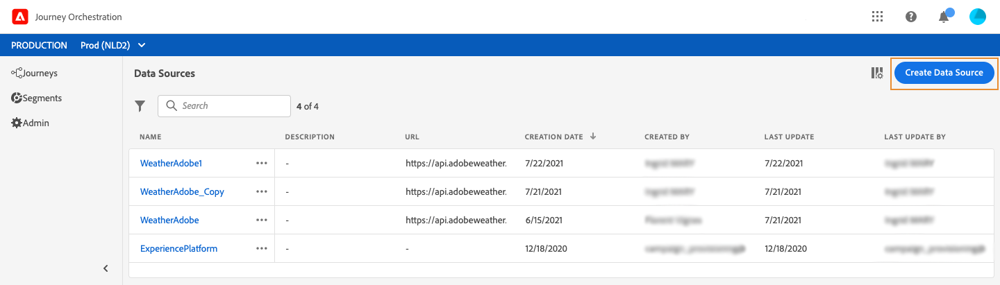

# 外部データソース {#concept_t2s_kqt_52b}

外部データソースを使用すると、サードパーティシステムへの接続を定義できます。例えば、ホテルの予約システムを使用して、部屋が登録されたかどうかを確認する場合などです。組み込みの Adobe Experience Platform データソースとは異なり、外部データソースは必要な分だけ作成できます。

POST または GET を使用して JSON を返す REST API がサポートされています。API キー、基本およびカスタム認証モードがサポートされています。

リアルタイムの天気データに応じて、ジャーニーの動作をカスタマイズするために使用する、天気 API サービスの例を見てみましょう。

以下に API 呼び出しの例を 2 つ示します。

* _https://api.adobeweather.org/weather?city=London,uk&amp;appid=1234_
* _https://api.adobeweather.org/weather?lat=35&amp;lon=139&amp;appid=1234_

呼び出しにはメイン URL（_https://api.adobeweather.org/weather_）、2 つのパラメーターセット（都市の場合は「city」、緯度と経度の場合は「lat/long」）、および API キー（appid）が含まれます。

新しい外部データソースを作成して構成するための主な手順は次のとおりです。

1. データソースのリストで「**[!UICONTROL データソースを作成]**」をクリックして、新しい外部データソースを作成します。

   

   画面の右側にデータソース設定ペインが開きます。


   

1. データソースの名前を入力します。

   >[!NOTE]
   >
   >スペースや特殊文字は使用しないでください。30 文字以内にしてください。

1. データソースに説明を追加します。この手順はオプションです。
1. 外部サービスの URL を追加します。この例では、次のようになります。_https://api.adobeweather.org/weather_。

   >[!CAUTION]
   >
   >セキュリティ上の理由から、HTTPS の使用を強くお勧めします。また、アドビの非公開アドレスや IP アドレスの使用は許可されていません。

   

1. 外部サービスの設定に応じて認証を&#x200B;**[!UICONTROL 認証なし]**、**[!UICONTROL 基本]**、**[!UICONTROL カスタム]**、**[!UICONTROL API キー]**&#x200B;のいずれかに設定します。カスタム認証モードについて詳しくは、[この節](../datasource/external-data-sources.md#section_wjp_nl5_nhb)を参照してください。この例では、次を選択します。


   * **[!UICONTROL タイプ]**：API キー
   * **[!UICONTROL 値]**：&quot;1234&quot;（API キーの値）
   * **[!UICONTROL 名前]**：&quot;appid&quot;（API キーのパラメーター名）
   * **[!UICONTROL 位置]**：「クエリパラメーター」（API キーは URL 内にあります）

   

1. 「**[!UICONTROL 新しいフィールドグループを追加]**」をクリックして、API パラメーターセットごとに新しいフィールドグループを追加します。フィールドグループ名にはスペースや特殊文字を使用しないでください。この例では、各パラメーターセット（都市と経度／緯度）ごとに 1 つずつ、2 つのフィールドグループを作成する必要があります。

「long/lat」パラメーターセットの場合、次の情報を含むフィールドグループを作成します。

* **[!UICONTROL 使用場所]**：フィールドグループを使用するジャーニーの数を表示します。**[!UICONTROL ジャーニーを表示]**&#x200B;アイコンをクリックし、このフィールドグループを使用するジャーニーのリストを表示できます。
* **[!UICONTROL メソッド]**：POST または GET メソッドを選択します。この場合は、GET メソッドを選択します。
* **[!UICONTROL 応答ペイロード]**：**[!UICONTROL ペイロード]**&#x200B;フィールド内でクリックし、呼び出しによって返されたペイロードの例をペーストします。この例では、天気 API の web サイトにあるペイロードを使用しました。フィールドタイプが正しいことを確認します。API が呼び出されるたびに、ペイロードの例に含まれるすべてのフィールドが取得されます。現在渡されているペイロードを変更する場合、「**[!UICONTROL 新しいペイロードをペースト]**」をクリックします。
* **[!UICONTROL 動的な値]**：この例では、「long,lat」というコンマで区切られた異なるパラメーターを入力します。パラメーター値は実行コンテキストに依存するので、ジャーニーで定義されます。[このページ](../expression/expressionadvanced.md)を参照してください。
* **[!UICONTROL 送信済みペイロード]**：このフィールドは、この例では表示されません。POST メソッドを選択した場合にのみ使用できます。サードパーティシステムに送信されるペイロードをペーストします。

GET 呼び出しにパラメーターが必要な場合は、「 **[!UICONTROL 動的な値]**」フィールドにパラメーターを入力すると、呼び出しの最後に自動的に追加されます。POST 呼び出しの場合は、次の操作が必要です。

* 呼び出し時に渡すパラメーターを「**[!UICONTROL 動的な値]**」フィールドにリストします（以下の例では「identifier」）。
* また、送信済みペイロードの本文で同じ構文を使用して指定します。そのためには、「&quot;param&quot;: &quot;パラメーター名&quot;」（以下の例ではパラメーター名は「identifier」）を追加する必要があります。次の構文に従います。

  ```
  {"id":{"param":"identifier"}}
  ```


「**[!UICONTROL 保存]**」をクリックします。

これで、データソースが設定され、ジャーニーで使用できる状態になりました。これで、状況に応じて、メールをパーソナライズできます。温度が 30°C を超える場合、特定のコミュニケーションを送信するようにできます。

## カスタム認証モード{#section_wjp_nl5_nhb}

>[!CONTEXTUALHELP]
>id="jo_authentication_payload"
>title="カスタム認証について"
>abstract="カスタム認証モードは、OAuth2 などの API ラッピングプロトコルを呼び出すための複雑な認証に使用されます。アクションの実行は 2 段階の手順で行われます。まず、エンドポイントへの呼び出しが実行されて、アクセストークンが生成されます。次に、アクセストークンがアクションの HTTP リクエストに挿入されます。"

この認証モードは、複雑な認証に使用され、OAuth2 などの API ラッピングプロトコルを呼び出すために頻繁に使用されます。これにより、アクションの実際の HTTP リクエストに挿入するアクセストークンが取得されます。

カスタム認証を設定する場合は、下のボタンをクリックして、カスタム認証ペイロードが正しく設定されているかどうかを確認できます。


テストに成功すると、ボタンが緑色に変わります。


この認証では、アクションの実行は次の 2 つの手順で構成されます。

1. エンドポイントを呼び出して、アクセストークンを生成します。
1. アクセストークンを適切な方法で挿入して、REST API を呼び出します。

この認証には 2 つの部分があります。

アクセストークンの生成時に呼び出されるエンドポイントの定義：

* endpoint：エンドポイントの生成に使用する URL
* エンドポイントでの HTTP リクエストのメソッド（GET または POST）
* headers：必要に応じて、この呼び出しでヘッダーとして挿入されるキーと値のペア。
* body：メソッドが POST の場合の呼び出しの本文を記述します。bodyParams（キーと値のペア）で定義される、制限付きの本文構造をサポートしています。bodyType は、呼び出しでの本文の形式とエンコーディングを記述します。
   * &#39;form&#39;：コンテンツタイプは application/x-www-form-urlencoded（文字セット UTF-8）になり、キーと値のペアは key1=value1&amp;key2=value2&amp;... のようにシリアル化されます。
   * &#39;json&#39;：コンテンツタイプは application/json（文字セット UTF-8）になり、キーと値のペアは&#x200B;_{ &quot;key1&quot;: &quot;value1&quot;, &quot;key2&quot;: &quot;value2&quot;, ...}_ のように json オブジェクトとしてシリアル化されます。

アクションの HTTP リクエストにアクセストークンを挿入する方法の定義：

* authorizationType：生成されたアクセストークンをアクションの HTTP 呼び出しに挿入する方法を定義します。使用可能な値は次のとおりです。

   * bearer：_Authorization: Bearer &lt;access token>_ のように、アクセストークンを Authorization ヘッダーに挿入する必要があることを示します。
   * header：プロパティ tokenTarget で定義されたヘッダー名のヘッダーとして、アクセストークンを挿入する必要があることを示しています。例えば、tokenTarget が myHeader の場合、アクセストークンは _myHeader: &lt;access token>_ のようにヘッダーとして挿入されます。
   * queryParam：プロパティ tokenTarget で定義されたクエリパラメーター名である queryParam として、アクセストークンを挿入する必要があることを示します。例えば、tokenTarget が myQueryParam の場合、アクション呼び出しの URL は _&lt;url>?myQueryParam=&lt;access token>_ のようになります。

* tokenInResponse：認証呼び出しからアクセストークンを抽出する方法を示します。このプロパティには次のようなものがあります。
   * &#39;response&#39;：HTTP 応答がアクセストークンであることを示します
   * JSON 内のセレクター（応答が JSON であると仮定し、XML などの他の形式はサポートされません）。このセレクターの形式は _json://&lt;path to the access token property>_ です。例えば、呼び出しの応答が _{ &quot;access_token&quot;: &quot;theToken&quot;, &quot;timestamp&quot;: 12323445656 }_ の場合、tokenInResponse は _json: //access_token_ のようになります。

この認証の形式は次のとおりです。

```
{
    "type": "customAuthorization",
    "authorizationType": "<value in 'bearer', 'header' or 'queryParam'>",
    (optional, mandatory if authorizationType is 'header' or 'queryParam') "tokenTarget": "<name of the header or queryParam if the authorizationType is 'header' or 'queryParam'>",
    "endpoint": "<URL of the authentication endpoint>",
    "method": "<HTTP method to call the authentication endpoint, in 'GET' or 'POST'>",
    (optional) "headers": {
        "<header name>": "<header value>",
        ...
    },
    (optional, mandatory if method is 'POST') "body": {
        "bodyType": "<'form'or 'json'>,
        "bodyParams": {
            "param1": value1,
            ...

        }
    },
    "tokenInResponse": "<'response' or json selector in format 'json://<field path to access token>'"
}
```

カスタム認証データソース用のトークンのキャッシュ時間を変更できます。次に、カスタム認証ペイロードの例を示します。キャッシュ時間は、「cacheDuration」パラメーターで定義します。キャッシュ内の生成されたトークンの保持期間を指定します。単位はミリ秒、秒、分、時間、日、月、年です。

```
"authentication": {
    "type":"customAuthorization",
    "authorizationType":"Bearer",
    "endpoint":"http://localhost:${port}/epsilon/oauth2/access_token",
    "method":"POST",
    "headers": {
        "Authorization":"Basic EncodeBase64(${epsilonClientId}:${epsilonClientSecret})"
        },
    "body": {
        "bodyType":"form",
        "bodyParams": {
             "scope":"cn mail givenname uid employeeNumber",
             "grant_type":"password",
             "username":"${epsilonUserName}",
             "password":"${epsilonUserPassword}"
             }
        },
    "tokenInResponse":"json://access_token",
    "cacheDuration":
             { "duration":5, "timeUnit":"seconds" }
    }
```

>[!NOTE]
>
>キャッシュ時間を使用すると、認証エンドポイントへの呼び出しが多くなりすぎないようにすることができます。認証トークンの保持はサービスにキャッシュされ、永続性はありません。サービスを再起動した場合は、キャッシュがクリーンアップされた状態でサービスが開始されます。デフォルトのキャッシュ時間は 1 時間です。カスタム認証ペイロードでは、別の保持時間を指定することで調整することができます。
