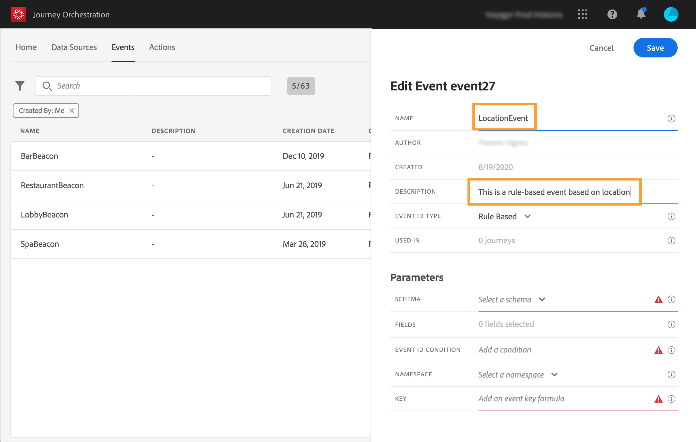

# 新しいイベントの作成 {#section_tbk_5qt_pgb}

新しいイベントを設定する主な手順は次のとおりです。

1. 上部のメニューで、「**[!UICONTROL イベント]**」タブをクリックします。イベントのリストが表示されます。インターフェイスの詳細は、[このページ](../about/user-interface.md)を参照してください。

   

1. 新しいイベントを作成するには、「**[!UICONTROL 追加]**」をクリックします。画面の右側にイベント設定ペインが開きます。イベントの名前を入力します。説明を追加することもできます。

   

   >[!NOTE]
   >
   >スペースや特殊文字は使用しないでください。30 文字以内にしてください。

1. **[!UICONTROL イベントID type]**&#x200B;フィールドで、使用するイベントタイプを選択します。

   

   * **ルール** ベースイベント：このタイプのイベントでは、eventIDは生成されません。「**イベントID条件**」フィールドでは、ジャーニーをトリガーする関連イベントを識別するためにシステムで使用されるルールを定義するだけです。 このルールは、イベントペイロードで使用可能な任意のフィールドに基づくことができます。例えば、プロファイルの場所や、プロファイルの買い物かごに追加された項目数などです。

   * **System-** generatedevents:この型にはeventIDが必要です。このeventIDフィールドは、ペイロードの作成時に自動的に生成され、イベントプレビューに追加されます。 イベントをプッシュするシステムはIDを生成しないでください。ペイロードプレビューで使用可能なIDを渡す必要があります。 [この節](../event/previewing-the-payload.md)を参照してください。
   >[!NOTE]
   >
   >[このセクション](../event/about-events.md)のイベントタイプについて詳しくお読みください。
1. このイベントを使用するジャーニーの数は、「**[!UICONTROL 使用されている場所]**」フィールドに表示されます。**[!UICONTROL ジャーニーを表示]**&#x200B;アイコンをクリックすると、このイベントを使用するジャーニーのリストを表示できます。
1. スキーマフィールドとペイロードフィールドを定義します。ここで、[!DNL Journey Orchestration] が受信するイベント情報（通常はペイロードと呼ばれる）を選択します。その後、この情報をジャーニーに使うことができます。[このページ](../event/defining-the-payload-fields.md)を参照してください。
   >[!NOTE]
   >
   >「**[!UICONTROL システム生成]**」タイプを選択した場合は、eventIDタイプがmixinのスキーマのみを使用できます。 「**[!UICONTROL ルールベース]**」タイプを選択すると、すべてのエクスペリエンスイベントスキーマを使用できます。

1. ルールベースのイベントの場合は、**[!UICONTROL イベントID条件]**フィールド内をクリックします。 シンプルな式エディターを使用して、ジャーニーをトリガーするイベントを識別するためにシステムで使用される条件を定義します。
   

   この例では、プロファイルの都市に基づいて条件を作成しました。 つまり、この条件に一致するイベント（**[!UICONTROL 市区町村]**&#x200B;フィールドと&#x200B;**[!UICONTROL パリ]**&#x200B;値）を受け取るたびに、システムはそれをJourney Orchestrationに渡します。

1. 名前空間を追加します。この手順はオプションですが、名前空間を追加すると、リアルタイム顧客プロファイルサービスに保存された情報を活用できるのでお勧めです。これは、イベントのキーのタイプを定義します。[このページ](../event/selecting-the-namespace.md)を参照してください。
1. キーを定義します。ペイロードフィールドからフィールドを選択するか、イベントに関連付けられた個人を識別する数式を定義します。このキーは、名前空間を選択した場合に自動的に設定されます（ただし、編集は可能です）。[!DNL Journey Orchestration] では、名前空間に対応するキーが選択されます（例：E メール名前空間を選択した場合、E メールキーが選択されます）。[このページ](../event/defining-the-event-key.md)を参照してください。
1. システム生成イベントの場合は、条件を追加できます。 この手順はオプションです。これにより、条件を満たすイベントのみが処理されます。条件は、イベントに含まれる情報に基づく場合にのみ指定できます。[このページ](../event/adding-a-condition.md)を参照してください。
1. 「**[!UICONTROL 保存]**」をクリックします。

   

   これでイベントが設定され、ジャーニーに含まれる準備が整いました。イベントを受信するには、追加の設定手順が必要です。[このページ](../event/additional-steps-to-send-events-to-journey-orchestration.md)を参照してください。
