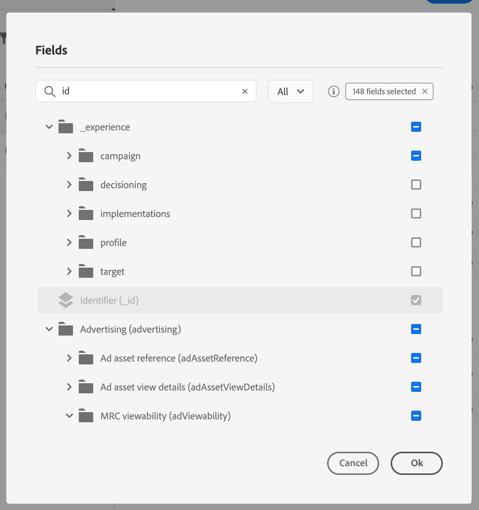

# イベントキーの定義 {#concept_ond_hqt_52b}

キーは、フィールドまたはフィールドの組み合わせが、イベントのペイロードデータの一部であり、イベントに関連付けられた人を識別できるようにします。 キーには、Experience CloudID、CRM ID、電子メールアドレスなどがあります。

リアルタイム顧客プロファイルデータベースに保存されたデータを活用する場合は、 [リアルタイム顧客プロファイルサービスでプロファイルのIDとして定義したイベントをキーとして選択する必要があります](https://docs.adobe.com/content/help/ja-JP/experience-platform/profile/home.html)。

これにより、イベントと個人のプロファイルの間の調整を実行できます。 主IDを持つスキーマを選択した場合は、「 **[!UICONTROL キー]** 」フィールドと「 **[!UICONTROL 名前空間]** 」フィールドに事前入力されます。 IDが定義されていない場合は、主キーとして _identityMap/id_ を選択します。 次に、名前空間を選択する必要があります。この場合、identityMap/idを使用して、( **[!UICONTROL 名前空間]** フィールドの下の _)キーが事前入力されます_。

フィールドを選択すると、主IDフィールドにタグが付けられます。

CRM IDや電子メールアドレスなど、別のキーを使用する必要がある場合は、キーを手動で追加する必要があります。

1. 「 **[!UICONTROL キー]** 」フィールド内または鉛筆アイコンの内側をクリックします。

   

1. ペイロードフィールドのリストでキーとして選択したフィールドを選択します。 高度な式エディタに切り替えて、より複雑なキーを作成することもできます(例えば、2つのフィールドのイベントを連結したキー)。 この節では、以下を参照してください。

   

イベントを受け取ると、キーの値によって、イベントに関連付けられた人物を識別できます。 名前空間に関連付けられている(参照 )が、このキーを使ってAdobe Experience Platformでクエリを行うことができます。  を参照してください。人が旅に出ているかどうかを調べるのにも使われます。 同じ旅の中で2つの異なる場所にいる人はいない。 その結果、同じキー（例えば、キーCRMID=3224）を同じ遍歴の異なる場所に置くことはできません。

また、追加の操作を実行する場合は、高度な式機能(**[!UICONTROL 詳細モード]**)にアクセスできます。 これらの関数を使用すると、形式の変更、フィールドの連結など、特定のクエリ（先頭の10文字など）を実行する際に使用する値を操作できます。ただし、フィールドの一部のみを考慮に入れます。  を参照してください。
