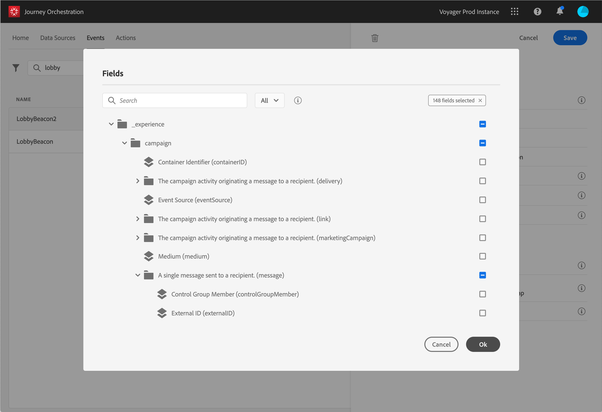

# ペイロードフィールドの定義 {#concept_yrw_3qt_52b}

ペイロード定義を使用すると、遍歴の中でイベントから受け取ると予想される情報と、イベントに関連付けられている人を識別する鍵を選択できます。 ペイロードは、Experience Cloud XDMフィールドの定義に基づいています。 For more information on XDM, refer to this [page](https://docs.adobe.com/content/help/ja-JP/experience-platform/xdm/home.html).

1. リストからXDMスキーマを選択し、「 **[!UICONTROL Payload]** 」フィールドまたは **[!UICONTROL 「Edit]** 」アイコンをクリックします。

   

   スキーマで定義されているすべてのフィールドが表示されます。 フィールドのリストは、スキーマによって異なります。 特定のフィールドを検索するか、フィルターを使用してすべてのノードとフィールドを表示するか、選択したフィールドのみを表示するかを指定できます。 スキーマ定義によると、一部のフィールドが必須で、事前に選択されている場合があります。 選択を解除することはできません。

   >[!NOTE]
   >
   >XDMスキーマに「オーケストレーション」ミックスインが追加されていることを確認してください。 これにより、Journey Orchestrationで作業するために必要な情報がスキーマにすべて含まれるようになります。

   

1. イベントから受け取るフィールドを選択します。 これらはビジネスユーザーがこの遍歴で活用するフィールドです。 また、イベントに関連付けられた人物を識別するために使用されるキーを含める必要があります(を参照 )。

   

   >[!NOTE]
   >
   >Journey Orchestrationが **[!UICONTROL イベントを識別できるように、選択したフィールドのリストに]** eventID（イベントID）フィールドが自動的に追加されます。 イベントをプッシュするシステムではIDを生成しない。ペイロードプレビューで使用できるIDを使用する必要がある。 を参照してください。

1. 必要なフィールドの選択が完了したら、「 **[!UICONTROL 保存]** 」をクリックするか、 **[!UICONTROL Enterキーを押します]**。

   

   選択したフィールドの数が「 **[!UICONTROL ペイロード]** 」フィールドに表示されます。

   
