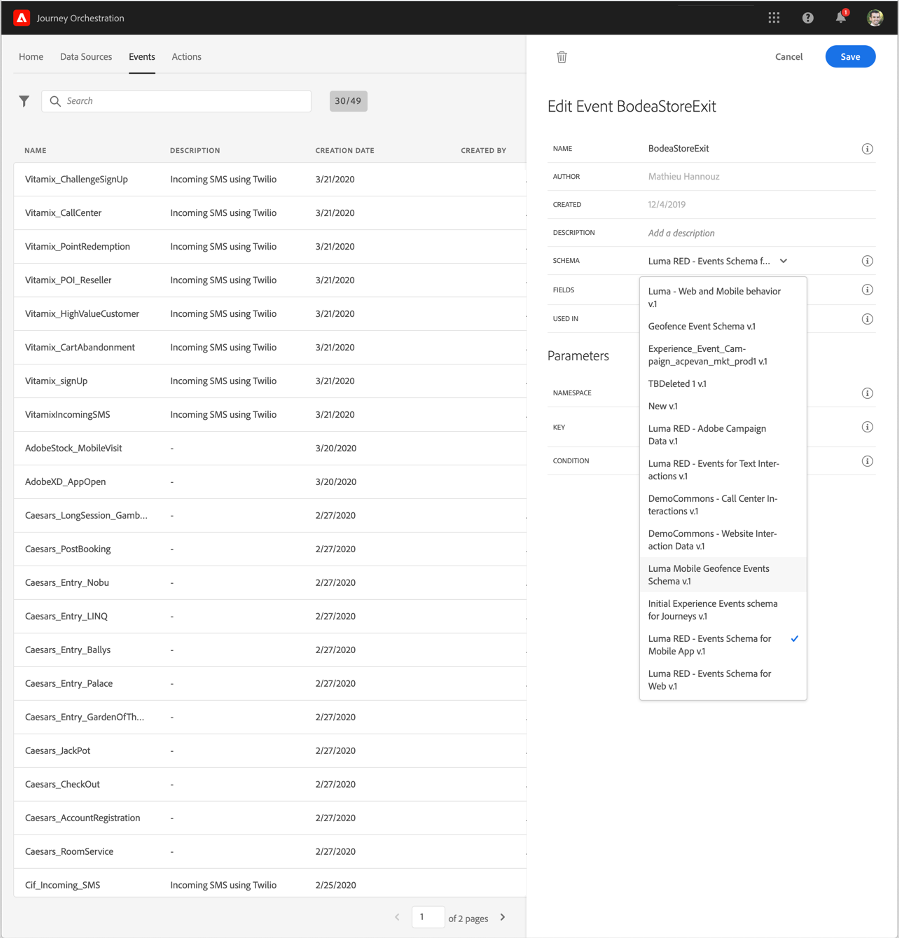

# [!DNL Journey Orchestration]イベントのExperienceEventスキーマについて

[!DNL Journey Orchestration] イベントは、XDM Experienceイベントで、Streaming Ingestion経由でAdobe Experience Platformに送信されます。

そのため、[!DNL Journey Orchestration]のイベントを設定するための重要な前提条件は、Adobe Experience PlatformのExperience Data Model（またはXDM）とXDM Experienceイベントスキーマの作成方法、およびXDM形式のデータをAdobe Experience Platformにストリーミングする方法に精通していることです。

## [!DNL Journey Orchestration]イベントのスキーマ要件

[!DNL Journey Orchestration]のイベントを設定する最初の手順は、イベントを表すXDMスキーマと、Adobe Experience Platform上のイベントのインスタンスを記録するために作成されたデータセットを確実に作成することです。 イベントのデータセットは必ずしも必要ではありませんが、特定のデータセットに送信すると、イベントのイベント履歴を今後の参照と分析のために維持できるので、常に有効です。 お使いのイベントに適したスキーマとデータセットがまだない場合は、これらのタスクはAdobe Experience PlatformのWebインターフェイスで実行できます。

[!DNL Journey Orchestration]イベントに使用されるXDMスキーマは、以下の要件を満たす必要があります。

* スキーマは、XDM ExperienceEventクラスである必要があります。

   

* システム生成イベントの場合、スキーマにオーケストレーションイベントIDミックスインが含まれている必要があります。 [!DNL Journey Orchestration] このフィールドを使用して、ジャーニーで使用されるイベントを識別します。

   

* イベントの件名を識別するためのIDフィールドを宣言します。 IDが指定されていない場合は、IDマップを使用できます。 これは推奨されません。

   

* このデータを後でジャーニーで参照できるようにする場合は、プロファイルのスキーマとデータセットをマークします。

   

   

* イベントに関する情報、イベントの生成元のデバイス、場所、イベントに関連するその他の有意義な状況など、ユーザーに含めたいその他のコンテキストデータを取り込むためのデータフィールドを自由に含めてください。

   

   
