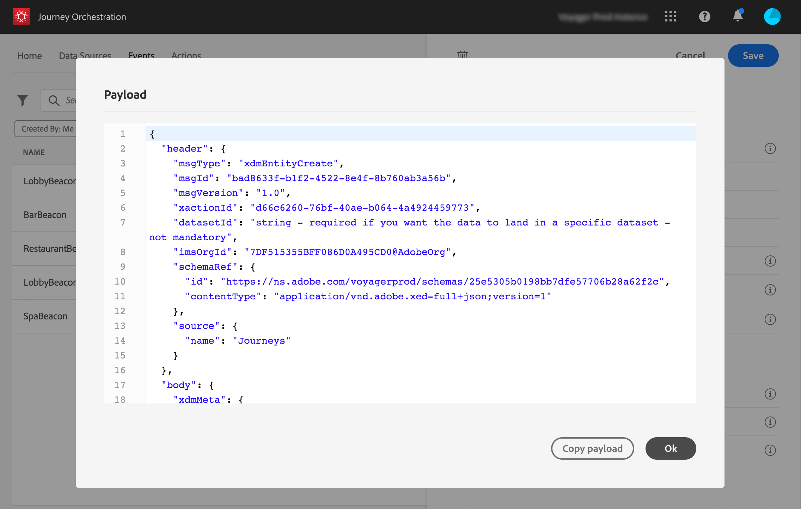

# ペイロードのプレビュー {#concept_jgf_4yk_4fb}

ペイロードのプレビューを使用すると、ペイロード定義を検証できます。

>[!NOTE]
>
>システム生成イベントの場合、イベントを作成する際、ペイロードプレビューを表示する前にイベントを保存して再度開きます。この手順は、ペイロードでイベント ID を生成するために必要です。

1. 「**[!UICONTROL ペイロードを表示]**」アイコンをクリックして、システムが想定するペイロードをプレビューします。

   

   選択したフィールドが表示されていることに注意してください。

   

1. ペイロード定義を検証するプレビューを確認します。

1. その後、イベント送信の担当者とペイロードプレビューを共有できます。このペイロードは、[!DNL Journey Orchestration]にプッシュするイベントのセットアップを設計するのに役立ちます。[このページ](../event/additional-steps-to-send-events-to-journey-orchestration.md)を参照してください。
