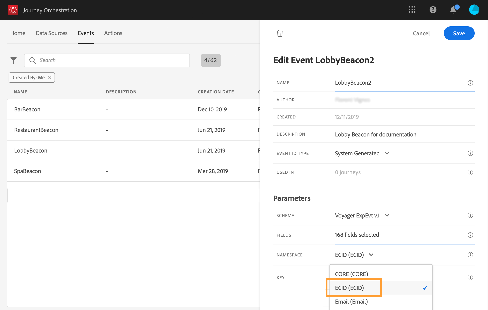

# 名前空間の選択 {#concept_ckb_3qt_52b}

名前空間を使用すると、イベントに関連付けられた人を識別するために使用するキーのタイプを定義できます。 設定はオプションです。 ジャーニーで[リアルタイム顧客プロファイル](https://docs.adobe.com/content/help/ja-JP/experience-platform/profile/home.html)からの追加情報を取得する場合に必要です。 カスタムデータソースを介してサードパーティシステムから取得されるデータのみを使用する場合、名前空間の定義は必要ありません。

事前定義済みのID名前空間の1つを使用するか、ID名前空間サービスを使用して新しいID名前空間を作成できます。 この[ページ](https://docs.adobe.com/content/help/ja-JP/experience-platform/identity/home.html)を参照してください。

プライマリIDを持つスキーマを選択した場合、**[!UICONTROL キー]**&#x200B;と&#x200B;**[!UICONTROL 名前空間]**&#x200B;のフィールドは事前入力されます。 IDが定義されていない場合は、_identityMap > id_&#x200B;をプライマリキーとして選択します。 次に、名前空間を選択し、_identityMap/id_&#x200B;を使用して、キーが（**[!UICONTROL Namespace]**&#x200B;フィールドの下に）事前入力されます。

フィールドを選択すると、プライマリIDフィールドにタグが付けられます。

ドロップダウンリストから名前空間を選択します。

1つのジャーニーで許可される名前空間は1つだけです。 同じジャーニーで複数のイベントを使用する場合、同じ名前空間を使用する必要があります。 [このページ](../building-journeys/journey.md)を参照してください。
