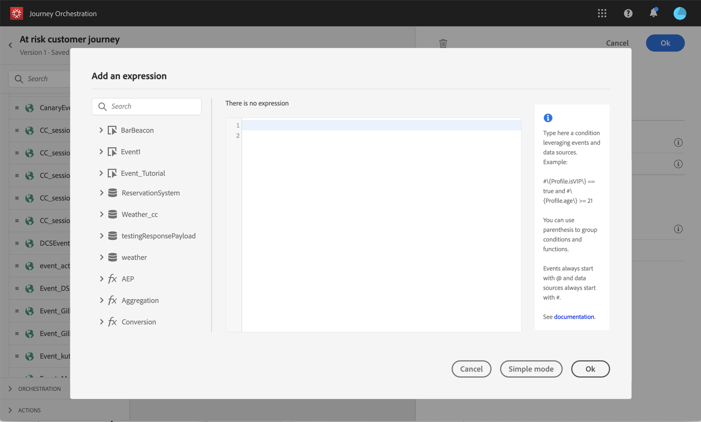

# 高度な式エディターについて {#concept_uyj_trt_52b}

高度な式エディターを使用して、インターフェイスの様々な画面で高度な式を作成します。 例えば、ジャーニーを設定して使用する場合、およびデータソース条件を定義する場合に、式を作成できます。
また、特定のデータ操作を必要とするアクションパラメーターを定義する必要が生じるたびに使用することもできます。イベントから取得したデータや、データソースから取得した追加情報を活用できます。ジャーニーで表示されるイベントフィールドのリストは状況に応じて異なり、ジャーニーに追加されたイベントに応じて変化します。

高度な式エディターでは、組み込みの関数と演算子が提供されるので、値を操作したり、ニーズに見合った式を定義したりできます。また、高度な式エディターでは、外部データソースパラメーターの値の定義、エクスペリエンスイベントなどのマップフィールドやコレクションの操作をおこなうこともできます。

_高度な式エディターのインターフェイス_

高度な式エディターは次の目的に使用できます。

* データソースとイベント情報に関する[詳細な条件](../building-journeys/condition-activity.md#about_condition)の作成
* カスタム[待機アクティビティ](../building-journeys/wait-activity.md#custom)の定義
* アクションパラメーターのマッピングの定義

可能な場合は、「**[!UICONTROL 詳細設定モード]**」／「**[!UICONTROL シンプルモード」]**&#x200B;ボタンを使用して、2 つのモードを切り替えることができます。シンプルモードについては、[ここ](../building-journeys/condition-activity.md#about_condition)で説明しています。

>[!NOTE]
>
>条件は、シンプルな式エディターでも高度な式エディターでも定義できます。常にブール型を返します。
>
>アクションパラメーターは、フィールドを選択するか、高度な式エディターを使用して定義できます。式に応じて特定のデータ型を返します。

## 高度な式エディターへのアクセス {#section_fdz_4nj_cjb}

高度な式エディターには、様々な方法でアクセスできます。

* データソース条件を作成する場合は、「**[!UICONTROL 詳細設定モード]**」をクリックして高度な式エディターにアクセスできます。

   

* カスタムタイマーを作成すると、高度な式エディターが直接表示されます。
* アクションパラメーターをマッピングする場合は、「**[!UICONTROL 詳細設定モード]**」をクリックします。

## インターフェイスの概要{#section_otq_tnj_cjb}

この画面では、式を手動で書き込むことができます。

画面の左側に、次の使用可能なフィールドと関数が表示されます。

* **[!UICONTROL イベント]**：受信イベントから受信したフィールドの 1 つを選択します。イベントフィールドに表示されるリストは状況に応じて異なり、ジャーニーに追加されたイベントに応じて変化します。[詳細情報](../event/about-events.md)
* **[!UICONTROL セグメント]**:もし君が **[!UICONTROL セグメントの選定]** イベントの場合は、式で使用するセグメントを選択します。 [詳細情報](../segment/using-a-segment.md)
* **[!UICONTROL データソース]**：データソースのフィールドグループから使用できるフィールドリストから選択します。[詳細情報](../datasource/about-data-sources.md)
* **[!UICONTROL ジャーニーのプロパティ]**:このセクションは、特定のプロファイルのジャーニーに関連する技術フィールドを再グループ化します。 [詳細情報](../expression/journey-properties.md)
* **[!UICONTROL 関数]**：複雑なフィルタリングを実行できる組み込み関数リストから選択します。関数はカテゴリ別に整理されます。[詳細情報](../expression/functions.md)

オートコンプリートメカニズムは、コンテキストの提案を表示します。

構文検証メカニズムは、コードの整合性をチェックします。エラーはエディターの上部に表示されます。

**高度な式エディターで条件を作成する場合のパラメーターの必要性**

パラメーターの呼び出しが必要な外部データソースからフィールドを選択する場合 ( [このページ](../datasource/external-data-sources.md). 例えば、天気関連のデータソースでは、頻繁に使用されるパラメーターは「市区町村」になります。その結果、この市区町村パラメーターを取得する場所を選択する必要があります。また、関数をパラメーターに適用して、形式の変更や連結を実行することもできます。

より複雑な使用例では、データソースのパラメーターをメイン式に含める場合、「params」キーワードを使用してその値を定義できます。[このページ](../expression/field-references.md)を参照してください。
