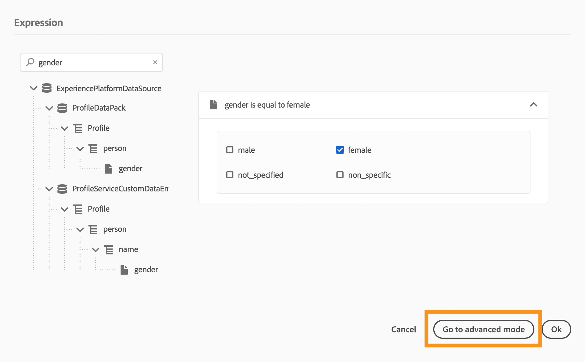

# 高度な式エディターについて {#concept_uyj_trt_52b}

アドバンス式エディターを使用すると、例えばデータソース条件を定義する場合など、インターフェイスの様々な画面で高度な式を作成できます。
また、特定のデータ操作を必要とするアクションパラメーターを定義する必要が生じるたびに使用することもできます。 イベントから取得したデータや、データソースから取得した追加情報を活用できます。 遍歴で表示されるイベントフィールドのリストは状況に応じて異なり、遍歴に追加されたイベントに応じて変化します。

高度な式エディターオファーでは、組み込みの関数と演算子を使用して、値を操作したり、ニーズに合った式を定義したりできます。 また、アドバンス式エディターでは、外部データソースパラメーターの値の定義、エクスペリエンスイベントーなどのマップフィールドやコレクションの操作を行うこともできます。

_高度な式エディターインターフェイス_

アドバンス式エディタは次の目的に使用できます。

* データソースと [イベント情報に関する詳細な条件](../building-journeys/condition-activity.md#about_condition) の作成
* カスタム [待機アクティビティの定義](../building-journeys/wait-activity.md#custom)
* アクションパラメーターのマッピングの定義

可能な場合は、「 **[!UICONTROL 詳細」モード]** /「 **[!UICONTROL 単純」モード]** ボタンを使用して、2つのモードを切り替えることができます。 シンプルモードについては、 [ここで説明し](../building-journeys/condition-activity.md#about_condition)ます。

>[!NOTE]
>
>条件は、シンプルエディターまたはアドバンス式エディターで定義できます。 常にブール型を返します。
>
>アクションパラメーターは、フィールドを選択するか、高度な式エディターを使用して定義できます。 式に応じて特定のデータ型を返します。

## Accessing the advanced expression editor {#section_fdz_4nj_cjb}

アドバンス式エディタには、様々な方法でアクセスできます。

* データソース条件を作成する場合は、 **[!UICONTROL 詳細モードをクリックして詳細エディタにアクセスできます]**。

   

* カスタムタイマーを作成すると、アドバンスエディターが直接表示されます。
* アクションパラメーターをマッピングする際に、 **[!UICONTROL 詳細モードをクリックします]**。

## インターフェイスの検出{#section_otq_tnj_cjb}

この画面では、式を手動で書き込むことができます。

画面の左側に、次の使用可能なフィールドと機能が表示されます。

* **[!UICONTROL イベント]**: 受信イベントから受信したフィールドの1つを選択します。 イベントフィールドに表示されるリストは状況に応じて異なり、遍歴に追加されたイベントに応じて変化します。
* **[!UICONTROL データソース]**: データソースのフィールドグループから使用できるフィールドのリストから選択します。
* **[!UICONTROL 関数]**: 複雑なフィルタリングを実行できる組み込み関数のリストから選択します。 関数はカテゴリ別に整理されます。

自動補完メカニズムは、コンテキストの提案を表示します。

構文検証メカニズムは、コードの整合性をチェックします。 エラーは、エディターの上部に表示されます。

**アドバンス式エディタで条件を作成する場合のパラメーターの必要性**

パラメータの呼び出しが必要な外部データソースからフィールドを選択する場合（を参照） 。 例えば、天気関連のデータソースでは、頻繁に使用されるパラメーターは「city」になります。 その結果、この市区町村パラメーターを取得する場所を選択する必要があります。 また、関数をパラメーターに適用して、形式の変更や連結を実行することもできます。

より複雑な使用例では、データソースのパラメーターをメイン式に含める場合、「params」キーワードを使用してその値を定義できます。 [このページ](../expression/field-references.md)を参照してください。
