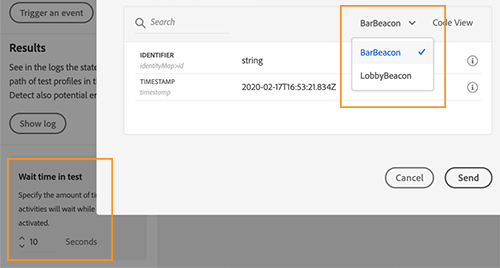
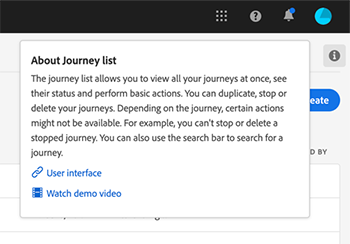

# リリースノート{#release-notes}

このページでは、Journey Orchestration のすべての新機能と改善点をリストします。
最新の[ドキュメントの更新](../release-notes/documentation-updates.md)も参照してください。

## 2021年2月リリース{#february-2021-release}

<table>
<thead>
<tr>
<th><strong>プロファイルアクティビティの更新</strong> </th>
</tr>
</thead>
<tbody>
<tr>
<td>

この新しいアクションアクティビティを使用すると、イベント、データソース、または特定の値を使用して、既存のAdobe Experience Platformプロファイルを更新できます。

詳しくは、<a href="../building-journeys/update-profiles.md">詳細ドキュメント</a>を参照してください。

</td>
</tr>
</tbody>
</table>

### その他の機能強化

* 現在は、イベントを設定する場合、XDM検証に必須のフィールドのみがデフォルトで事前に選択されています。 これらのフィールドは選択解除できません。
* ジャーニーパレットに新しいフィルターが追加されました。 標準搭載されたイベントに加えて、直近使用した5つのアクションのみを表示できます。 これは、各ユーザーに固有です。 デフォルトでは、すべての項目が表示されます。 [詳細を表示](../building-journeys/using-the-journey-designer.md#palette)
* 新しいジャーニーを開始すると、最初の手順としてキャンバスにドロップできない要素は非表示になります。 これは、すべてのアクション、条件のアクティビティ、待ち、反応に関するものです。
* 高度な式エディターの左側で、リストの最後の&#x200B;**関数**&#x200B;セクションの下に関数が再グループ化されました。

## 2021 年 1 月リリース{#january-2021-release}

イベント設定でスキーマを選択する場合、Journey Orchestration がイベントを適切に受け取るために必須のフィールドのみが選択されます。[詳細を表示](../event/defining-the-payload-fields.md)

ジャーニーのプロパティ属性は、シンプルな式エディターで使用できるようになりました。[詳細を表示](../expression/journey-properties.md)

2 つの新しいジャーニーのプロパティ属性（sandboxName と organizationId）が追加されました。[詳細を表示](../expression/journey-properties.md)

Adobe Campaign Standard の SLA に合わせるために、Adobe Campaign Standard 統合が設定されるとすぐに、Adobe Campaign Standard の操作に対して 1 秒あたり 13 コールの制限ルールが自動的に定義されるようになりました。[詳細を表示](../action/working-with-adobe-campaign.md)

イベントのタイムアウト時間が、タイムアウトパスでより明確に指定されるようになりました。[詳細を表示](../building-journeys/event-activities.md#listening-to-events-during-a-specific-time)

[getListItem](../functions/functiongetlistitem.md) 関数と [split](../functions/functionsplit.md) 関数が、詳細式エディターで使用できる関数のリストに追加されました。これにより、文字列計算の使用においてより多くの可能性が提供されます。

## 2020 年 11 月リリース {#november-release}

<table>
<thead>
<tr>
<th><strong>ジャーニー間での移動</strong> </th>
</tr>
</thead>
<tbody>
<tr>
<td>

新しいアクションアクティビティで、各個人をジャーニー間で移動させることができるようになりました。<strong>ジャンプ</strong>アクティビティを使用すると、次のことができます。

<ul>
<li>非常に複雑なジャーニーを複数のジャーニーに分けて設計を簡素化する </li>
<li>一般的で再利用可能なジャーニーパターンに基づいてジャーニーを作成する</li>
</ul>

詳しくは、<a href="../building-journeys/jump.md">詳細ドキュメント</a>および<a href="https://experienceleague.adobe.com/docs/journey-orchestration-learn/tutorials/building-a-journey/jumping-to-another-journey.html?lang=ja">チュートリアルビデオ</a>を参照してください。

</td>
</tr>
</tbody>
</table>

<table>
<thead>
<tr>
<th><strong>式エディターでのジャーニープロパティの使用</strong> </th>
</tr>
</thead>
<tbody>
<tr>
<td>

高度な式エディターで、フィールドと関数のリストに新しいカテゴリを追加しました。これは、ジャーニー ID や発生した特定のエラーなど、ライブジャーニーからシステムによって取得された情報です。これにより、ジャーニーを作成する際に、より多くのことができるようになります。例えば、条件やアクションでエラーが発生した場合に、サードパーティ製システムにアラートを出すことができます。

詳しくは、<a href="../expression/journey-properties.md">詳細ドキュメント</a>を参照してください。

</td>
</tr>
</tbody>
</table>

<table>
<thead>
<tr>
<th><strong>ルールベースのイベント(ベータ版)</strong> </th>
</tr>
</thead>
<tbody>
<tr>
<td>

イベント ID を使用せず、より簡単にイベントを設定できる新しい方法が追加されました。ルールベースのイベントは、一定の条件に従ってイベントをトリガーする必要があるかを評価します。既存のメソッド（現在は「システム生成」と呼ばれています）も引き続き使用できます。この機能は、アルファプログラムを使用して一部の顧客にてテストされていましたが、すべての顧客がベータ版で利用できるようになりました。

</td>
</tr>
</tbody>
</table>

### その他の機能強化

新しいバージョンのジャーニーを作成する場合の制限が追加されました。これらの制限により、ジャーニーの急激な変動が抑制され、バージョン間の一貫性が維持されます。[詳細を表示](../about/limitations.md#journey-versions-limitations)

**セグメント認定**&#x200B;アクティビティは、Campaign Standard メッセージアクティビティを含むジャーニーでは使用できなくなりました。この制限により、Adobe Campaign Standard インスタンスの整合性が維持されます。実際、セグメント認定を使用すると、メッセージ送信が毎日のようにピークに達し、Campaign Standard のトランザクションメッセージに大きな負荷がかかる可能性があります。[詳細を表示](../about/limitations.md#segment-qualification)

## 2020 年 10 月リリース {#october-release}

<table>
<thead>
<tr>
<th><strong>イベントタイムアウト</strong> </th>
</tr>
</thead>
<tbody>
<tr>
<td>

一定時間のみイベントをジャーニーでリッスンするように、イベントのタイムアウトを設定できるようになりました。これをおこなうために、イベントパスに並行して待機アクティビティを追加する必要がなくなりました。

詳しくは、<a href="../building-journeys/event-activities.md#listening-to-events-during-a-specific-time">詳細ドキュメント</a>を参照してください。

</td>
</tr>
</tbody>
</table>

### その他の機能強化

* 新しいバージョンのジャーニーを公開すると、前のバージョンが自動的に終了し、「クローズド」ステータスに切り替わります。[詳細を表示](../building-journeys/journey-versions.md)

## 2020 年 9 月リリース {#september-release}

### 一般公開（GA）アップデート{#september-ga-update}

<table>
<thead>
<tr>
<th><strong>条件アクティビティの改善</strong> </th>
</tr>
</thead>
<tbody>
<tr>
<td>

ジャーニーに条件を追加する際に、ラベルを定義できるようになりました。1 つのジャーニーで複数の条件を使用すると、それらの条件をより簡単に特定できます。

詳しくは、<a href="../building-journeys/condition-activity.md#about_condition">詳細ドキュメント</a>を参照してください。

</td>
</tr>
</tbody>
</table>

### アルファアップデート{#september-alpha-update}

<table>
<thead>
<tr>
<th><strong>「セグメントを読み取り」アクティビティの改善</strong> </th>
</tr>
</thead>
<tbody>
<tr>
<td>

<strong>セグメントを読み取り</strong>アクティビティに対して、次の機能が強化されました。

<ul>
<li>
セグメントベースのジャーニーがキャンバスの上に表示されるようになりました。これは、ジャーニーのスケジュールタイプを知らせる役割を果たします。このリマインダーをクリックすると、スケジュール設定メニューにアクセスできます。

</li>
<li>
テストモードログの精度が改善され、セグメントエクスポートの進行状況ステータスが表示されるようになりました。

</li>
</ul>
</td>
</tr>
</tbody>
</table>

## 2020 年 8 月リリース {#august-release}

### 一般公開（GA）アップデート{#august-ga-update}

セグメントの選定イベントのペイロードには、行動（エントリ、離脱）、選定のタイムスタンプおよびセグメント ID のコンテキスト情報が含まれるようになりました。これらの情報は、条件およびアクションで使用できます。[詳細を表示](../building-journeys/segment-qualification-events.md)

### アルファアップデート{#august-alpha-update}

<table>
<thead>
<tr>
<th><strong>セグメントトリガーアクティビティ</strong> </th>
</tr>
</thead>
<tbody>
<tr>
<td>

セグメントトリガーアクティビティに対して、次の機能が強化されました。

<ul>
<li>
アクティビティの名前が「セグメントを読み取り」に変更されました。 

</li>
<li>
ジャーニースケジューラーの設定がアクティビティプロパティから削除されました。「セグメントを読み取り」アクティビティがキャンバスにドロップされた場合に表示される専用のセクションで、ジャーニーのプロパティから直接アクセスできるようになりました。 

</li>
<li>
これにより、単一のプロファイルでジャーニーをテストし、視覚的なフローを使用して、ジャーニーの進行状況を追跡できるようになりました。

</li>
</ul>
</td>
</tr>
</tbody>
</table>

<table>
<thead>
<tr>
<th><strong>ルールベースのイベント</strong> </th>
</tr>
</thead>
<tbody>
<tr>
<td>

ルールベースのイベントに対して、次の機能が強化されました。

<ul>
<li>
既にキャプチャ済みで Platform へのストリーミングをおこなっている Adobe Analytics のあらゆる行動イベントデータを活用し、ジャーニーをトリガーして顧客向けのエクスペリエンスを自動化できるようになりました。<a href="../event/about-analytics.md">詳細を表示</a>

</li>
<li>
テストモードでルールベースのイベントをトリガーする場合、イベント ID 条件を直接表示できるようになりました。また、ルール評価の一部である各フィールドの横にツールチップが追加されました。<a href="../building-journeys/testing-the-journey.md#test-rule-based">詳細を表示</a>

</li>
<li>
ルールベースのイベント定義画面が再構成され、エクスペリエンスが向上しました。<a href="../event/about-creating.md">詳細を表示</a>

</li>
</ul>
</td>
</tr>
</tbody>
</table>

## アルファリリース - 2020 年 7 月 {#alpha-release---july-2020}

アルファプログラムオファー機能は、限られた顧客セットの中で現在テストされています。これにより、受け取ったフィードバックに基づいて製品を改善できます。これらの機能は、すべての Journey Orchestration ユーザーにご利用いただけるわけではありません。

<table>
<thead>
<tr>
<th><strong>ユーザーインターフェイスの強化</strong> </th>
</tr>
</thead>
<tbody>
<tr>
<td>

Adobe Experience Platform との一貫したインターフェイスを提供するため、Journey Orchestration メニュー内のナビゲーションが強化されました。

<ul>
<li>
メニューがインターフェイスの上部から左側に移動しました。 

</li>
<li>
管理機能を 1 つのダッシュボードにグループ化しました。

</li>
</ul>
</td>
</tr>
</tbody>
</table>

<table>
<thead>
<tr>
<th><strong>セグメントトリガーアクティビティ</strong> </th>
</tr>
</thead>
<tbody>
<tr>
<td>

セグメントトリガーアクティビティを使用すると、Adobe Experience Platform セグメントに属するすべての個人をジャーニーにエントリさせることができます。ジャーニーへのエントリは、1 回きりでも定期的にでもおこなえます。 

</td>
</tr>
</tbody>
</table>

<table>
<thead>
<tr>
<th><strong>ルールベースのイベント</strong> </th>
</tr>
</thead>
<tbody>
<tr>
<td>

エクスペリエンスイベントの設定方法が簡略化されました。eventID を使用する必要のない新しいメソッドが導入されます。Journey Orchestration でイベントを設定する際に、ルールベースのイベントを定義できるようになりました。<a href="../event/about-events.md">詳細を表示</a>

</td>
</tr>
</tbody>
</table>

## 第 2 四半期リリース - 2020 年 6 月 {#q2-release---june-2020}

<table>
<thead>
<tr>
<th><strong>Adobe Experience Platform 統合の強化</strong> </th>
</tr>
</thead>
<tbody>
<tr>
<td>

Adobe Experience Platform 統合に関する次の機能強化がおこなわれました。

<ul>
<li>
新しいアクティビティでは、Adobe Experience Platform セグメントのエントリ／離脱をリッスンして、ユーザーによるジャーニーへのエントリやジャーニーの進行を可能にします。<a href="../building-journeys/segment-qualification-events.md">詳細を表示</a>

</li>
<li>
新しい「<strong>セグメント</strong>」タブにより、Journey Orchestration インターフェイスを離れることなく、Adobe Experience Platform セグメントを作成および編集できるようになりました。<a href="../segment/about-segments.md">詳細を表示</a>

</li>
<li>
シンプルな式エディターで、Adobe Experience Platform セグメントがナビゲーションツリーに直接表示され、「この人はセグメント A に属しているか」などの条件を容易に設定できるようになりました。<a href="../segment/using-a-segment.md">詳細を表示</a>

</li>
<li>
Journey Orchestration は、ジャーニーで実行される手順を Adobe Experience Platform に自動的に渡すようになりました。これには、発生する可能性のあるエラーも含まれます。この情報は、特定のジャーニーまたはすべてのジャーニーに対して、ジャーニーステップイベントのクエリを実行することで、レポートとトラブルシューティングを達成するために使用できます。<a href="../building-journeys/sharing-overview.md">詳細を表示</a>

</li>
<li>
Journey Orchestration は、実稼動用および非実稼動用の Adobe Experience Platform サンドボックスに接続できるようになりました。サンドボックスはベータ版機能です。<a href="../about/access-management.md#sandboxes">詳細を表示</a>

</li>
</ul>
</td>
</tr>
</tbody>
</table>

<table>
<thead>
<tr>
<th><strong>ジャーニーデザイナーとテストモードの強化</strong> </th>
</tr>
</thead>
<tbody>
<tr>
<td>

ジャーニーデザイナーとテストモードが次のように強化されました。

<ul>
<li>
1 または N 個のジャーニーアクティビティを選択して、1 つのジャーニーから別のジャーニーにアクティビティをコピー＆ペーストできるようになりました。<a href="../building-journeys/using-the-journey-designer.md#copy-paste">詳細を表示</a>

</li>
<li>
イベントを実行してテストプロファイルをジャーニーにエントリした後、色付きのビジュアルフローにより、ジャーニーに沿って進行状況を確認できるようになりました。ジャーニーでエラーが発生した場合は、エラーの詳細も表示されます。<a href="../building-journeys/testing-the-journey.md#firing_events">詳細を表示</a>

</li>
<li>ジャーニーの「<strong>完了</strong>」ステータスは、ステータスの意味をより明確に反映するために、「<strong>クローズ済み (新規エントリなし)</strong>」に変更されました。</li>
</ul>
</td>
</tr>
</tbody>
</table>

**その他の機能強化**

サードパーティのシステムに対して、多すぎる API 呼び出しを防ぐために、新しいパブリック API が導入され、「キャッピング」ルールが設定されました。キャッピングルールを使用すると、API エンドポイントへの最大呼び出し数をミリ秒単位で定義できます。[詳細を表示](../api/capping.md)

アクセス制御によってユーザーアクセス管理の精度が高まりました。使用可能となる日付：2020 年 6 月 30 日。[詳細を表示](../about/access-management.md#create-product-profile)

Journey Orchestration が APAC（オーストラリアのデータセンター）で利用できるようになりました。使用可能となる日付：2020 年 6 月 30 日

Journey Orchestration インターフェイスは日本語で利用できます。

## 第 1 四半期のリリース - 2020 年 3 月 {#q1-release---march-2020}

<table>
<thead>
<tr>
<th><strong>テストモードの強化</strong> </th>
</tr>
</thead>
<tbody>
<tr>
<td>

テストモードが次のように強化されました。

<ul>
<li>1 つのジャーニーで複数のイベントを使用する場合、テストモードの<strong>イベント設定</strong>画面で、ドロップダウンリストからそれぞれのイベントを個別にトリガーできるようになりました。<a href="../building-journeys/testing-the-journey.md#firing_events">詳細を表示</a>
</li>
<li>
1 つ以上の<strong>待機</strong>アクティビティを 1 つのジャーニーで使用する場合、それぞれのアクティビティがテストモードで持続する時間を定義できるようになりました。デフォルト時間は 10 秒です。これを変更するには、左下隅にある <strong>Wait time in test</strong> パラメーターを使用します。<a href="../building-journeys/testing-the-journey.md">詳細を表示</a>

</li>
<li><strong>テストログ</strong>で、サードパーティシステムの呼び出し時にエラーが発生した場合（データソースまたはアクション）に、エラーコードとエラー応答が表示されるようになりました。<a href="../building-journeys/testing-the-journey.md#viewing_logs">詳細を表示</a>
</li>
</ul>
</td>
</tr>
</tbody>
</table>

<table>
<thead>
<tr>
<th><strong>一元化されたタイムゾーン管理</strong> </th>
</tr>
</thead>
<tbody>
<tr> 
<td>

タイムゾーン管理をジャーニープロパティパネルで一元化しました。次の 2 つのパラメーターをジャーニープロパティに追加しました。

<ul>
<li>「<strong>タイムゾーン</strong>」ドロップダウンリストを使用すると、特定のタイムゾーンを選択できます。デフォルトでは、ブラウザーのタイムゾーンが使用されます。 </li>
<li>「<strong>プロファイルタイムゾーン</strong>」チェックボックスを使用すると、ジャーニーにエントリする人の Adobe Experience Platform プロファイルタイムゾーン（ある場合）を使用できます。タイムゾーンがない場合は、ドロップダウンリストで定義されたタイムゾーンが使用されます。この機能は、名前空間を持たないイベントを使用するジャーニーとは互換性がありません。</li>
</ul>

詳しくは、<a href="../building-journeys/changing-properties.md#timezone">プロパティの変更</a>および<a href="../building-journeys/timezone-management.md">タイムゾーン管理</a>の節を参照してください。

</td>
</tr>
</tbody>
</table>

<table>
<thead>
<tr>
<th><strong>ジャーニーデザイナーの機能強化</strong> </th>
</tr>
</thead>
<tbody>
<tr> 
<td>

ジャーニーデザイナーの左側にあるジャーニー<strong>パレット</strong>機能が強化されました。

<ul>
<li><strong>検索</strong>バーの横にある新しいアイコンを使用すると、パレット内の使用できない要素（例：ジャーニーで使用しているものとは異なる名前空間を使用するイベント）を表示または非表示にできます。デフォルトでは、使用できない項目は非表示になります。</li>
<li>「<strong>検索</strong>」フィールドを使用する場合、キャンバスアクティビティカテゴリごとの結果数が表示されるようになりました。</li>
<li>異なるアクティビティカテゴリ間のナビゲーションを改善しました。</li>
</ul>

ジャーニーデザイナーで、最新バージョンのジャーニーにアクセスしていることを確認できるようになりました。この情報は、バージョン番号の横に表示されます。

ジャーニー<strong>キャンバス</strong>で、2 つのアクティビティが切断された場合に、警告メッセージが表示されるようになりました。

詳しくは、<a href="../building-journeys/using-the-journey-designer.md">詳細ドキュメント</a>を参照してください。

</td>
</tr>
</tbody>
</table>

<table>
<thead>
<tr>
<th><strong>コンテキストヘルプ</strong> </th>
</tr>
</thead>
<tbody>
<tr>
<td>

Journey Orchestration の様々なリスト画面（ジャーニー、イベント、アクション、データソース）で、コンテキストヘルプを利用できるようになりました。現在の機能の簡単な説明を表示し、関連記事やビデオにアクセスできます。

コンテキストヘルプを表示するには、画面の右上隅にある  アイコンをクリックします。 

</td>
</tr>
</tbody>
</table>

**その他の機能強化**

* 米国に加えて、**EMEA** でも Journey Orchestration を利用できるようになりました。アプリケーションとドキュメントは、フランス語とドイツ語で入手できます。

* Experience League が製品に統合されました。関連コンテンツへのアクセスが簡素化され、Experience Cloud を最大限に活用できます。Journey Orchestration ドキュメントには「ヘルプ」タブの下部から直接アクセスできます。さらに、ヘルプ／フィードバックをクリックして、問題を報告したり、アドビとアイデアを共有したりできます。

* 新しい項目を作成するための「**C**」キーボードショートカットを、すべてのリスト画面（ジャーニー、データソース、アクション、イベント）で使用できるようになりました。[詳細を表示](../about/user-interface.md#section_ksq_zr1_ffb)

* 停止済みジャーニーを&#x200B;**削除**&#x200B;できるようになりました。これらの削除されたジャーニーに関連付けられたレポートは使用できません。

* **Adobe Experience Platform フィールド**（XDM 形式）を参照する際、フィールド名に加えて表示名が表示されるようになりました。この情報は、エクスペリエンスデータモデルのスキーマ定義から取得されます。使用可能な場合は、代替の表示名が表示されます。内容がわかりやすいように付けられた代替の表示名によって、（特に eVar フィールドの場合は）フィールドをより簡単に識別することができます。[詳細を表示](../about/user-interface.md#friendly-names-display)

## 一般公開（GA）リリース - 2019 年 12 月 {#ga-release---december-2019}

Journey Orchestration が一般公開されました。

イベントやデータソースに保存されたコンテキストデータを活用して、リアルタイムオーケストレーションの使用例を構築します。

Journey Orchestration を使用すると、イベントからのコンテキストデータ、Adobe Experience Platform からの情報、またはサードパーティの API サービスからのデータを利用したリアルタイムオーケストレーションを実現できます。アプリケーションは、ジャーニーと呼ばれる複数手順のフローで、ユーザーのプロファイルと行動に基づいて、ユーザーに特有の次のベストアクションを決定します。これには、最適なタイミングに加えて、Adobe Campaign Standard のトランザクションメッセージング機能（Adobe Campaign Standard が必要）を介した消費者へのプッシュ通知の送信、サードパーティシステムの通知など、アクションのタイプも含まれます。これらの決定は、ルールと Sensei のスコアに基づいておこなわれます。

Journey Orchestration の[詳細](../action/working-with-adobe-campaign.md)をご確認ください。

その他のリソース：

* [チュートリアル](https://docs.adobe.com/content/help/ja-JP/journey-orchestration-learn/tutorials/understanding-journey-orchestration.html)
* [コミュニティ](https://www.adobe.com/go/journeyorchestrationcommunity_jp)
