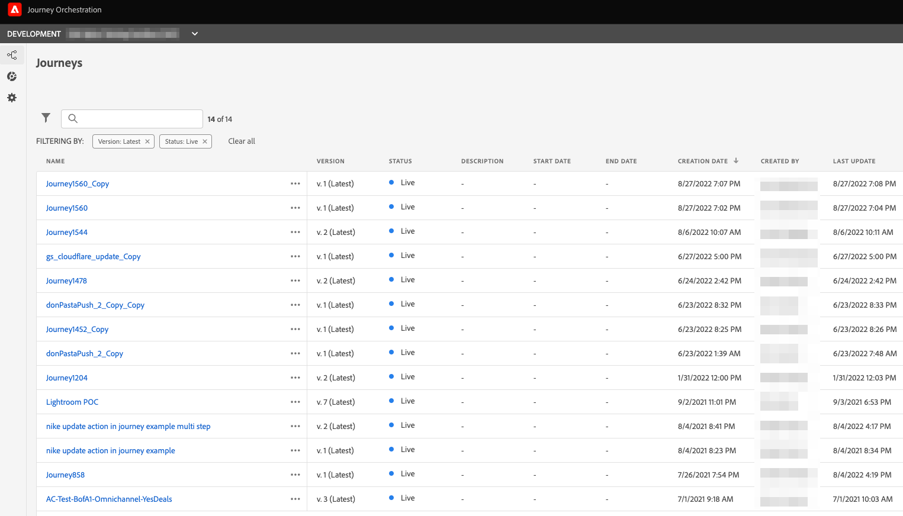

# Journey Orchestration 環境を Adobe Journey Optimizer にアップグレード{#ugrade-ajo}

## Adobe Journey Optimizer について

Adobe Journey Optimizer は、任意のアプリ、デバイス、画面、チャネルにわたって、接続、パーソナライズされたタイムリーなカスタマージャーニーを統合および提供するために、Adobe Experience Platform 上でネイティブに構築された、アジャイルで拡張性の高いアプリケーションです。

## Journey Orchestration とは

Journey Orchestration は、Adobe Experience Platform 上に構築されたサービスで、以前の行動と好みに基づいて、顧客ごとに個別のジャーニーをカスタマイズできます。Journey Orchestration は、Journey Optimizer の前身であるアプリケーションです。

## Adobe Journey Optimizer に移行すべき理由

Experience Platform の機能を備えた&#x200B;**合理化されたインターフェイスへのアクセス**&#x200B;を使用すると、ジャーニー、データセット、プロファイル、アラートなどにすばやくアクセスできます。Adobe Experience Platform と Journey Orchestration 間でやり取りをしてスキーマやデータセットにアクセスする必要がなくなり、すべてが Adobe Journey Optimizer から直接利用可能です。詳しくは、[このページ](https://experienceleague.adobe.com/docs/journey-optimizer/using/get-started/user-interface.html?lang=ja)を参照してください。

<table>
<tr>
<th>前</th>
<th>後</th>
</tr>
<tr>
<td>
Journey Orchestration で、ジャーニー、セグメントおよび管理者セクション（データソース、イベント、アクション）にアクセスします。セグメントとデータセットには、Adobe Experience Platform でアクセスできます。 
</td>
<td>
ジャーニー、セグメント、管理者、セグメントおよびデータセットへのアクセスは、<strong>すべて Adobe Journey Optimizer 内</strong>で可能です。<strong>その他の Adobe Experience Platform の機能</strong>にも、ここからアクセスできます。
</td>
</tr>
</table>

**新しいレポートインターフェイス**&#x200B;および新しいレポート機能へのアクセス：

<table>
<tr>
<th>前</th>
<th>後</th>
</tr>
<tr>
<td></td>
<td>
<strong>グローバル表示</strong>を使用すると、選択した期間におけるジャーニーと配信の効果を測定できます。リアルタイムの指標についてより詳しくは、<strong>ライブビュー</strong>にアクセスできます。ジャーニーで使用されている各配信チャネル（電子メール、SMS、プッシュ）に対して、指標を表示するためのレポートで<strong>専用セクション</strong>が使用できます。これは、標準搭載の <strong>Adobe Journey Optimizer のメッセージ機能</strong>を使用する場合にのみ適用されます。詳しくは、アカウントチームにお問い合わせください。
</td>
</tr>
</table>

レポートエクスペリエンスを改善したり、新しい機能リリースに従ってレポートエクスペリエンスを強化したりするなどの変更は、新しいレポートインターフェイスでのみ使用できます。これを使用することで、より完全な Adobe Journey Optimizer エクスペリエンスを得られます。

他の最新の **Adobe Journey Optimizer の機能**&#x200B;と、フィールドレベルのアクセス制御やオブジェクトレベルのアクセス制御などの新機能を利用できます。 詳しくは、アカウントチームにお問い合わせください。

## Journey Orchestration 環境をアップグレードする方法

1. アカウントチームに連絡して、アドビとの契約を無料で更新してください。

1. エンジニアリングチームが変更を完了するまでお待ちください。

1. Journey Optimizer の製品プロファイルを使用して権限を更新します。 この[ページ](https://experienceleague.adobe.com/docs/journey-optimizer/using/administration/ootb-product-profiles.html?lang=ja)を参照してください。

1. Adobe Journey Optimizer にアクセスできるようになりました。

## よくある質問

### Journey Orchestration から Adobe Journey Optimizer に移行するには、何か計画が必要ですか？

移行、作業、ダウンタイム、追加投資も不要です。お客様はアドビとの契約を更新するだけで、あとの作業は当社が行います。 このプロセスの開始方法については、アカウント担当者にお問い合わせください。

### 変更後に何かを失うことがありますか？

いいえ、既存の Journey Orchestration と Adobe Experience Platform オブジェクト（スキーマ、データセット、ジャーニー、イベント、データソース、アクション）は、すべて保持されます。 何も失うことなく、ライブジャーニーはすべて中断なしで引き続き機能します。

<table>
<tr>
<th>前</th>
<th>後</th>
</tr>
<tr>
<td></td>
<td></td>
</tr>
</table>

### アプリケーションスイッチャーに Journey Orchestration が表示されますが、正常ですか？

はい、正常です。 アップグレード後、1 か月間は Journey Orchestration へのアクセスを維持できます。これにより、すべてのユーザー権限を更新し、Adobe Journey Optimizer に慣れるのに十分な時間を確保できます。 1 か月後、アクセスが削除されます。

### 現在、Adobe Campaign Standard で Journey Orchestration を使用するとどうなりますか？

Adobe Journey Optimizer に移行すると、Adobe Journey Optimizer でカスタマージャーニーを設計し、Adobe Campaign Standard で配信を送信することで、ジャーニーと Adobe Campaign Standard の統合を引き続き使用できます。

ただし、Adobe Journey Optimizer のレポートスタックの仕組みにより、レポートはジャーニーと Campaign Standard のデータを結合しません。 ジャーニー情報は、Adobe Campaign Standard の Adobe Journey Optimizer レポートおよび配信情報で使用できます。 Experience Platform の設定で、Adobe Campaign Standard データを Adobe Experience Platform に取り込み、Customer Journey Analytics（[詳細情報](https://business.adobe.com/products/experience-platform/customer-journey-analytics.html)）や、Tableau や PowerBI などのその他のサードパーティレポートツールで利用できるようにします。

Adobe Journey Optimizer のレポートは、Adobe Journey Optimizer の標準のメッセージ機能（専用の Adobe Journey Optimizer 製品で利用可能）を使用する場合に最適です。 ジャーニーキャンバスでのメッセージの作成方法について詳しくは、この [ページ](https://experienceleague.adobe.com/docs/journey-optimizer/using/messages/messages-in-journeys.html?lang=ja)を参照してください。

詳しくは、アカウントチームにお問い合わせください。