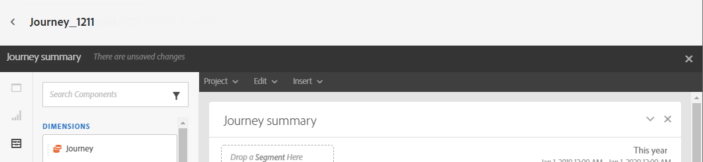
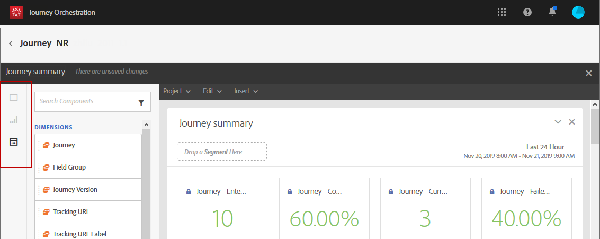
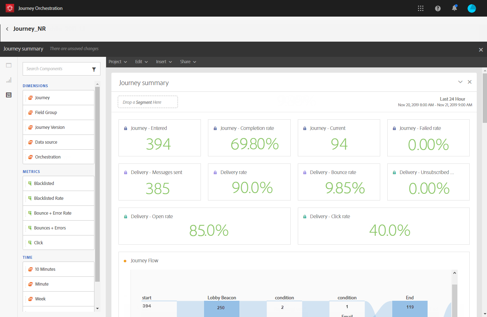
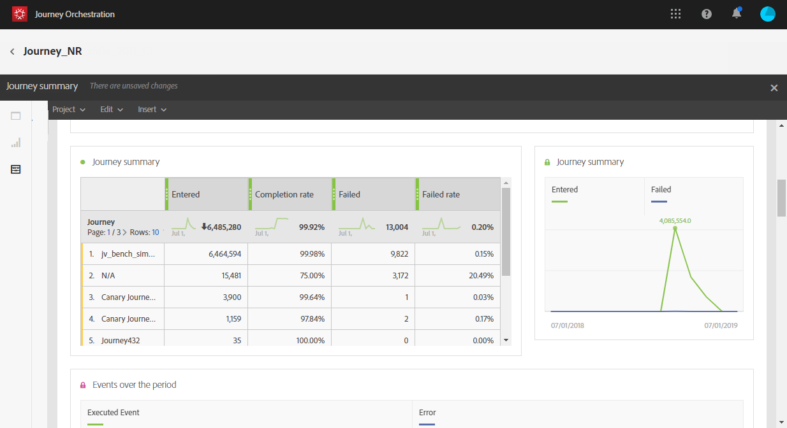
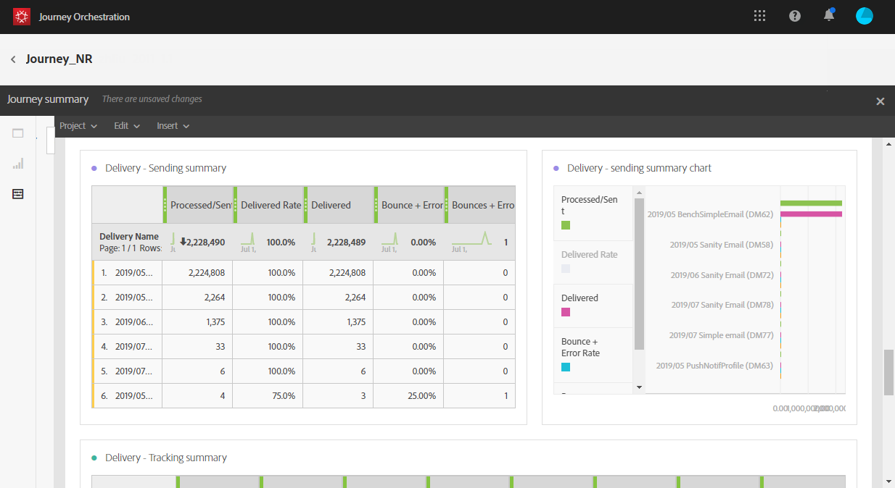

# ジャーニーレポートについて {#concept_rfj_wpt_52b}

>[!CAUTION]
>
>**Adobe Journey Optimizer をお探しですか**？ Journey Optimizer のドキュメントについて詳しくは、[こちら](https://experienceleague.adobe.com/ja/docs/journey-optimizer/using/ajo-home){target="_blank"}をクリックしてください。
>
>
>_このドキュメントは、Journey Optimizer に置き換えられた従来の Journey Orchestration 資料を参照しています。 Journey Orchestration または Journey Optimizer へのアクセスについてご質問がある場合は、アカウントチームにお問い合わせください。_

>[!NOTE]
>
>配信データとセグメント コンポーネントは、Adobe Campaign Standardがある場合にのみ入力されます。

このセクションでは、レポートにアクセスしてジャーニーの効果を測定する方法を紹介します。

## レポートのインターフェイス {#reporting-interface}

上部のツールバーから、レポートを変更、保存または印刷できます。

「**[!UICONTROL プロジェクト]**」タブでは、次の操作を実行できます。

* **[!UICONTROL 開く]**：以前に作成したレポートまたはテンプレートを開きます。
* **[!UICONTROL 別名で保存]**: テンプレートを複製して変更できるようにします。
* **[!UICONTROL プロジェクトを更新]**：新しいデータとフィルターの変更に基づいてレポートを更新します。
* **[!UICONTROL CSVをダウンロード]**：レポートをCSV ファイルに書き出します。
* **[!UICONTROL 印刷]**：レポートを印刷します。

「**[!UICONTROL 編集]**」タブでは、次の操作を実行できます。

* **[!UICONTROL 取り消し]**: ダッシュボードでの最後のアクションをキャンセルします。
* **[!UICONTROL やり直し]**: ダッシュボードの最後の&#x200B;**[!UICONTROL 取り消し]** アクションをキャンセルします。
* **[!UICONTROL すべてを消去]**: ダッシュボードのすべてのパネルを削除します。

「**[!UICONTROL 挿入]**」タブでは、ダッシュボードにグラフやテーブルを追加してレポートをカスタマイズできます。

* **[!UICONTROL 新しい空白パネル]**：新しい空白パネルをダッシュボードに追加します。
* **[!UICONTROL 新しいフリーフォーム]**：新しいフリーフォームテーブルをダッシュボードに追加します。
* **[!UICONTROL 新しい行]**：新しい折れ線グラフをダッシュボードに追加します。
* **[!UICONTROL 新しい棒グラフ]**：新しい棒グラフをダッシュボードに追加します。

左側のタブを使用して、レポートを作成し、必要に応じてデータをフィルターできます。

これらのタブから、次の項目にアクセスできます。

* **[!UICONTROL パネル]**：レポートに空のパネルまたはフリーフォームを追加して、データのフィルタリングを開始します。 詳しくは、[&#x200B; パネルの追加](../reporting/creating-your-journey-reports.md#adding-panels) セクションを参照してください
* **[!UICONTROL ビジュアライゼーション]**：選択したビジュアライゼーション項目をドラッグ＆ドロップして、レポートにグラフィカルなディメンションを設定します。 詳しくは、「[&#x200B; ビジュアライゼーションの追加](../reporting/creating-your-journey-reports.md#adding-visualizations)」の節を参照してください。
* **[!UICONTROL コンポーネント]**：様々なディメンション、指標、セグメントおよび期間でレポートをカスタマイズします。 詳しくは、「[&#x200B; コンポーネントの追加](../reporting/creating-your-journey-reports.md#adding-components)」の節を参照してください。

## ジャーニー概要テンプレート {#ootb-template}

レポートは、すぐに使えるテンプレートとカスタムレポートの2つのカテゴリーに分けられます。すぐに使用できるテンプレート **[!UICONTROL ジャーニーの概要]**&#x200B;を使用すると、最も重要なトラッキングデータを明確に把握できます。

各テーブルは、概要の数値とグラフで表されています。 それぞれのビジュアライゼーション設定で、詳細の表示方法を変更できます。

レポートの上部には、次のKPIがあります。

* **[!UICONTROL ジャーニー - エントリ済み]**：ジャーニーのエントリイベントに到達した個人の合計数。
* **[!UICONTROL ジャーニー – 完了率]**: ジャーニーの最後に到達した個人の合計数（または条件に一致しない個人の場合）と、ジャーニーにエントリした個人の合計数を比較した合計数。
* **[!UICONTROL ジャーニー – 現在]**：現在ジャーニーに参加している個人の合計数。
* **[!UICONTROL ジャーニー – 失敗率]**：実行されたジャーニーの数に対する、正常に実行されなかったジャーニーの合計数。
* **[!UICONTROL 配信 – メッセージ送信数]**：送信されたメッセージの合計数。
* **[!UICONTROL 配信率]**：送信されたメッセージと正常に配信されたメッセージの合計数です。
* **[!UICONTROL 配信 – 直帰率]**：送信されたメッセージとバウンスしたメッセージの合計数。
* **[!UICONTROL 配信 – 登録解除率]**：配信されたメッセージと比較した受信者による登録解除の合計数。
* **[!UICONTROL 配信 – 開封率]**：開封されたメッセージの合計数と配信されたメッセージ数の比較。
* **[!UICONTROL 配信 – クリック率]**：配信されたメッセージ数に対する配信のクリック数の合計。

ジャーニーフローの可視化では、ターゲットプロファイルのパスを、ジャーニーのステップバイステップで確認できます。 これは、1つのジャーニーをターゲットにする場合にのみ使用できます。 自動的に生成され、変更できません。

**[!UICONTROL ジャーニーの概要]** テーブルには、ジャーニーで使用可能なデータが含まれています。例：

* **[!UICONTROL エントリ済み]**: ジャーニーのエントリイベントに到達した個人の合計数。
* **[!UICONTROL 完了率]**: ジャーニーにエントリした個人の合計数に対する、ジャーニーの最終フロー制御に到達した個人の合計数。
* **[!UICONTROL 現在]**：現在ジャーニーにいる個人の合計数。
* **[!UICONTROL 失敗]**：正常に実行されなかったジャーニーの合計数。
* **[!UICONTROL 失敗率]**：実行されたジャーニーの数に対して、正常に実行されなかったジャーニーの合計数です。

**[!UICONTROL 上位イベント]** テーブルには、最も成功したイベントと、ジャーニーで最も成功したアクションである&#x200B;**[!UICONTROL 上位アクション]**&#x200B;が表示されます。

**[!UICONTROL 配信 – 送信概要]** テーブルには、ジャーニーの配信で使用可能なデータが含まれています。次のデータが含まれます。

* **[!UICONTROL 処理/送信]**：送信されたメッセージの合計数。
* **[!UICONTROL 配信率]**：正常に配信されたメッセージの合計数と、送信されたメッセージの合計数を比較します。
* **[!UICONTROL 配信済み]**：送信されたメッセージの合計数に対する、正常に送信されたメッセージの数。
* **[!UICONTROL バウンス + エラー率]**：送信されたメッセージとバウンスしたメッセージの合計数。
* **[!UICONTROL バウンス + エラー]**：送信されたメッセージの合計数に対する、配信中および自動返品処理中に累積されたエラーの合計。

**[!UICONTROL 配信 – トラッキングの概要]** テーブルには、ジャーニーの配信の成功を追跡するために使用可能なデータが含まれています。次のデータが含まれます。

* **[!UICONTROL 開封率]**：開封済みメッセージの割合。
* **[!UICONTROL Open]**：配信でメッセージが開かれた回数。
* **[!UICONTROL クリック率]**：配信されたメッセージ数に対する配信のクリック数の合計。
* **[!UICONTROL クリック]**：配信でコンテンツがクリックされた回数。
* **[!UICONTROL 登録解除率]**：配信されたメッセージと比較した受信者による登録解除の割合。
* **[!UICONTROL 登録解除]**：配信されたメッセージと比較した受信者による登録解除の合計数。
