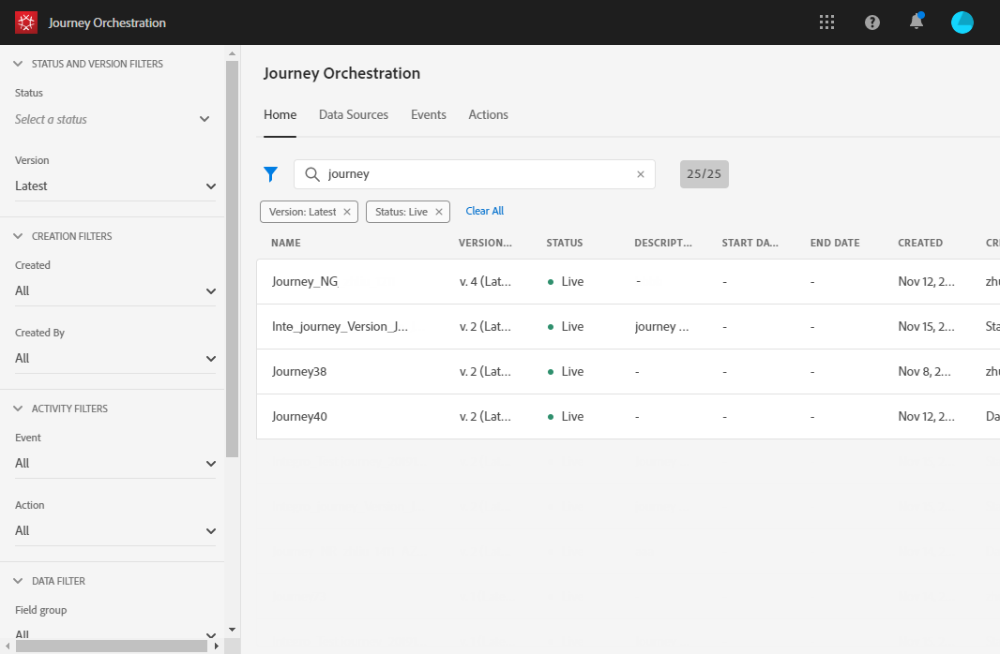
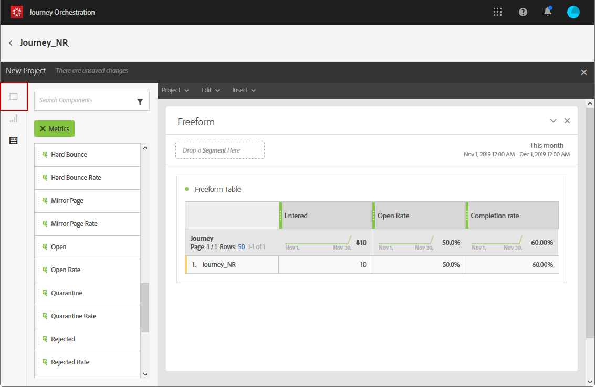
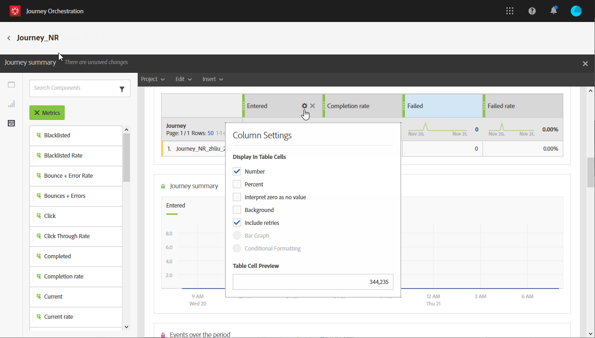
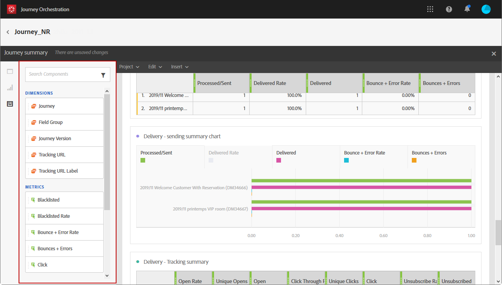

# ジャーニーレポートの作成 {#concept_rfj_wpt_52b}

>[!CAUTION]
>
>**Adobe Journey Optimizerをお探しですか** Journey Optimizerのドキュメントについては、[ こちら ](https://experienceleague.adobe.com/ja/docs/journey-optimizer/using/ajo-home){target="_blank"} をクリックしてください。
>
>
>_このドキュメントでは、Journey Optimizerに置き換えられた従来のJourney Orchestration マテリアルについて説明します。 Journey OrchestrationやJourney Optimizerへのアクセスに関するご質問は、アカウントチームにお問い合わせください。_

## レポートへのアクセスと作成 {#accessing-reports}

>[!NOTE]
>
>ジャーニーを削除すると、関連するすべてのレポートは使用できなくなります。

この節では、標準提供のレポートを作成または使用する方法を説明します。 パネル、コンポーネントおよびビジュアライゼーションを組み合わせて、ジャーニーの成功をより適切に追跡します。

ジャーニーのレポートにアクセスし、配信の成功の追跡を開始するには：

1. トップメニューで、「**[!UICONTROL ホーム]**」タブをクリックします。

1. レポートするジャーニーを選択します。

   また、ジャーニーのリストのジャーニーの上にカーソルを置いて **レポート** をクリックすると、レポートにアクセスできます。

   

1. 画面右上の **[!UICONTROL レポート]** アイコンをクリックします。

   

1. **[!UICONTROL ジャーニーの概要]** 標準レポートが画面に表示されます。 カスタムレポートにアクセスするには、「**[!UICONTROL 閉じる]** ボタンをクリックします。

   

1. **[!UICONTROL 新規プロジェクトを作成]** をクリックして、レポートをゼロから作成します。

   

1. 「**[!UICONTROL パネル]**」タブから、必要な数のパネルまたはフリーフォームテーブルをドラッグ&amp;ドロップします。 詳しくは、この[節](#adding-panels)を参照してください。

   

1. その後、「**[!UICONTROL コンポーネント]** タブからフリーフォームテーブルにディメンションと指標をドラッグ&amp;ドロップして、データのフィルタリングを開始できます。 詳しくは、この[節](#adding-components)を参照してください。

   

1. データをより明確に表示するには、「**[!UICONTROL ビジュアライゼーション]** タブでビジュアライゼーションを追加します。 詳しくは、この[節](#adding-visualizations)を参照してください。

## パネルの追加{#adding-panels}

### 空のパネルの追加 {#adding-a-blank-panel}

レポートを開始するには、一連のパネルを、標準またはカスタムレポートに追加します。 各パネルには、様々なデータセットが含まれ、フリーフォームテーブルおよびビジュアライゼーションで構成されます。

このパネルを使用すると、必要に応じてレポートを作成できます。 異なる期間でデータをフィルタリングするために、レポートに必要な数のパネルを追加できます。

1. **[!UICONTROL パネル]** アイコンをクリックします。 また、「挿入」タブをクリックして **[!UICONTROL 新しい空のパネル]** を選択することで、パネルを追加す **[!UICONTROL こともでき]** す。

   

1. **[!UICONTROL 空のパネル]** をダッシュボードにドラッグ&amp;ドロップします。

   

これで、フリーフォームテーブルをパネルに追加して、データのターゲット設定を開始できます。

### フリーフォームテーブルの追加 {#adding-a-freeform-table}

フリーフォームテーブルを使用すると、**[!UICONTROL コンポーネント]** テーブルで使用できる様々な指標やディメンションを使用して、データを分析するテーブルを作成できます。

各テーブルとビジュアライゼーションはサイズ変更可能で、移動してレポートをカスタマイズできます。

1. **[!UICONTROL パネル]** アイコンをクリックします。

   

1. **[!UICONTROL フリーフォーム]** 項目をダッシュボードにドラッグ&amp;ドロップします。

   また、「**[!UICONTROL 挿入]**」タブをクリックして **[!UICONTROL 新しいフリーフォーム]** を選択するか、空のパネルで **[!UICONTROL フリーフォームテーブルを追加]** をクリックして、テーブルを追加することもできます。

   

1. 「**[!UICONTROL コンポーネント]**」タブから列と行に項目をドラッグ&amp;ドロップして、テーブルを作成します。

   

1. **[!UICONTROL 設定]** アイコンをクリックして、列でのデータの表示方法を変更します。

   

   **[!UICONTROL 列設定]** は、次の要素で構成されます。

   * **[!UICONTROL 数値]**：列の概要数値の表示と非表示を切り替えることができます。
   * **[!UICONTROL パーセント]**：列のパーセントの表示/非表示を切り替えます。
   * **[!UICONTROL ゼロを値なしで解釈]**：値が 0 と等しい場合に表示または非表示にできます。
   * **[!UICONTROL 背景]**：セル内の水平プログレスバーの表示と非表示を切り替えることができます。
   * **[!UICONTROL 再試行を含める]**：結果に再試行を含めることができます。 これは、**[!UICONTROL 送信済み]** および **[!UICONTROL バウンス + エラー]** でのみ使用できます。

1. 1 つまたは複数の行を選択して、「**[!UICONTROL 視覚化]**」アイコンをクリックします。 ビジュアライゼーションが追加され、選択した行が反映されます。

   

必要な数のコンポーネントを追加し、ビジュアライゼーションを追加して、データをグラフで表示できるようになりました。

## コンポーネントの追加{#adding-components}

コンポーネントを使用すると、様々なディメンション、指標および期間でレポートをカスタマイズできます。

1. 「**[!UICONTROL コンポーネント]**」タブをクリックして、コンポーネントのリストにアクセスします。

   

1. 「**[!UICONTROL コンポーネント]**」タブに表示される各カテゴリには、最も使用されている 5 つの項目が表示されます。カテゴリの名前をクリックすると、コンポーネントの完全なリストにアクセスできます。

   コンポーネント テーブルは、次の 3 つのカテゴリに分かれています。

   * **[!UICONTROL ディメンション]**：配信ログから詳細（受信者のブラウザーやドメイン、配信の成功など）を取得します。
   * **[!UICONTROL 指標]**：メッセージのステータスに関する詳細を取得します。 例えば、メッセージが配信され、ユーザーが開いた場合などです。
   * **[!UICONTROL 時間]**：テーブルの期間を設定します。

1. パネルにコンポーネントをドラッグ&amp;ドロップして、データのフィルタリングを開始します。

必要な数のコンポーネントをドラッグ&amp;ドロップして、相互に比較できます。

## ビジュアライゼーションの追加{#adding-visualizations}

「**[!UICONTROL ビジュアライゼーション]**」タブでは、領域、ドーナツ、グラフなどのビジュアライゼーション項目をドラッグ&amp;ドロップできます。 ビジュアライゼーションにより、データをグラフで表示できます。

1. 「**[!UICONTROL ビジュアライゼーション]**」タブで、パネル内のビジュアライゼーション項目をドラッグ&amp;ドロップします。

   

1. パネルにビジュアライゼーションを追加すると、レポートによってフリーフォームテーブルのデータが自動的に検出されます。 視覚化の設定を選択します。
1. 複数のフリーフォームテーブルがある場合は、**[!UICONTROL データSourceの設定]** ウィンドウで、グラフに追加できるデータソースを選択します。 このウィンドウは、ビジュアライゼーションのタイトルの横にある色付きの点をクリックしても使用できます。

   

1. **[!UICONTROL ビジュアライゼーション]** 設定ボタンをクリックして、グラフのタイプや表示される内容を直接変更します。次に例を示します。

   * **[!UICONTROL パーセンテージ]**：値をパーセンテージで表示します。
   * **[!UICONTROL Y 軸をゼロに固定]**：値の範囲がゼロより大きい場合でも、Y 軸を強制的にゼロにします。
   * **[!UICONTROL 凡例を表示]**：凡例を非表示にできます。
   * **[!UICONTROL 正規化]**：値を強制的に一致させます。
   * **[!UICONTROL 二重軸を表示]**: グラフに別の軸を追加します。
   * **[!UICONTROL 項目数の上限]**：表示するグラフの数を制限します。
   * **[!UICONTROL しきい値]**：グラフのしきい値を設定できます。 黒い点線で表示されます。

   

このビジュアライゼーションにより、レポート内のデータをより明確に表示できます。
