# ジャーニーレポートの作成 {#concept_rfj_wpt_52b}

>[!CAUTION]
>
>**Adobe Journey Optimizer をお探しですか**？ Journey Optimizer のドキュメントについて詳しくは、[こちら](https://experienceleague.adobe.com/ja/docs/journey-optimizer/using/ajo-home){target="_blank"}をクリックしてください。
>
>
>_このドキュメントは、Journey Optimizer に置き換えられた従来の Journey Orchestration 資料を参照しています。 Journey Orchestration または Journey Optimizer へのアクセスについてご質問がある場合は、アカウントチームにお問い合わせください。_

## レポートへのアクセスと作成 {#accessing-reports}

>[!NOTE]
>
>ジャーニーを削除すると、関連するすべてのレポートは使用できなくなります。

ここでは、すぐに利用できるレポートを作成して活用する方法を紹介します。 パネル、コンポーネント、ビジュアライゼーションを組み合わせて、ジャーニーの成果をより適切に追跡できます。

ジャーニーのレポートにアクセスし、配信の成功の追跡を開始するには：

1. 上部メニューで、「**[!UICONTROL ホーム]**」タブをクリックします。

1. レポートを作成するジャーニーを選択します。

   ジャーニーのリストのジャーニーにカーソルを合わせたときに「**レポート**」をクリックすると、レポートにアクセスすることもできます。

   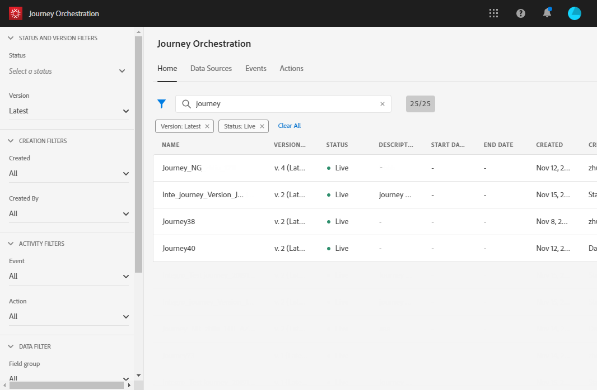

1. 画面の右上にある「**[!UICONTROL レポート]**」アイコンをクリックします。

   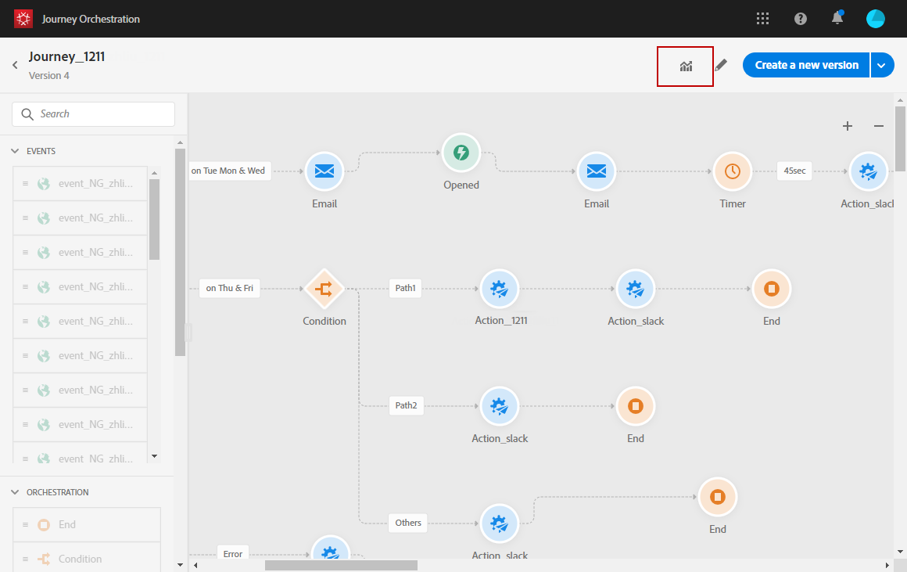

1. **[!UICONTROL ジャーニーの概要]**&#x200B;のすぐに使用できるレポートが画面に表示されます。 カスタムレポートにアクセスするには、**[!UICONTROL 閉じる]** ボタンをクリックします。

   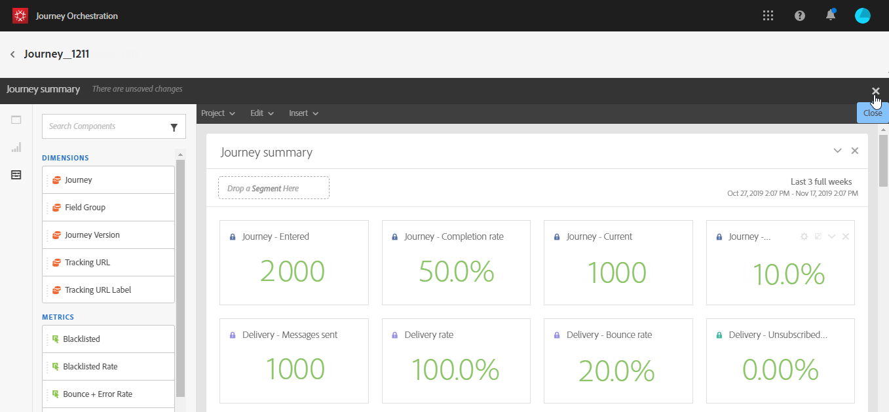

1. 「**[!UICONTROL 新しいプロジェクトを作成]**」をクリックして、レポートをゼロから作成します。

   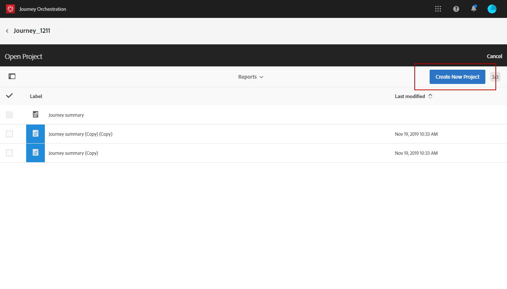

1. 「**[!UICONTROL パネル]**」タブから、必要に応じてパネルまたはフリーフォームテーブルをドラッグ&amp;ドロップします。 詳しくは、この[節](#adding-panels)を参照してください。

   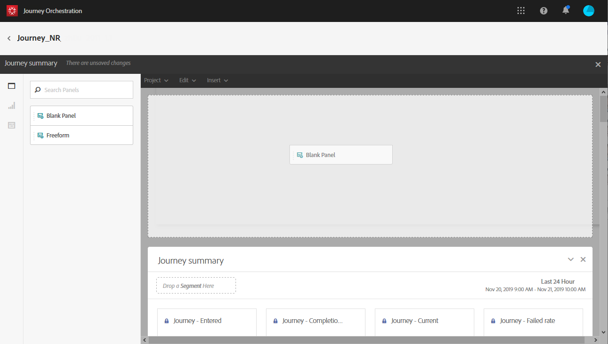

1. その後、「**[!UICONTROL コンポーネント]**」タブからフリーフォームテーブルにディメンションと指標をドラッグ&amp;ドロップして、データのフィルタリングを開始できます。 詳しくは、この[節](#adding-components)を参照してください。

   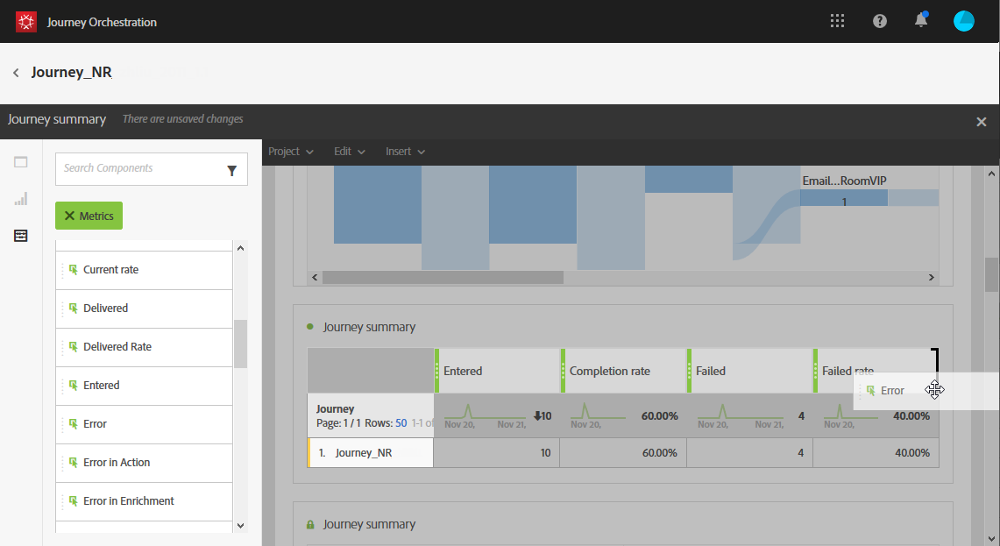

1. データをより明確に表示するには、「**[!UICONTROL ビジュアライゼーション]**」タブからビジュアライゼーションを追加します。 詳しくは、この[節](#adding-visualizations)を参照してください。

## パネルの追加{#adding-panels}

### 空のパネルの追加 {#adding-a-blank-panel}

レポートを開始するには、パネルのセットを標準またはカスタムのレポートに追加します。 各パネルは、様々なデータセットを含み、フリーフォームテーブルとビジュアライゼーションで構成されています。

このパネルを使用すると、必要に応じてレポートを作成できます。 異なる期間でデータをフィルタリングするために、レポートに必要な数のパネルを追加できます。

1. 「**[!UICONTROL パネル]**」アイコンをクリックします。 また、「**[!UICONTROL タブを挿入]**」をクリックして「**[!UICONTROL 新しい空のパネルl]**」を選択することで、パネルを追加することもできます。

   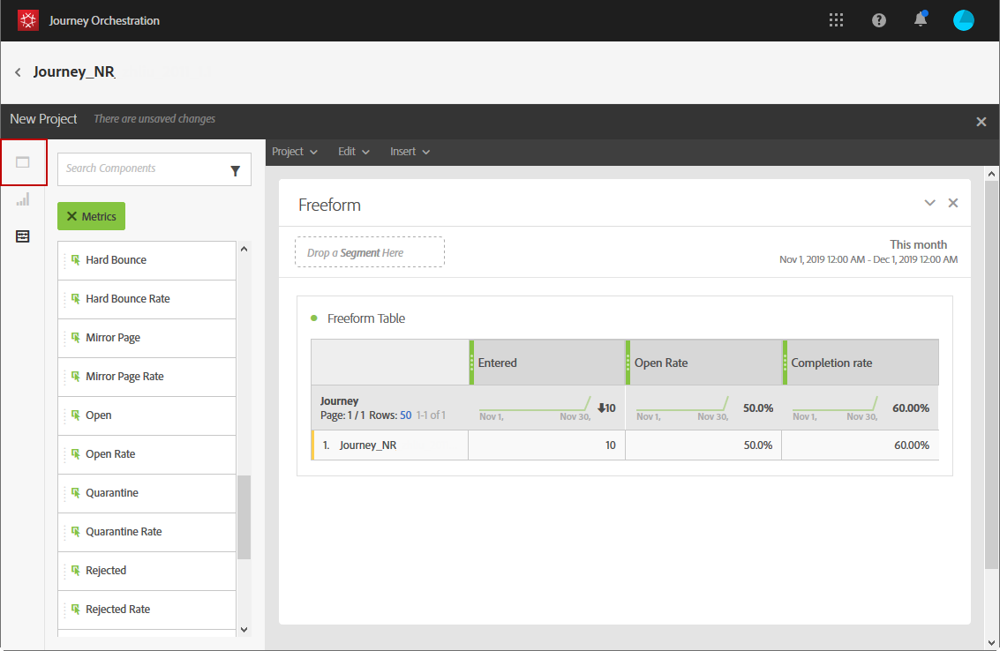

1. **[!UICONTROL 空のパネル]**&#x200B;をダッシュボードにドラッグ＆ドロップします。

   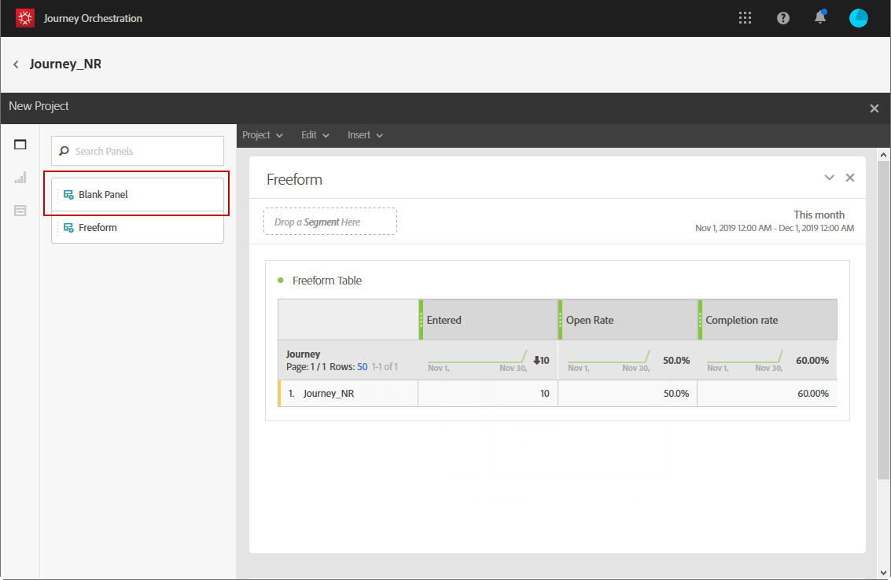

これで、パネルにフリーフォームテーブルを追加して、データのターゲティングを開始できるようになりました。

### フリーフォームテーブルの追加 {#adding-a-freeform-table}

フリーフォームテーブルでは、**[!UICONTROL コンポーネント]**&#x200B;テーブルにある様々な指標やディメンションを使ってテーブルを作成し、データを分析できます。

各テーブルとビジュアライゼーションはサイズ変更したり、移動したりしてレポートをカスタマイズできます。

1. **[!UICONTROL パネル]**&#x200B;アイコンをクリックします。

   

1. **[!UICONTROL フリーフォーム]**&#x200B;項目をダッシュボードにドラッグ＆ドロップします。

   また、「**[!UICONTROL 挿入]**」タブをクリックして「**[!UICONTROL 新しいフリーフォーム]**」を選択するか、空のパネルで「**[!UICONTROL フリーフォームテーブルを追加]**」をクリックして、テーブルを追加することもできます。

   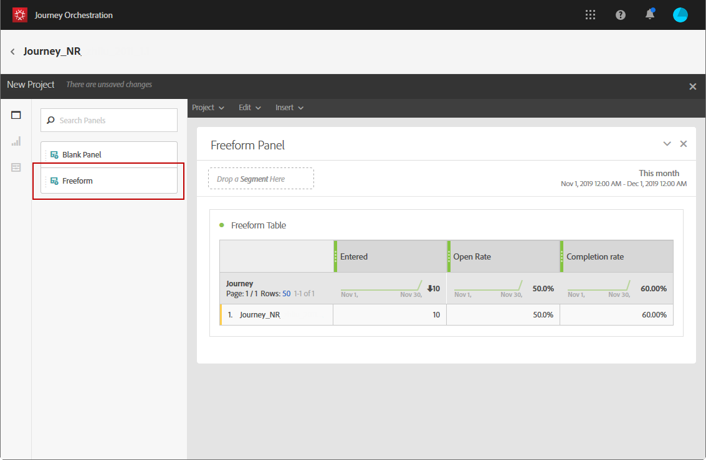

1. 列と行に「**[!UICONTROL コンポーネント]**」タブの項目をドラッグ＆ドロップして、テーブルを作成します。

   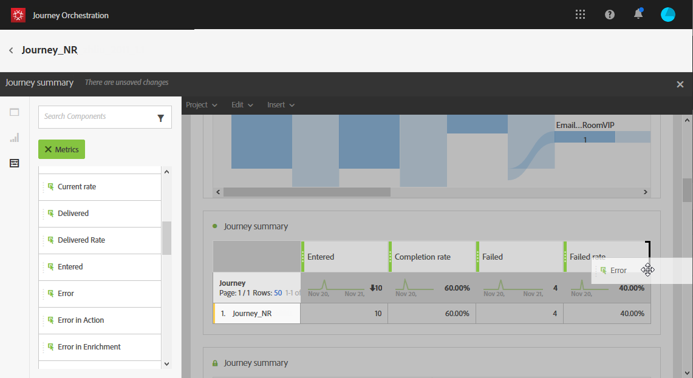

1. 「**[!UICONTROL 設定]**」アイコンをクリックして、列のデータの表示方法を変更します。

   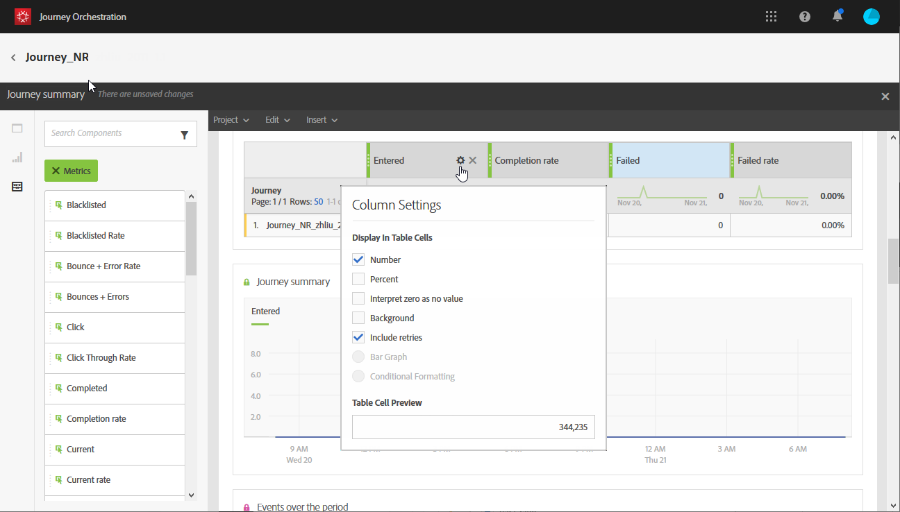

   「**[!UICONTROL 列設定]**」の構成要素は次のとおりです。

   * **[!UICONTROL 数値]**：列の概要の数値を表示または非表示にできます。
   * **[!UICONTROL パーセント]**：列のパーセントを表示または非表示にできます。
   * **[!UICONTROL ゼロを値なしとして解釈]**：値が 0 と等しい場合に表示または非表示にできます。
   * **[!UICONTROL 背景]**：セル内の水平プログレスバーを表示または非表示にできます。
   * **[!UICONTROL 再試行を含める]**：結果に再試行を含めることができます。 これは、**[!UICONTROL 送信済み]**&#x200B;および&#x200B;**[!UICONTROL バウンス数 + エラー数]**&#x200B;でのみ使用できます。

1. 1 つまたは複数の行を選択して、「**[!UICONTROL 視覚化]**」アイコンをクリックします。 ビジュアライゼーションが追加され、選択した行が反映されます。

   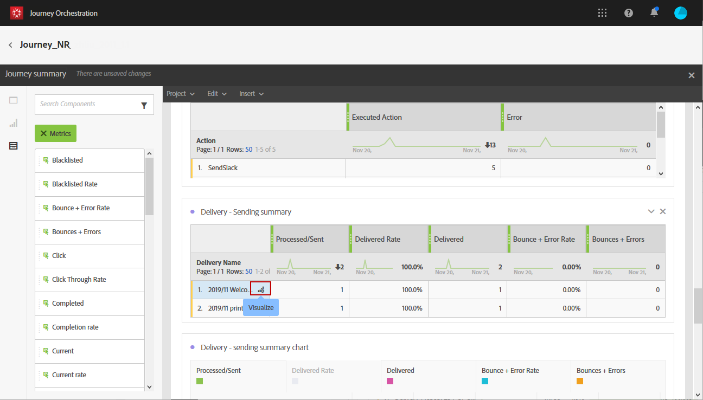

必要な数のコンポーネントを追加し、ビジュアライゼーションを追加して、データをグラフで表示できるようになりました。

## コンポーネントの追加{#adding-components}

コンポーネントでは、様々なディメンション、指標および期間を使用してレポートをカスタマイズできます。

1. 「**[!UICONTROL コンポーネント]**」タブをクリックして、コンポーネントのリストにアクセスします。

   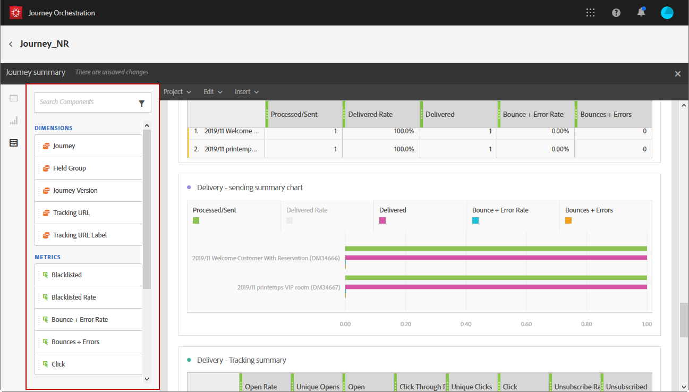

1. 「**[!UICONTROL コンポーネント]**」タブに表示される各カテゴリには、最も頻繁に使用されている 5 つの項目が表示されます。カテゴリの名前をクリックすると、コンポーネントの完全なリストにアクセスできます。

   コンポーネントテーブルは、次の3つのカテゴリに分かれています。

   * **[!UICONTROL ディメンション]**：配信ログから詳細（受信者のブラウザーやドメイン、配信の成功など）を取得します。
   * **[!UICONTROL 指標]**：メッセージのステータスに関する詳細を取得します。 例えば、メッセージが配信され、ユーザーがメッセージを開いた場合などです。
   * **[!UICONTROL 時間]**：テーブルの期間を設定します。

1. パネルにコンポーネントをドラッグ＆ドロップして、データのフィルタリングを開始します。

必要な数のコンポーネントをドラッグ＆ドロップして、相互に比較できます。

## ビジュアライゼーションの追加{#adding-visualizations}

「**[!UICONTROL ビジュアライゼーション]**」タブでは、領域、ドーナツ、グラフなどのビジュアライゼーション項目をドラッグ＆ドロップできます。 ビジュアライゼーションを使用すると、データをグラフで表示できます。

1. 「**[!UICONTROL ビジュアライゼーション]**」タブで、パネル内のビジュアライゼーション項目をドラッグ＆ドロップします。

   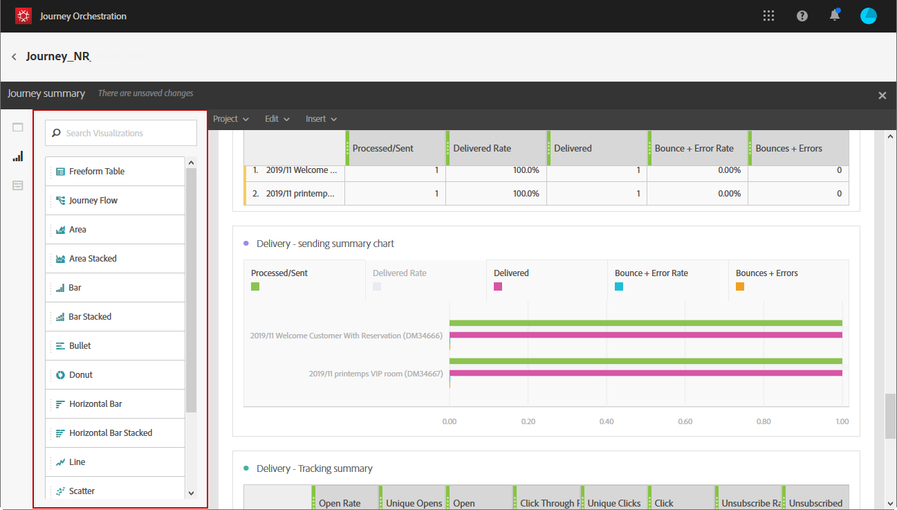

1. パネルにビジュアライゼーションを追加すると、レポートがフリーフォームテーブル内のデータを自動的に検出します。 ビジュアライゼーションの設定を選択します。
1. 複数のフリーフォームテーブルがある場合は、**[!UICONTROL データソースの設定]**&#x200B;ウィンドウで、グラフに追加できるデータソースを選択します。 このウィンドウは、ビジュアライゼーションのタイトルの横にある色付きのドットをクリックして開くこともできます。

   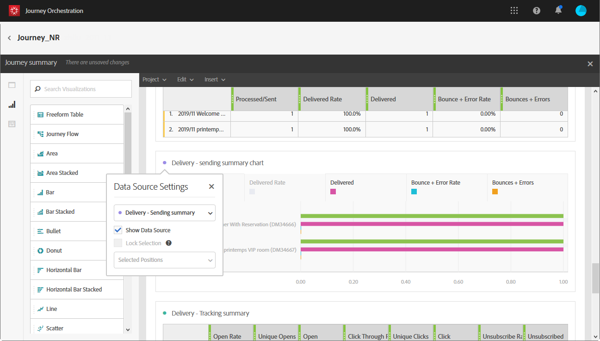

1. **[!UICONTROL ビジュアライゼーション]**&#x200B;設定のボタンをクリックして、次のようなグラフのタイプや表示内容を直接変更します。

   * **[!UICONTROL パーセンテージ]**：値をパーセンテージで表示します。
   * **[!UICONTROL Y 軸をゼロに固定]**：値の範囲がゼロより大きい場合でも、Y 軸を強制的にゼロにします。
   * **[!UICONTROL 凡例を表示]**：凡例を非表示にできます。
   * **[!UICONTROL 正規化]**：値を強制的に一致させます。
   * **[!UICONTROL 二重軸を表示]**：グラフに別の軸を追加します。
   * **[!UICONTROL 項目数の上限を設定]**：表示するグラフの数を制限します。
   * **[!UICONTROL しきい値]**: グラフのしきい値を設定できます。 しきい値は、黒い点線で表示されます。

   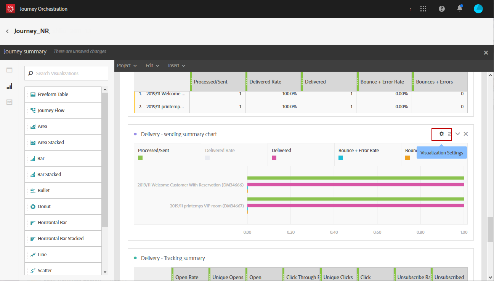

このビジュアライゼーションにより、レポート内のデータをより明確に表示することができます。
