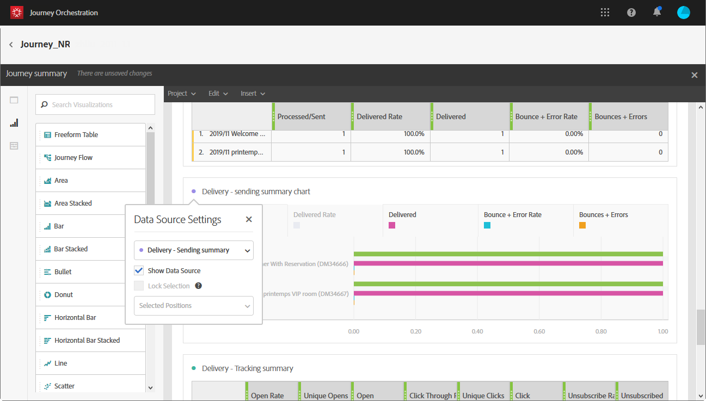

# ジャーニーレポートの作成 {#concept_rfj_wpt_52b}

## レポートへのアクセスと作成 {#accessing-reports}

>[!NOTE]
>
>ジャーニーを削除すると、関連するすべてのレポートが使用できなくなります。

このセクションでは、すぐに使用できるレポートの作成方法と使用方法について説明します。 パネル、コンポーネントおよびビジュアライゼーションを組み合わせて、ジャーニーの成功をより適切に追跡します。

ジャーニーのレポートにアクセスし、配信の成功の追跡を開始するには：

1. 上部のメニューで、タブをクリック **[!UICONTROL Home]**します。

1. レポートする旅行を選択します。

   また、ジャーニーリスト内の旅の上にマウスポインターを置い **た状態で** 「レポート」をクリックしても、レポートにアクセスできます。

   

1. 画面の右 **[!UICONTROL Report]**上にあるアイコンをクリックします。

   

1. 既製 **[!UICONTROL Journey summary]**のレポートが画面に表示されます。 カスタムレポートにアクセスするには、ボタンをクリッ**[!UICONTROL Close]** クします。

   

1. をクリックし **[!UICONTROL Create new project]**て、レポートを新規に作成します。

   

1. 必要に応じて、 **[!UICONTROL Panels]**タブからパネルまたはフリーフォームテーブルをドラッグ&amp;ドロップします。 詳しくは、この[節](#adding-panels)を参照してください。

   

1. その後、ディメンションや指標をタブからフリーフォームテーブルにドラッグ&amp;ドロップして、データのフ **[!UICONTROL Components]**ィルタリングを開始できます。 詳しくは、この[節](#adding-components)を参照してください。

   

1. データをより明確に表示するには、タブからビジュアライゼーションを追加で **[!UICONTROL Visualizations]**きます。 詳しくは、この[節](#adding-visualizations)を参照してください。

## パネルの追加{#adding-panels}

### 空のパネルの追加 {#adding-a-blank-panel}

レポートを開始するには、あらかじめ用意されているレポートまたはカスタムレポートに一連のパネルを追加します。 各パネルには様々なデータセットが含まれ、フリーフォームテーブルとビジュアライゼーションで構成されています。

このパネルでは、必要に応じてレポートを作成できます。 様々な期間でデータをフィルターするために、レポートに任意の数のパネルを追加できます。

1. アイコンをクリッ **[!UICONTROL Panels]**クします。 パネルを追加するには、をクリックし、を選択**[!UICONTROL Insert tab]** します **[!UICONTROL New Blank Panel]**。

   

1. ダッシュボードにをドラッ **[!UICONTROL Blank Panel]**グ&amp;ドロップします。

   

パネルにフリーフォームテーブルを追加して、データのターゲット設定を開始できるようになりました。

### フリーフォームテーブルの追加 {#adding-a-freeform-table}

フリーフォームテーブルを使用すると、テーブルで使用可能な様々な指標やディメンションを使用してデータを分析するテーブルを作成で **[!UICONTROL Component]**きます。

各テーブルとビジュアライゼーションはサイズ変更が可能で、移動してレポートをより適切にカスタマイズできます。

1. アイコンをクリッ **[!UICONTROL Panels]**クします。

   

1. 項目をダッシュボードにド **[!UICONTROL Freeform]**ラッグ&amp;ドロップします。

   タブをクリックしてを選択するか、空のパネル内 **[!UICONTROL Insert]**をクリックして、**[!UICONTROL New Freeform]** テーブルを追 **[!UICONTROL Add a freeform table]**加することもできます。

   

1. タブから列や行に項目をド **[!UICONTROL Components]**ラッグ&amp;ドロップして、テーブルを作成します。

   

1. アイコンをク **[!UICONTROL Settings]**リックして、列でのデータの表示方法を変更します。

   

   は、次 **[!UICONTROL Column settings]**の要素で構成されます。

   * **[!UICONTROL Number]**:列内の概要番号の表示/非表示を切り替えます。
   * **[!UICONTROL Percent]**:列内の割合を表示または非表示にできます。
   * **[!UICONTROL Interpret zero as no value]**:値がゼロの場合に表示/非表示を切り替えます。
   * **[!UICONTROL Background]**:セル内の水平プログレスバーの表示/非表示を切り替えます。
   * **[!UICONTROL Include retries]**:結果に再試行を含めることができます。 これは、とでのみ使用で**[!UICONTROL Sent]** きま **[!UICONTROL Bounces + Errors]**す。

1. 1つまたは複数の行を選択し、アイコンをクリック **[!UICONTROL Visualize]**します。 選択した行を反映するビジュアライゼーションが追加されます。

   

必要な数のコンポーネントを追加でき、ビジュアライゼーションを追加してデータをグラフィカルに表示できるようになりました。

## コンポーネントの追加{#adding-components}

コンポーネントは、様々なディメンション、指標および期間でレポートをカスタマイズするのに役立ちます。

1. タブをクリック **[!UICONTROL Components]**して、コンポーネントのリストにアクセスします。

   

1. タブに表示される各カテゴリに **[!UICONTROL Components]**は、最も使用される5つの項目が表示されます。カテゴリの名前をクリックすると、そのコンポーネントの完全なリストにアクセスできます。

   コンポーネントの表は、次の3つのカテゴリに分かれています。

   * **[!UICONTROL Dimensions]**:受信者のブラウザーやドメイン、配信の成功など、配信ログから詳細を取得します。
   * **[!UICONTROL Metrics]**:メッセージの状態の詳細を取得します。 例えば、メッセージが配信され、ユーザーが開いた場合です。
   * **[!UICONTROL Time]**:テーブルの期間を設定します。

1. コンポーネントをパネルにドラッグ&amp;ドロップして、データのフィルタリングを開始します。

必要な数のコンポーネントをドラッグ&amp;ドロップして、相互に比較できます。

## ビジュアライゼーションの追加{#adding-visualizations}

このタ **[!UICONTROL Visualizations]**ブでは、領域、ドーナツ、グラフなどのビジュアライゼーション項目をドラッグ&amp;ドロップできます。 ビジュアライゼーションは、データをグラフィカルに表示します。

1. タブで、ビジュ **[!UICONTROL Visualizations]**アライゼーション項目をパネルにドラッグ&amp;ドロップします。

   

1. パネルにビジュアライゼーションを追加した後、レポートは自動的にフリーフォームテーブルのデータを検出します。 ビジュアライゼーションの設定を選択します。
1. 複数のフリーフォームテーブルがある場合は、ウィンドウでグラフに追加する利用可能なデータソースを選択 **[!UICONTROL Data Source Settings]**します。 このウィンドウは、ビジュアライゼーションタイトルの横にある色付きの点をクリックしても使用できます。

   

1. 設定ボタン **[!UICONTROL Visualization]**をクリックして、グラフの種類や表示内容を直接変更します。例：

   * **[!UICONTROL Percentages]**:値をパーセントで表示します。
   * **[!UICONTROL Anchor Y Axis at Zero]**:値の範囲がゼロより大きい場合でも、y軸を強制的にゼロにします。
   * **[!UICONTROL Legend visible]**:凡例を非表示にできます。
   * **[!UICONTROL Normalization]**:値を強制的に一致させます。
   * **[!UICONTROL Display Dual Axis]**:グラフに別の軸を追加します。
   * **[!UICONTROL Limit Max Items]**:表示するグラフの数を制限します。
   * **[!UICONTROL Threshold]**:グラフにしきい値を設定できます。 黒い点線で表示されます。
   

このビジュアライゼーションにより、レポート内のデータをより明確に表示できます。