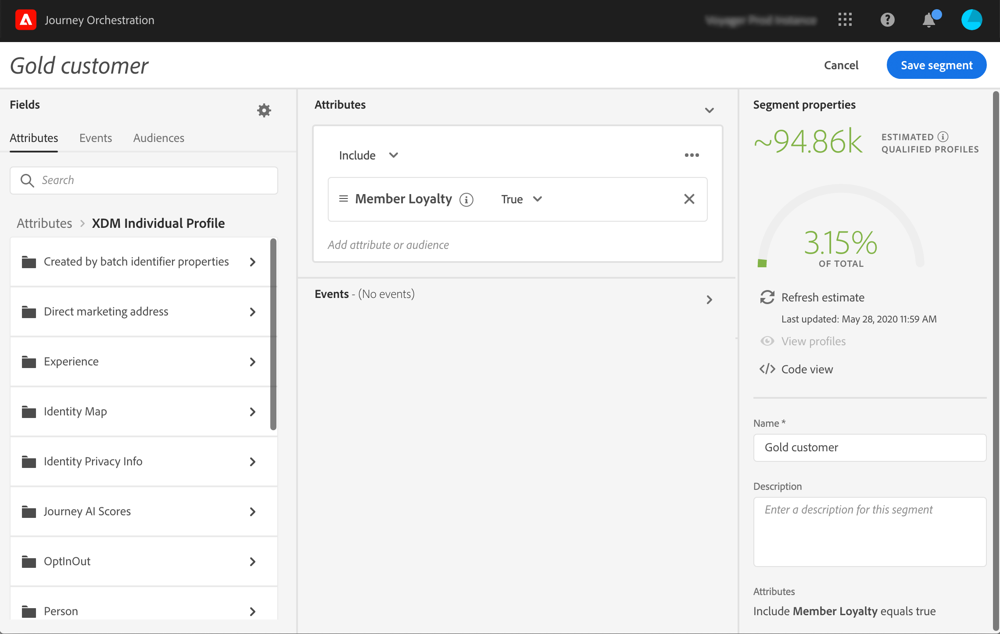

# セグメントの作成 {#creating-a-segment}

>[!CAUTION]
>
>**Adobe Journey Optimizer をお探しですか**？ Journey Optimizer のドキュメントについて詳しくは、[こちら](https://experienceleague.adobe.com/ja/docs/journey-optimizer/using/ajo-home){target="_blank"}をクリックしてください。
>
>
>_このドキュメントは、Journey Optimizer に置き換えられた従来の Journey Orchestration 資料を参照しています。 Journey Orchestration または Journey Optimizer へのアクセスについてご質問がある場合は、アカウントチームにお問い合わせください。_

[Adobe Experience Platform Segmentation Service](https://experienceleague.adobe.com/docs/experience-platform/segmentation/home.html?lang=ja)を使用してセグメントを作成するか、[!DNL Journey Orchestration]で直接アクセスして作成できます。

1. 上部メニューで、「**[!UICONTROL セグメント]**」タブをクリックします。 Adobe Experience Platform セグメントのリストが表示されます。 リスト内の特定のセグメントを検索できます。

   

1. 「**[!UICONTROL 追加]**」をクリックして、新しいセグメントを作成します。 「セグメント定義」画面では、必須フィールドをすべて設定してセグメントを定義できます。 設定は、セグメント化サービスと同じです。 [&#x200B; セグメントビルダーユーザーガイド &#x200B;](https://experienceleague.adobe.com/docs/experience-platform/segmentation/ui/overview.html?lang=ja)を参照してください。

   

セグメントをジャーニーで使用して、条件を作成したり、**[!UICONTROL セグメントの選定]** イベントを追加したりできるようになりました。 [条件でのセグメントの使用](../segment/using-a-segment.md)および[&#x200B; イベントアクティビティ &#x200B;](../building-journeys/segment-qualification-events.md)を参照してください。
