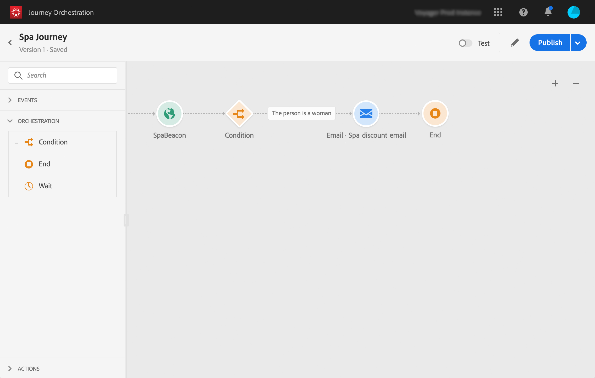

# 簡単な使用例について{#concept_grh_vby_w2b}

## 目的 {#purpose}

マールトンというホテルブランドの例を見てみましょう 彼らのホテルでは、すべての戦略エリアの近くにビーコン装置を配置しています。ロビー、床、レストラン、ジム、プールなど

この使用例では、スパの近くに配置されたビーコンの隣を歩く人に、リアルタイムでパーソナライズされたメッセージを送信する方法を確認します。

私たちはその人が女性の場合にのみメッセージを送りたい。 メッセージは、数秒以内に受信する必要があります。

## 前提条件 {#prerequisites}

使用例に応じて、Adobe Campaign Standardで1つの電子メールトランザクションメッセージングテンプレートを設計しました。 イベントトランザクションメッセージングテンプレートを使用しています。 この[ページ](https://docs.adobe.com/content/help/en/campaign-standard/using/communication-channels/transactional-messaging/about-transactional-messaging.html)を参照してください。

Adobe Campaign Standardは電子メールを送信するように設定されています。

イベントは、顧客の携帯電話がビーコンの近くで検出されると送信されます。 顧客の携帯電話からMobile SDKにイベントを送信するには、モバイルアプリケーションを設計する必要があります。