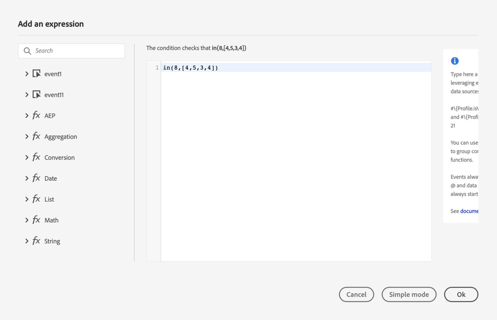
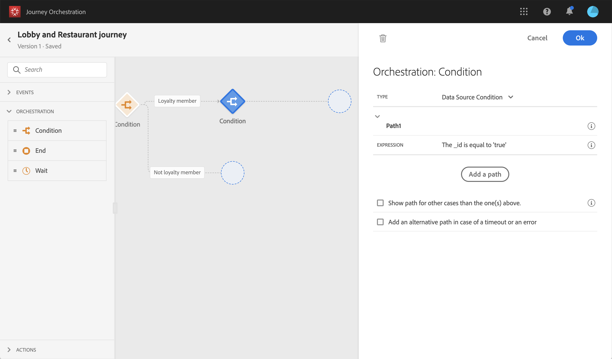
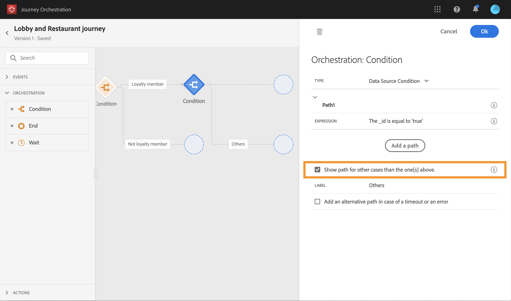

# ジャーニーの構築 {#concept_owm_kdy_w2b}

これで **ビジネスユーザー** はこの旅を作成できます。 以下のアクティビティを行います。

* 2つの **[!UICONTROL イベント]** アクティビティ: &quot;LobbyBeacon&quot;および&quot;RestaranBeacon&quot;
* 2つの **[!UICONTROL 条件]** アクティビティ
* 3つの **[!UICONTROL プッシュ]** アクティビティと1つの **[!UICONTROL 電子メール]** アクティビティ(Adobe Campaign標準を使用)
* **[!UICONTROL 待機]** アクティビティ
* 4つの **[!UICONTROL エンド]** アクティビティ

>[!NOTE]
>
>「 **[!UICONTROL プッシュ]** 」および「 **[!UICONTROL 電子メール]** 」アクティビティは、Adobe Campaign標準を使用している場合にのみ、パレットで使用できます。

遍歴の作り方の詳細については、を参照してください [](../building-journeys/journey.md)。

## 最初の手順{#section_ntb_ws1_ffb}

1. 上部のメニューで、「 **[!UICONTROL ホーム]** 」タブをクリックし、「 **[!UICONTROL 作成]** 」をクリックして新しいジャーニーを作成します。

   

1. 右側に表示される設定ペインで、ジャーニーのプロパティを編集します。 12追加月1日から12月31日までの1か月間の名前を付けておきます。

   

1. 「LobbyBeacon」イベントをパレットからキャンバスにドラッグ&amp;ドロップして、旅のデザインに開始が発生しました。 パレット内のイベントを重複クリックして、キャンバスに追加することもできます。

   

1. ここで、その人が過去24時間以内に連絡を受けていないことを確認する条件を追加し、その人が忠誠度メンバーであるかどうかを確認します。 条件アクティビティをジャーニーにドラッグ&amp;ドロップします。

   

1. 「 **[!UICONTROL Data Source Condition]** 」タイプを選択し、「 **[!UICONTROL 式]** 」フィールドをクリックします。 また、キャンバス上の矢印に表示される条件ラベルを定義することもできます。 この例では、「条件1」を「Loyality member」に置き換えます。

   

1. 「 **[!UICONTROL 詳細モード]** 」をクリックし、Experience Platformデータソースから取得される「timestamp」フィールドと「directMarketing.sends.value」フィールドに基づいて、次の条件を定義します。 式の構文：

   ```
   count(#{ExperiencePlatformDataSource.MarltonExperience.experienceevent.all(
       currentDataPackField.directMarketing.sends.value > 0 and
       currentDataPackField.timestamp > nowWithDelta(-1, "days")).timestamp}) == 0
   and
       #{ExperiencePlatformDataSource.MarltonProfiles.Profile._customer.marlton.loyaltyMember}
   ```

   

1. 「パス **** 」ボタンをクリックし、過去24時間以内に連絡がなく、忠誠度のメンバーでない顧客の2番目のパスを作成します。 パスに「Not loyalty member」という名前を付けます。 式の構文：

   ```
   count(#{ExperiencePlatformDataSource.MarltonExperience.experienceevent.all(
       currentDataPackField.directMarketing.sends.value > 0 and
       currentDataPackField.timestamp > nowWithDelta(-1, "days").timestamp}) == 0
   and not
       #{ExperiencePlatformDataSource.MarltonProfiles.Profile._customer.marlton.loyaltyMember}
   ```

   >[!NOTE]
   >
   >式の2番目の部分では、「プロファイル」はオプションです。

1. 名前空間を選択する必要があります。 名前空間は、スキーマのプロパティに基づいて事前に選択されます。 あらかじめ選択されているものを選択したままにすることができます。 名前空間の詳細については、を参照してください [](../event/selecting-the-namespace.md)。

使用する場合は、これら2つの条件にのみ反応したいので、[上記以外の場合のパスを **[!UICONTROL 表示する]**]チェックボックスはオフにします。

条件の後に2つのパスが作成されます。

* _過去24時間に連絡を受けていない、忠誠度の高い会員である顧客。_
* _過去24時間に連絡を受けていない、忠誠度の高い会員でない顧客。_


## 最初のパス： 顧客は忠誠度のメンバーです {#section_otb_ws1_ffb}

1. 最初のパスに、予約があるかどうかを確認する条件を追加します。 条件アクティビティをジャーニーにドラッグ&amp;ドロップします。

   

1. 「 **[!UICONTROL データ・ソース条件]** 」タイプを選択し、予約システムから取得した予約ステータス情報に基づいて条件を定義します。

   ```
   #{MarltonReservation.MarltonFieldGroup.reservation} == true
   ```

   

1. 外部データソースからフィールドを選択すると、画面の右側に、外部データソースの設定時に定義したパラメータのリストが表示されます(を参照 [](../usecase/configuring-the-data-sources.md))。 この例では、パラメーター名をクリックし、予約システムキーの値であるExperience Cloud IDを定義します。

   ```
   @{LobbyBeacon.endUserIDs._experience.mcid.id}
   ```

   

1. また、予約をしていないお客様にも対応したいので、[上記以外の場合のパスを **[!UICONTROL 表示する]**]チェックボックスをオンにする必要があります。

   

   2つのパスが作成されます。

   * _部屋を予約した顧客_
   * _部屋を予約していない顧客。_
   

1. 最初のパス（ルームメモ）に、 **[!UICONTROL プッシュ]** アクティビティをドロップし、モバイルアプリと「ようこそ」テンプレートを選択します。

   

1. プッシュを送信するためにシステムで必要な **[!UICONTROL ターゲット]** ・フィールドを定義します。

   * **[!UICONTROL プッシュプラットフォーム]**: プラットフォームを選択します。 **[!UICONTROL Apple Push Notification Server]** (Apple)または **[!UICONTROL Firebase Cloud Messaging]** (Android)。
   * **[!UICONTROL 登録トークン]**: アドバンスモードを使用して、(設定済みのイベントに基づいて)次の式を追加します。

      ```
      @{LobbyBeacon._experience.campaign.message.profileSnapshot.pushNotificationTokens.first().token}
      ``
      
1. プッシュ通知パーソナライゼーションフィールドを定義します。 この例では、次のようになります。 名と姓

1. 「追加RestarantBeacon」イベント。

   

1. 新し追加い **[!UICONTROL プッシュ]** アクティビティで、「食事割引 **[!UICONTROL 」テンプレートを選択し、「]** 住所 **** 」フィールドと「個人設定」フィールドを定義します。 Add an **[!UICONTROL End]** activity.

   

1. 歓迎のプッシュの後6時間以内にレストランに入った場合にのみ、割引のプッシュ通知を送信します。 これを行うには、待機アクティビティを使用する必要があります。 スタートアッププッシュアクティビティにカーソルを置き、「+」記号をクリックします。 新しいパスに待機アクティビティを追加し、6時間の期間を定義します。 最初の有効なアクティビティが選択されます。 ウェルカムプッシュの6時間未満でレストランのイベントが受信された場合は、プッシュアクティビティが送信されます。 次の6時間以内にレストランのイベントが受信されない場合は、待機が選択されます。 待機アクティビティの後に **[!UICONTROL 終了]** アクティビティを配置します。

   

1. 予約条件に従う2番目のパス（部屋が予約されていない）に、 **[!UICONTROL プッシュ]** アクティビティを追加し、「部屋率」テンプレートを選択します。 Add an **[!UICONTROL End]** activity.

   

## 2番目のパス： 顧客が忠誠度のメンバーではありません{#section_ptb_ws1_ffb}

1. 最初の条件に従う2番目のパス（顧客が忠誠度メンバーではない）で、 **[!UICONTROL 電子メール]** アクティビティを追加し、「忠誠度メンバーシップ」テンプレートを選択します。

   

1. 「 **[!UICONTROL アドレス]** 」フィールドで、データソースの電子メールアドレスを選択します。

   

1. データソースの姓と名のパーソナライゼーションフィールドを定義します。

   

1. Add an **[!UICONTROL End]** activity.

「 **[!UICONTROL テスト]** 」トグルをクリックして、遍歴をテストします。 エラーが発生した場合は、テストモードを非アクティブ化し、遍歴を変更して再度テストします。 For more information on the test mode, refer to [](../building-journeys/testing-the-journey.md).


テストが最終的な結果を得られたら、右上のドロップダウンメニューからジャーニーを公開できます。


